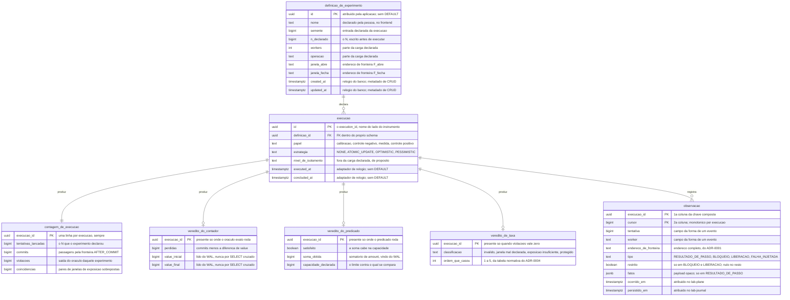

# Proposta 1 — Uma tabela por formato de veredito

A aposta central é que o `lab-journal` conhece a forma de cada veredito, e cada formato
ganha tabela própria com coluna tipada. Ela otimiza a comparação entre execuções.

## O problema que este modelo resolve

O E3 compara estratégias sobre a mesma carga, e a comparação é de magnitude. O relatório
exibe três contagens, a taxa de aborto e o limite superior do zero, pelo
[ADR-0004](../../../adr/0004-o-estatuto-da-barreira-e-o-diagnostico-da-nao-ocorrencia.md#o-veredito-de-uma-execução-medida-é-uma-taxa).
Um caderno que guarde o relatório inteiro como texto não sustenta essa
tabela. Cada célula exigiria abrir e reinterpretar o documento. Aqui cada número é coluna, e a tabela
comparativa vira uma consulta.

O mesmo caderno guarda o log de observações evento a evento, persistido desde a etapa 1
pelo
[ADR-0017](../../../adr/0017-a-persistencia-antecipada-do-log-de-observacoes-e-o-buffer-que-a-alimenta.md#a-persistência-no-lab-journal-começa-na-etapa-1-e-não-mais-na-6).
O stream o lê por cursor, e não por instante, pelo
[ADR-0016](../../../adr/0016-o-streaming-e-o-replay-do-log-de-observacoes.md#o-replay-por-cursor-é-o-único-mecanismo-com-ou-sem-histórico-completo).

## O modelo

A `execucao` carrega o discriminador, e o instrumento o chama de `execution_id`, pelo
[ADR-0015](../../../adr/0015-a-chave-o-discriminador-de-execucao-e-as-colunas-de-tempo.md#o-nome-assimétrico-do-discriminador-e-a-tradução-num-ponto-único).
Nenhuma linha do desenho atravessa schema, e essa ausência é a decisão, pela regra de
[`schemas/`](../../../architecture/schemas/README.md#a-ausência-de-linha-entre-os-dois-diagramas-é-a-decisão).

## O que o diagrama não expressa

| Ausência ou detalhe                         | O que ela decide                                                                                                                                                                                                                 |
|---------------------------------------------|----------------------------------------------------------------------------------------------------------------------------------------------------------------------------------------------------------------------------------|
| ordem da chave de `observacao`              | `(execucao_id, cursor)`, discriminador primeiro; a ordem inversa espalha o replay de uma execução por toda a B-tree                                                                                                              |
| índice                                      | nenhum índice aditivo; a chave composta já serve ao `cursor > C` do replay ([ADR-0016](../../../adr/0016-o-streaming-e-o-replay-do-log-de-observacoes.md#o-replay-por-cursor-é-o-único-mecanismo-com-ou-sem-histórico-completo)) |
| `DEFAULT` em `executed_at` e `concluded_at` | ausente; as duas vêm do adaptador de relógio, pelo [ADR-0015](../../../adr/0015-a-chave-o-discriminador-de-execucao-e-as-colunas-de-tempo.md#as-colunas-de-tempo-e-a-fonte-do-relógio-por-papel-do-valor)                        |
| `DEFAULT` na definição de experimento       | presente; `created_at` e `updated_at` da definição vêm do banco, pela mesma tabela do ADR-0015 — é a única coluna deste schema em que `now()` não contraria a regra de relógio injetável                                         |
| trigger                                     | nenhum, em tabela nenhuma; a escrita que esquecer a coluna falha alto                                                                                                                                                            |
| chave estrangeira                           | todas dentro de `lab_journal`; nenhuma alcança `sut` nem `lab_plane`, pelo [ADR-0010](../../../adr/0010-a-fronteira-de-schema-e-o-cdc-como-fonte-do-veredito.md#decisão)                                                         |
| taxa de violação, taxa de aborto e o limite | não são colunas; as três derivam de `contagem_de_execucao`, e guardá-las criaria um segundo lugar onde o mesmo número vive                                                                                                       |
| tabela para o formato curva do E4           | ausente, de propósito; ele não tem forma decidida ([`features/README.md`](../../../features/README.md#capacidade-conhecida-e-não-especificada))                                                                                  |
| tabela de veredito no caderno               | ela guarda o veredito, e não o produz; o caderno NÃO DEVE derivar veredito do log ([ADR-0002](../../../adr/0002-o-dominio-minimo-e-os-dois-oraculos.md#o-oráculo-lê-o-banco-e-não-deve-ler-o-log-de-observações))                |

## Trade-offs

| O que fica fácil                                                                          | O que fica caro ou impossível                                                                                              |
|-------------------------------------------------------------------------------------------|----------------------------------------------------------------------------------------------------------------------------|
| a tabela comparativa do E3 vira uma consulta, com as três contagens lado a lado           | cada formato de veredito novo é uma migração, e o E4 fica sem casa até a decisão de formato                                |
| `NOT NULL` recusa a linha incompleta antes de a tela mostrar um relatório sem denominador | um relatório que o `lab-plane` emitir com campo novo é descartado em silêncio, até alguém migrar                           |
| a calibração é verificável em SQL: `commits` contra `value_final − value_inicial`         | o caderno passa a conhecer o vocabulário dos oráculos, e uma emenda de ADR sobre veredito alcança o schema dele            |
| o replay por cursor lê uma chave composta, sem índice aditivo nem ordenação por tempo     | `classificacao` e `ordem_que_casou` copiam a tabela normativa do ADR-0004 para dentro do schema, livres para divergir dela |

## O que esta proposta NÃO decide

| Assunto                                       | Estado                                                                                                                                                           |
|-----------------------------------------------|------------------------------------------------------------------------------------------------------------------------------------------------------------------|
| a composição global dos formatos de veredito  | continua aberta; este desenho apenas dá tabela ao formato já decidido, e cala sobre como eles convivem num relatório                                             |
| onde vive a definição de experimento          | não existe decisão sobre em qual banco ela vive ([`schemas/lab-plane.md`](../../../architecture/schemas/lab-plane.md#o-que-o-diagrama-do-lab_plane-não-desenha)) |
| a fonte do `persistido_em`                    | o ADR-0016 exige o instante, e não nomeia o relógio dele                                                                                                         |
| o formato JSON de cada evento no stream       | segue aberto no próprio [ADR-0016](../../../adr/0016-o-streaming-e-o-replay-do-log-de-observacoes.md#negativas)                                                  |
| o que acontece com o `Last-Event-ID` inválido | comportamento não decidido, pelo mesmo ADR                                                                                                                       |
| a limpeza entre duas execuções                | nada aqui apaga linha, e nada aqui decide quem apaga                                                                                                             |

## Perguntas que ela levanta

| Pergunta em aberto                                                                                                                                                                                                                                         |
|------------------------------------------------------------------------------------------------------------------------------------------------------------------------------------------------------------------------------------------------------------|
| Dois regimes de relógio conviveriam no mesmo schema — banco na definição, adaptador na execução. A pessoa aceita essa assimetria dentro de um arquivo de migração só?                                                                                      |
| O controle positivo NÃO DEVE ser reportado como resultado ([ADR-0004](../../../adr/0004-o-estatuto-da-barreira-e-o-diagnostico-da-nao-ocorrencia.md#a-barreira-é-o-controle-positivo)). Nada neste desenho o impede. Uma coluna `papel` basta como guarda? |
| Nada impede duas linhas de veredito para a mesma execução, em tabelas diferentes. Isso é composição implícita, e ela não foi decidida?                                                                                                                     |
| `cursor` é palavra reconhecida pelo PostgreSQL em contexto de comando. O nome da coluna precisa mudar, ou a citação entre aspas basta?                                                                                                                     |
| A `classificacao` guarda o veredito, e `ordem_que_casou` guarda como se chegou nele. Guardar as duas é redundância útil, ou é a mesma informação duas vezes?                                                                                               |

## Por que ela não é a Proposta 2 nem a 3

Ela aposta que o caderno **conhece** a forma de um veredito. A Proposta 2 aposta o
contrário, e guarda o relatório como documento opaco. A Proposta 3 não aposta
na forma do veredito: ela aposta na estrutura do ciclo de execuções, e faz o schema recusar a
comparação que o ADR-0004 proíbe.
