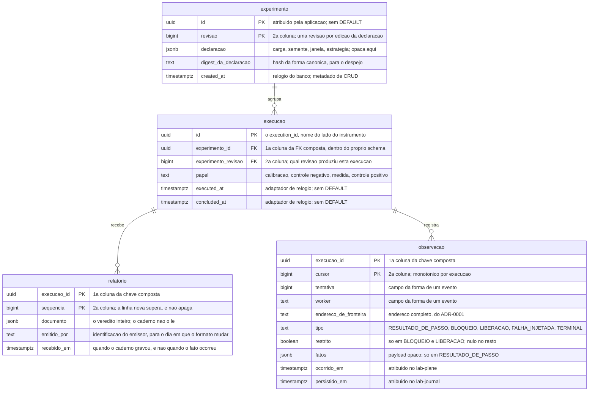
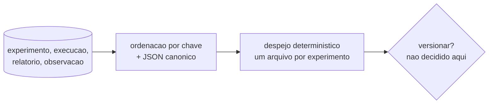

# Proposta 2 — O caderno escriba, e o relatório como documento opaco

A aposta central é que o `lab-journal` NÃO conhece a forma de um veredito: ele guarda o
que recebe, sem interpretar. Ela otimiza a chegada de um formato de veredito novo.

## O problema que este modelo resolve

Como o veredito de cada oráculo entra num relatório único continua **decisão aberta**, e
[`features/README.md`](../../../features/README.md#capacidade-conhecida-e-não-especificada)
é o dono dessa afirmação. Um schema que dê coluna a cada formato fecha essa decisão por
efeito colateral: a forma da tabela passa a ser a resposta, escrita por quem redigiu a
migração, e não pela pessoa.

Este desenho recusa essa antecipação. O relatório entra como documento, e o caderno só
guarda quem o emitiu e quando ele chegou. O log de observações, esse sim, é relacional —
o replay por cursor precisa de ordenação indexada, pelo
[ADR-0016](../../../adr/0016-o-streaming-e-o-replay-do-log-de-observacoes.md#o-replay-por-cursor-é-o-único-mecanismo-com-ou-sem-histórico-completo).

A segunda aposta é a **imutabilidade**. Nenhuma linha é atualizada, e uma correção é
linha nova que supera a anterior. Isso ataca de frente o custo nomeado pelo
[ADR-0011](../../../adr/0011-a-topologia-de-servicos-e-o-caderno-de-laboratorio-fora-do-git.md#negativas):
um caderno append-only tem despejo determinístico, e um despejo determinístico tem diff.

## O modelo

O evento terminal entra como um `tipo` do próprio log, e não como coluna de estado da
execução. Ele carrega o cursor do último evento, e o stream fecha depois dele, pela `R4`
do
[card de streaming](../../../features/streaming-e-replay-do-log-de-observacoes/feature-card.md#regras-de-negócio).
Nenhuma linha do desenho atravessa schema, e essa ausência é a decisão, pela regra de
[`schemas/`](../../../architecture/schemas/README.md#a-ausência-de-linha-entre-os-dois-diagramas-é-a-decisão).

O despejo é uma função sobre estas quatro tabelas, e não uma tabela a mais:

## O que o diagrama não expressa

| Ausência ou detalhe                  | O que ela decide                                                                                                                                                                                                                                     |
|--------------------------------------|------------------------------------------------------------------------------------------------------------------------------------------------------------------------------------------------------------------------------------------------------|
| ordem da chave de `observacao`       | `(execucao_id, cursor)`, discriminador primeiro; a ordem inversa espalha o replay de uma execução por toda a B-tree                                                                                                                                  |
| ordem da chave de `experimento`      | `(id, revisao)`; a revisão nunca é reaproveitada, e uma edição da declaração é linha nova                                                                                                                                                            |
| índice                               | um índice aditivo sobre `execucao (experimento_id, experimento_revisao)`; o PostgreSQL não o cria pelo lado que referencia, e sem ele toda leitura por experimento varre a tabela                                                                    |
| chave estrangeira de `execucao`      | **presente**, composta, e inteiramente dentro de `lab_journal`; ela nunca cascateia, porque o append-only não deixa a linha referida mudar                                                                                                           |
| `DEFAULT`                            | ausente em `executed_at`, `concluded_at`, `recebido_em`, `persistido_em` e `ocorrido_em`; presente só em `experimento.created_at`, metadado de CRUD com relógio do banco                                                                             |
| `updated_at`                         | **não existe**, porque nada é atualizado; o [ADR-0015](../../../adr/0015-a-chave-o-discriminador-de-execucao-e-as-colunas-de-tempo.md#as-colunas-de-tempo-e-a-fonte-do-relógio-por-papel-do-valor) dá relógio a uma coluna que este desenho não cria |
| trigger                              | nenhum; nem para versionar, nem para carimbar instante                                                                                                                                                                                               |
| `UPDATE` e `DELETE`                  | não aparecem no desenho, e a proibição deles é a decisão; sem ela, o despejo deixa de ser reproduzível                                                                                                                                               |
| a canonicalização do JSON            | ordenação de chave e forma de número; sem ela, dois despejos do mesmo caderno diferem sem que nada tenha mudado                                                                                                                                      |
| o caderno como leitor do `documento` | ele nunca o abre; o caderno NÃO DEVE derivar veredito ([ADR-0002](../../../adr/0002-o-dominio-minimo-e-os-dois-oraculos.md#o-oráculo-lê-o-banco-e-não-deve-ler-o-log-de-observações))                                                                |

## Trade-offs

| O que fica fácil                                                                               | O que fica caro ou impossível                                                                                                                                                                 |
|------------------------------------------------------------------------------------------------|-----------------------------------------------------------------------------------------------------------------------------------------------------------------------------------------------|
| o formato curva do E4 chega sem migração nenhuma, e a composição global segue aberta no código | nenhuma consulta SQL compara duas execuções; a tabela comparativa do E3 é montada por quem lê, fora do banco                                                                                  |
| o caderno não pode virar oráculo por acidente, porque não sabe ler o que guarda                | as regras que exigem exibir três contagens, taxa de aborto e limite superior não têm onde ser recusadas ([card](../../../features/execucao-de-experimento/feature-card.md#regras-de-negócio)) |
| o append-only devolve diff e revisão ao caderno, pelo despejo determinístico                   | o despejo é um segundo artefato, e a canonicalização vira requisito de código, sem o qual ele mente                                                                                           |
| uma correção de relatório preserva o que foi afirmado antes, e a evidência não some            | duas linhas de `relatorio` para a mesma execução exigem regra de precedência, e ela não existe                                                                                                |
| a execução guarda qual revisão da declaração a produziu, e a declaração nunca muda embaixo     | um documento malformado só aparece quando alguém o lê, meses depois                                                                                                                           |

## O que esta proposta NÃO decide

| Assunto                                       | Estado                                                                                                                                                           |
|-----------------------------------------------|------------------------------------------------------------------------------------------------------------------------------------------------------------------|
| a composição global dos formatos de veredito  | continua aberta, e este desenho existe para não fechá-la por efeito colateral                                                                                    |
| onde vive a definição de experimento          | não existe decisão sobre em qual banco ela vive ([`schemas/lab-plane.md`](../../../architecture/schemas/lab-plane.md#o-que-o-diagrama-do-lab_plane-não-desenha)) |
| se o despejo entra no Git                     | **não decide, e não pode**: o ADR-0011 fechou as duas rotas conhecidas, e uma terceira é decisão nova                                                            |
| o esquema interno do `documento`              | o caderno não o valida, e quem o valida não foi decidido                                                                                                         |
| a fonte do `persistido_em` e do `recebido_em` | o ADR-0016 exige o instante de persistência, e não nomeia o relógio dele                                                                                         |
| a retenção do log de observações              | nada aqui apaga linha, e um caderno append-only cresce para sempre; quem poda, e quando, não foi decidido                                                        |

## Perguntas que ela levanta

| Pergunta em aberto                                                                                                                                                                                                                                                                            |
|-----------------------------------------------------------------------------------------------------------------------------------------------------------------------------------------------------------------------------------------------------------------------------------------------|
| O despejo determinístico repõe diff e revisão, mas só se alguém o versionar. Versionar onde, se `experiments/` e `docs/experiments/` estão fechados pelo [ADR-0011](../../../adr/0011-a-topologia-de-servicos-e-o-caderno-de-laboratorio-fora-do-git.md#o-caderno-de-laboratório-sai-do-git)? |
| Um caderno que não lê o que guarda pode aceitar relatório de uma execução que não existe. Ele deveria recusar, e com que evidência?                                                                                                                                                           |
| A imutabilidade elimina `updated_at`, e o ADR-0015 decidiu o relógio dessa coluna. A decisão fica sem alvo, ou o desenho é que está errado?                                                                                                                                                   |
| O evento terminal virou um `tipo` do log. O conjunto de tipos da [forma de um evento](../../../adr/0007-o-log-de-observacoes-forma-ordem-e-onde-vive.md#a-forma-de-um-evento) é fechado. Isso exige decisão nova?                                                                             |
| Duas linhas de `relatorio` para a mesma execução: a maior `sequencia` vence sempre, ou a superação precisa ser declarada?                                                                                                                                                                     |

## Por que ela não é a Proposta 1 nem a 3

Ela aposta que o caderno **ignora** a forma de um veredito, e a Proposta 1 aposta o
oposto. Ela também é a única das três que enfrenta o custo do
[ADR-0011](../../../adr/0011-a-topologia-de-servicos-e-o-caderno-de-laboratorio-fora-do-git.md#negativas),
e cobra por isso um despejo canonicalizado mais a proibição de `UPDATE`. A
Proposta 3 não mexe nesse custo: ela gasta a rigidez que este desenho recusa para tornar estrutural o
protocolo das quatro execuções.
