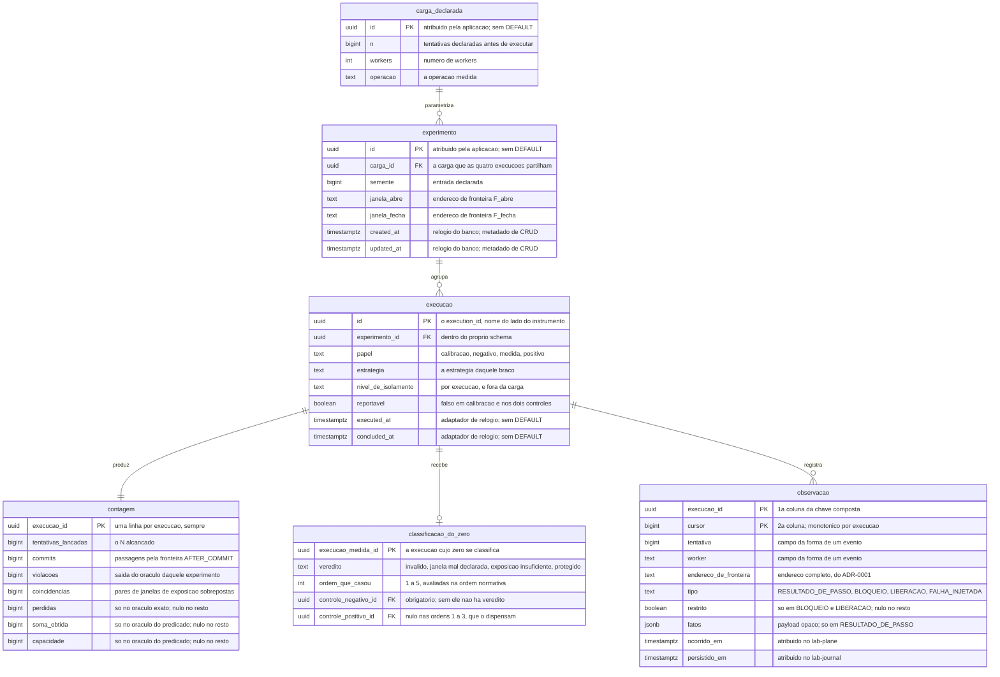
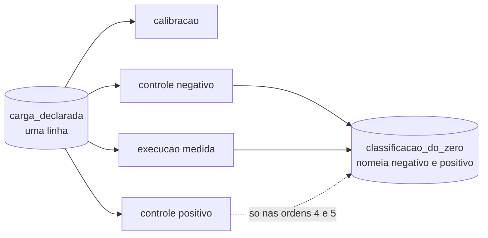

# Proposta 3 — O ciclo de quatro execuções como estrutura

A aposta central é que o protocolo epistêmico vira estrutura de tabela. Ela otimiza a
recusa: um relatório que o ADR-0004 proíbe não tem onde ser escrito.

## O problema que este modelo resolve

O ADR-0004 impõe regras que hoje só existem como prosa. A plataforma NÃO DEVE comparar
contagens de execuções cuja carga declarada diferir, e o controle positivo NÃO DEVE ser
reportado como resultado. As duas vivem em
[A plataforma conta coincidências](../../../adr/0004-o-estatuto-da-barreira-e-o-diagnostico-da-nao-ocorrencia.md#a-plataforma-conta-coincidências)
e em
[A barreira é o controle positivo](../../../adr/0004-o-estatuto-da-barreira-e-o-diagnostico-da-nao-ocorrencia.md#a-barreira-é-o-controle-positivo).
O [ADR-0018](../../../adr/0018-cada-controle-roda-sob-o-seu-proprio-nivel.md#decisão)
acrescenta a terceira: o nível de isolamento NÃO DEVE entrar na carga comparada.

Uma regra escrita em prosa é violada em silêncio pela primeira consulta
descuidada. Aqui a carga declarada é entidade própria, e comparar duas execuções
da mesma carga é seguir uma chave estrangeira, e não confiar em quem escreveu o `WHERE`.

A terceira aposta está na classificação do zero: ela é linha que **nomeia as
execuções que a produziram**. Um `protegido` que não consiga apontar qual controle negativo o sustenta
não pode ser gravado.

## O modelo

O ciclo que a estrutura reproduz é o do ADR-0004, e ela o torna verificável no banco:

Nenhuma linha destes desenhos atravessa schema, e a ausência é a decisão, pela
regra de [`schemas/`](../../../architecture/schemas/README.md#a-ausência-de-linha-entre-os-dois-diagramas-é-a-decisão).

## O que o diagrama não expressa

| Ausência ou detalhe                      | O que ela decide                                                                                                                                                                                                                                                                                                           |
|------------------------------------------|----------------------------------------------------------------------------------------------------------------------------------------------------------------------------------------------------------------------------------------------------------------------------------------------------------------------------|
| unicidade em `execucao`                  | `UNIQUE (experimento_id, papel)`; no máximo uma execução por papel, e é isso que faz o ciclo ser um ciclo                                                                                                                                                                                                                  |
| unicidade em `carga_declarada`           | `UNIQUE (n, workers, operacao)`; duas cargas idênticas viram uma linha só, e a comparação passa a ser identidade                                                                                                                                                                                                           |
| ausência do nível de isolamento na carga | deliberada; o nível vive na execução, pelo [ADR-0018](../../../adr/0018-cada-controle-roda-sob-o-seu-proprio-nivel.md#decisão), e pô-lo na carga quebraria a comparabilidade que ele manda preservar                                                                                                                       |
| ordem da chave de `observacao`           | `(execucao_id, cursor)`, discriminador primeiro; a ordem inversa espalha o replay de uma execução por toda a B-tree                                                                                                                                                                                                        |
| índice                                   | um índice aditivo sobre `execucao (experimento_id)`; o resto já é chave, e o replay lê pela chave composta                                                                                                                                                                                                                 |
| chave estrangeira                        | todas dentro de `lab_journal`, e as duas de `classificacao_do_zero` apontam para `execucao` no mesmo schema; nenhuma alcança `sut` nem `lab_plane`                                                                                                                                                                         |
| `NOT NULL` em `controle_negativo_id`     | é a guarda de verdade deste desenho: a ordem 1 da tabela normativa lê o controle negativo, e sem ele nenhum veredito de zero é escrevível                                                                                                                                                                                  |
| coluna nulável em `contagem`             | `perdidas`, `soma_obtida` e `capacidade` são nulas fora do oráculo que as produz; o formato do veredito passa a ser **quais colunas estão preenchidas**                                                                                                                                                                    |
| `DEFAULT`                                | ausente em `executed_at` e `concluded_at`, que vêm do adaptador; presente em `created_at` e `updated_at` do experimento, metadado de CRUD com relógio do banco pelo [ADR-0015](../../../adr/0015-a-chave-o-discriminador-de-execucao-e-as-colunas-de-tempo.md#as-colunas-de-tempo-e-a-fonte-do-relógio-por-papel-do-valor) |
| trigger                                  | nenhum; `reportavel` é escrito pela aplicação junto do `papel`, e não derivado no banco                                                                                                                                                                                                                                    |
| taxas e limite superior                  | não são colunas; derivam de `contagem`, e guardá-las criaria um segundo lugar onde o mesmo número vive                                                                                                                                                                                                                     |

## Trade-offs

| O que fica fácil                                                                               | O que fica caro ou impossível                                                                                                |
|------------------------------------------------------------------------------------------------|------------------------------------------------------------------------------------------------------------------------------|
| comparar duas execuções da mesma carga vira seguir uma chave, e não confiar num `WHERE`        | a tabela de cinco condições do ADR-0004 vira coluna `ordem_que_casou`, e ela envelhece calada se o ADR mudar                 |
| um `protegido` sem controle negativo nomeado não pode ser gravado                              | o E4 não tem os quatro papéis, e a estrutura que protege os outros experimentos não tem onde acomodá-lo                      |
| o nível de isolamento fica fora da carga por construção, e não por disciplina de quem consulta | `UNIQUE (experimento_id, papel)` proíbe repetir a execução medida, e repetir medida é coisa que um laboratório faz           |
| um formato de veredito novo é coluna nova, e não tabela nova                                   | uma coluna nula não distingue "não se aplica" de "não foi medido", e o relatório não sabe qual dos dois leu                  |
| a carga declarada tem identidade, e duas execuções da mesma carga são visivelmente a mesma     | a `carga_declarada` compartilhada acopla experimentos que só coincidem por acaso: mudar a definição de um alcançaria o outro |
| o caderno recusa a linha inválida antes de a tela existir                                      | o caderno passa a conhecer o vocabulário do ADR-0004 inteiro, e vira o schema que mais depende de decisão alheia             |

## O que esta proposta NÃO decide

| Assunto                                      | Estado                                                                                                                                                           |
|----------------------------------------------|------------------------------------------------------------------------------------------------------------------------------------------------------------------|
| a composição global dos formatos de veredito | continua aberta; este desenho escolhe **onde** os números moram, e não como eles convivem num relatório                                                          |
| onde vive a definição de experimento         | não existe decisão sobre em qual banco ela vive ([`schemas/lab-plane.md`](../../../architecture/schemas/lab-plane.md#o-que-o-diagrama-do-lab_plane-não-desenha)) |
| o formato curva do E4                        | sem colunas e sem papéis; a ausência é a decisão, e ela cobra uma revisão quando o formato fechar                                                                |
| quem escreve `reportavel`                    | a aplicação, e nada aqui diz qual serviço nem em que ponto do ciclo                                                                                              |
| o custo do ADR-0011                          | não o enfrenta; um resultado continua sem diff, sem revisão em PR e sem sobreviver a um banco recriado                                                           |
| a fonte do `persistido_em`                   | o ADR-0016 exige o instante, e não nomeia o relógio dele                                                                                                         |

## Perguntas que ela levanta

| Pergunta em aberto                                                                                                                                                                                                                                                                                   |
|------------------------------------------------------------------------------------------------------------------------------------------------------------------------------------------------------------------------------------------------------------------------------------------------------|
| `UNIQUE (experimento_id, papel)` proíbe uma segunda execução medida sobre o mesmo experimento. Repetir uma medida cria experimento novo, ou o papel precisa de ordinal?                                                                                                                              |
| A `carga_declarada` compartilhada faz dois experimentos apontarem para a mesma linha. Isso é a comparabilidade que o ADR-0004 quer, ou é acoplamento por coincidência de números?                                                                                                                    |
| O `veredito` e a `ordem_que_casou` copiam para o schema uma tabela que vive no [ADR-0004](../../../adr/0004-o-estatuto-da-barreira-e-o-diagnostico-da-nao-ocorrencia.md#o-zero-é-classificado-e-a-classificação-tem-quatro-valores). Copiar aqui é aceitável, ou é uma segunda fonte da mesma regra? |
| A calibração exige `commits = value_final − value_inicial`, pelo [ADR-0002](../../../adr/0002-o-dominio-minimo-e-os-dois-oraculos.md#a-calibração-do-denominador). `value_inicial` e `value_final` não são colunas aqui. Onde eles ficam?                                                            |
| Uma coluna nulável em `contagem` cala sobre "não se aplica" contra "não foi medido". Isso exige uma coluna de motivo, ou o `papel` já responde?                                                                                                                                                      |

## Por que ela não é a Proposta 1 nem a 2

Ela é a única que aposta na **estrutura do ciclo**, e não na forma do veredito. Onde a
Proposta 1 cria uma tabela por formato e a Proposta 2 guarda um documento opaco, esta
usa uma linha larga com colunas nuláveis, e gasta o orçamento de rigidez em outro lugar:
na recusa do relatório que o ADR-0004 proíbe. Ela também é a única que não mexe no custo
do [ADR-0011](../../../adr/0011-a-topologia-de-servicos-e-o-caderno-de-laboratorio-fora-do-git.md#negativas),
e o declara acima.
