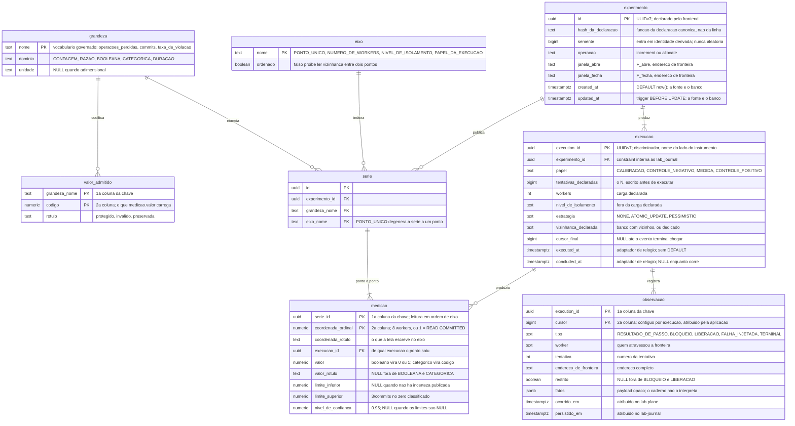

# Proposta 3 — O caderno como série de medições

A aposta: o caderno não conhece formato de veredito nenhum, porque só existe um — uma
**medição**, com grandeza nomeada, valor e incerteza, indexada por um ponto ao longo de um
eixo declarado. Ela otimiza para que o formato decidido amanhã não custe tabela, migração
nem ramo de tela.

Isto é proposta, e não decisão. Nenhum schema deste banco foi desenhado, e a pasta
[`schemas/`](../../../architecture/schemas/README.md#a-ausência-de-linha-entre-os-dois-diagramas-é-a-decisão)
declara a ausência do `lab_journal` de propósito.

## O problema que este modelo resolve

O caderno guarda resultados de formas diferentes: a contagem do
[oráculo exato](../../../adr/0002-o-dominio-minimo-e-os-dois-oraculos.md#o-oráculo-exato),
o booleano do
[oráculo do predicado](../../../adr/0002-o-dominio-minimo-e-os-dois-oraculos.md#o-oráculo-do-predicado),
a [taxa com limite de confiança](../../../adr/0004-o-estatuto-da-barreira-e-o-diagnostico-da-nao-ocorrencia.md#o-veredito-de-uma-execução-medida-é-uma-taxa)
e a curva do E4, cuja composição num relatório único segue
[sem decisão](../../../features/README.md#capacidade-conhecida-e-não-especificada). Uma
tabela por formato amarra o esquema a uma lista que não está fechada, e cada formato novo
passa a custar migração.

A [comparação entre níveis](../../../features/comparacao-entre-niveis-de-isolamento/feature-card.md#regras-de-negócio)
mostra o mesmo defeito pelo outro lado. Ela não é um quinto formato: é o mesmo veredito,
três vezes, com um rótulo ao lado. Dar-lhe estrutura própria cria duas maneiras de agrupar
execuções — uma para a curva, outra para a comparação —, e as duas divergem na primeira
pergunta que nenhuma previu.

## O modelo

Oito tabelas: três de vocabulário, duas de declaração, uma de agrupamento, uma de medição
e uma de log.

## O que o diagrama não expressa

**A ordem das colunas nas duas chaves compostas é a leitura dominante.** Em `medicao`,
`serie_id` vem primeiro porque ler a série inteira na ordem do eixo é o que a curva, a
comparação e o relatório fazem; invertida, cada uma dessas leituras vira busca espalhada.
Em `observacao`, `execution_id` vem primeiro, e o
[replay de `cursor > C`](../../../adr/0016-o-streaming-e-o-replay-do-log-de-observacoes.md#o-replay-por-cursor-é-o-único-mecanismo-com-ou-sem-histórico-completo)
vira varredura de faixa na cauda de uma execução só.

**Dois índices aditivos, que o `erDiagram` não desenha.** Um sobre `medicao(execucao_id)`,
porque a [comparação de coincidências](../../../adr/0004-o-estatuto-da-barreira-e-o-diagnostico-da-nao-ocorrencia.md#a-plataforma-conta-coincidências)
caminha no sentido oposto ao da chave. Outro sobre `serie(experimento_id, grandeza_nome)`,
porque a tela abre por experimento e escolhe a grandeza depois.

**Quatro colunas sem `DEFAULT`, e duas com ele.** `executed_at`, `concluded_at`,
`ocorrido_em` e `persistido_em` são escritas pela aplicação, pelo adaptador de relógio, e
a escrita que esquecer a coluna falha alto. As exceções são `experimento.created_at` e
`experimento.updated_at`, com `DEFAULT now()` e trigger: elas contrariam o hábito do
schema medido, e o
[ADR-0015](../../../adr/0015-a-chave-o-discriminador-de-execucao-e-as-colunas-de-tempo.md#as-colunas-de-tempo-e-a-fonte-do-relógio-por-papel-do-valor)
já as decidiu assim, porque metadado de CRUD não entra em veredito, escalonamento nem
identidade derivada da semente.

**Nenhuma `SEQUENCE` alimenta `observacao.cursor`.** Uma sequência global é monotônica sem
ser contígua dentro de uma execução, e um buraco dela é indistinguível de um evento
perdido no transporte — a diferença que a guarda de completude de
[`R15`](../../../features/execucao-de-experimento/feature-card.md#regras-de-negócio)
precisa enxergar.

**Chave estrangeira existe aqui, e não existe no `sut`.** Lá o motivo de
[proibi-la](../../../adr/0015-a-chave-o-discriminador-de-execucao-e-as-colunas-de-tempo.md#sem-chave-estrangeira-em-allocationresource_id)
é o lock que ela adquire dentro da janela medida, e nada deste schema roda dentro dela. As
setas do diagrama são constraints de verdade, e nenhuma atravessa a fronteira de schema,
porque nenhuma poderia.

**Nada liga `observacao` a `medicao`, e essa ausência é a decisão mais cara do desenho.** O
oráculo [NÃO DEVE derivar o veredito do log](../../../adr/0002-o-dominio-minimo-e-os-dois-oraculos.md#o-oráculo-lê-o-banco-e-não-deve-ler-o-log-de-observações),
e um caminho de `join` entre as duas ilhas convidaria a recomputá-lo. Elas se encontram só
em `execucao`, que não carrega valor nenhum.

**Três constraints que ninguém escreveu.** Nada liga `medicao.valor` ao `valor_admitido` da
grandeza, porque a `medicao` não carrega o nome dela. Nada obriga `medicao.execucao_id` a
concordar com a coordenada quando o eixo é o papel da execução. E nada faz o controle
negativo rodar sob o menor `coordenada_ordinal` declarado, como o
[ADR-0018](../../../adr/0018-cada-controle-roda-sob-o-seu-proprio-nivel.md#decisão) exige.

## Decisões assumidas

| O que esta proposta assume                                                                                                                                                                                | A alternativa que ficou de fora                                                         | O que muda no modelo se a decisão for a contrária                                                                                                                                                                        |
| --------------------------------------------------------------------------------------------------------------------------------------------------------------------------------------------------------- | --------------------------------------------------------------------------------------- | ------------------------------------------------------------------------------------------------------------------------------------------------------------------------------------------------------------------------ |
| A composição global dos formatos de veredito é **uma série de medições**: contagem, booleano, taxa e curva são a mesma linha, com domínio e eixo diferentes.                                              | Uma tabela por formato — `contagem_de_perdidas`, `predicado`, `taxa`, `ponto_de_curva`. | O esquema volta a crescer por formato; `serie`, `eixo` e `grandeza` desaparecem, e a comparação entre níveis precisa de estrutura própria.                                                                               |
| A definição de experimento vive no schema `lab_journal`, pelo [ADR-0011](../../../adr/0011-a-topologia-de-servicos-e-o-caderno-de-laboratorio-fora-do-git.md#o-caderno-de-laboratório-sai-do-git).        | O `lab_plane`, que o ADR-0015 mantém em aberto ao lado deste.                           | `experimento` sai daqui, e `serie` passa a apontar para uma declaração de outro schema — que nenhuma constraint pode alcançar.                                                                                           |
| A carga declarada — `N` e `workers` — mora em `execucao`; `experimento` guarda semente, operação e janela.                                                                                                | Tudo na definição, com uma execução por declaração.                                     | A curva do E4 deixa de caber numa série só: variar workers passaria a criar experimentos distintos.                                                                                                                      |
| Grandeza e eixo são **vocabulário em tabela**, e não `enum` no código.                                                                                                                                    | Enumeração compilada no `lab-journal`.                                                  | Toda grandeza nova vira deploy; `valor_admitido` some, e a validação do valor sai do banco.                                                                                                                              |
| `medicao.valor` é `numeric` para todo domínio: booleano vira 0 ou 1, categórico vira código.                                                                                                              | Uma coluna por domínio, ou um `jsonb` de valor.                                         | O esquema volta a distinguir booleano de contagem, ao custo de colunas nulas em toda linha, ou de um payload que nenhuma consulta agrega.                                                                                |
| A [classificação do zero](../../../adr/0004-o-estatuto-da-barreira-e-o-diagnostico-da-nao-ocorrencia.md#o-zero-é-classificado-e-a-classificação-tem-quatro-valores) é uma medição de domínio categórico.  | Uma coluna `classificacao` em `execucao`.                                               | O rótulo deixa de ser indexável por eixo, e a comparação de classificações entre braços precisa de consulta própria.                                                                                                     |
| O papel da execução — calibração, controle negativo, medida, controle positivo — é um **eixo**.                                                                                                           | Uma coluna de tipo em `execucao`, comparada em código.                                  | A comparação entre exposição oferecida e sobrevivente sai do modelo e vira regra de aplicação.                                                                                                                           |
| `coordenada_ordinal` é `numeric`, e a ordem dos níveis é a do [ADR-0018](../../../adr/0018-cada-controle-roda-sob-o-seu-proprio-nivel.md#decisão): `READ COMMITTED` < `REPEATABLE READ` < `SERIALIZABLE`. | Coordenada textual, ordenada por rótulo.                                                | `8` passa a vir antes de `50` por acaso e depois de `10` por engano; a regra do nível mais fraco perde o `min()` que a exprime.                                                                                          |
| O cursor é atribuído pela aplicação e é **contíguo por execução**, pelo [ADR-0016](../../../adr/0016-o-streaming-e-o-replay-do-log-de-observacoes.md#o-cursor-é-campo-próprio-monotônico-por-execução).   | Uma `SEQUENCE` global do PostgreSQL.                                                    | O cursor continua monotônico e deixa de ser contíguo; a guarda de completude perde o sinal que distingue buraco de perda.                                                                                                |
| O evento terminal é uma linha de `observacao`, e `execucao.cursor_final` o espelha.                                                                                                                       | Só a coluna em `execucao`, sem linha no log.                                            | O stream precisa de um caminho de emissão que não é o replay, e a `R4` do [card de streaming](../../../features/streaming-e-replay-do-log-de-observacoes/feature-card.md#regras-de-negócio) passa a ter dois mecanismos. |
| `persistido_em` vem do adaptador de relógio do `lab-journal`.                                                                                                                                             | `DEFAULT now()`, porque o valor não entra em veredito.                                  | Uma coluna a menos para a aplicação preencher, e a medida da travessia passa a depender do relógio do servidor.                                                                                                          |
| `experimento.created_at` e `updated_at` vêm do banco, com `DEFAULT now()` e trigger.                                                                                                                      | O adaptador, como no resto do instrumento.                                              | Duas colunas a mais na escrita, e a coerência com o schema medido volta — contrariando o recorte do ADR-0015.                                                                                                            |
| Chave estrangeira é permitida **dentro** do `lab_journal`.                                                                                                                                                | Nenhuma FK, por simetria com o `sut`.                                                   | A órfã passa a ser verificada em vez de impedida, e o modelo herda um problema que só existia por causa da janela medida.                                                                                                |
| `experimento` é imutável depois da primeira execução; reexecutar clona a declaração, e `hash_da_declaracao` liga as duas.                                                                                 | Definição mutável, com histórico de versão.                                             | `serie` deixa de poder pertencer ao experimento sem ambiguidade, e o agrupamento precisa de uma entidade de campanha.                                                                                                    |
| `execucao.vizinhanca_declarada` é obrigatória, pela exigência de `Q-INT-3` em [`integrations.md`](../../../architecture/integrations.md#perguntas-em-aberto).                                             | Registrar a vizinhança fora do esquema, no relatório.                                   | Dois relatórios com o mesmo veredito voltam a afirmar coisas diferentes sem que o banco saiba.                                                                                                                           |
| `observacao.fatos` é `jsonb` opaco, pela [forma do evento](../../../adr/0007-o-log-de-observacoes-forma-ordem-e-onde-vive.md#a-forma-de-um-evento).                                                       | Colunas tipadas por tipo de evento.                                                     | O caderno passa a interpretar o payload que o ADR-0007 declara opaco, e cada fato novo vira migração.                                                                                                                    |
| Nenhum caminho de `join` liga `observacao` a `medicao`.                                                                                                                                                   | Uma FK de conveniência, para a tela cruzar as duas.                                     | O esquema passa a oferecer o caminho que o ADR-0002 proíbe ao oráculo, e a proibição fica só na prosa.                                                                                                                   |

## Trade-offs

O ganho é que um formato de veredito novo não toca o esquema: ele é uma grandeza a mais no
vocabulário. O preço é o que esta aposta não tem como esconder — **o esquema para de
distinguir um booleano de uma contagem**. `valor numeric` aceita 7 onde só 0 e 1 significam
algo, e o que reprova o 7 mora em `valor_admitido`, que nenhuma constraint alcança a partir
de `medicao`. A semântica migra para um vocabulário que passa a precisar de governo
próprio, e este desenho cria esse vocabulário sem dizer quem o governa.

O segundo ganho é que a regra de exibir as três contagens, e nunca só a razão, vira a
presença de três linhas — verificável por consulta, e não por leitura de tela. O preço é
que nada no esquema obriga as três a existirem: a regra migra para quem escreve.

O terceiro enfrenta o custo do Git nomeado no
[ADR-0011](../../../adr/0011-a-topologia-de-servicos-e-o-caderno-de-laboratorio-fora-do-git.md#o-caderno-de-laboratório-sai-do-git).
Uma medição é uma tupla estreita e estável, uma série se exporta como texto canônico que
cabe num diff, e `hash_da_declaracao` sobrevive a um banco recriado. O que isso cobra é uma
forma canônica que ninguém decidiu: um hash sobre o conjunto errado de campos parte a
história de um experimento em duas, em silêncio.

## O que esta proposta NÃO decide

O contrato do relatório e do stream continua ausente, e `Q-INT-1` é dono dessa lacuna, em
[`integrations.md`](../../../architecture/integrations.md#perguntas-em-aberto). Também
ficam fora: onde o nível de isolamento é declarado e como ele chega à conexão; quem limpa
o banco medido entre duas execuções; a forma da tabela de execuções ativas do instrumento,
que é de outro schema
([`lab-plane.md`](../../../architecture/schemas/lab-plane.md#o-que-o-diagrama-do-lab_plane-não-desenha));
e quem PODE acrescentar um termo ao vocabulário de grandezas e de eixos.

## Perguntas que ela levanta

**Onde a definição de experimento vive já está decidido, ou ainda não?** O
[ADR-0011](../../../adr/0011-a-topologia-de-servicos-e-o-caderno-de-laboratorio-fora-do-git.md#o-caderno-de-laboratório-sai-do-git)
manda a definição e o resultado para o banco do `lab-journal`; o
[ADR-0015](../../../adr/0015-a-chave-o-discriminador-de-execucao-e-as-colunas-de-tempo.md#as-colunas-de-tempo-e-a-fonte-do-relógio-por-papel-do-valor)
trata o lado do instrumento como `lab_plane` ou `lab_journal`, em aberto. Os dois estão
`Aceito`, e esta proposta seguiu o primeiro.

**A regra de comparabilidade do
[ADR-0004](../../../adr/0004-o-estatuto-da-barreira-e-o-diagnostico-da-nao-ocorrencia.md#a-plataforma-conta-coincidências)
proíbe a curva do E4 de ser uma série só?** Ela recusa comparar contagens de execuções cuja
carga declarada difira, e a curva varia o número de workers de ponto a ponto, por
construção. Se a proibição alcança só o par controle-negativo contra medida, ou toda
leitura conjunta, nenhum documento deste repositório diz.

**O `persistido_em` precisa vir do adaptador de relógio?** O
[ADR-0016](../../../adr/0016-o-streaming-e-o-replay-do-log-de-observacoes.md#dois-instantes-nenhum-deles-é-ordem)
publica a diferença entre os dois instantes como medida da travessia, e não diz qual
relógio produz o segundo.
