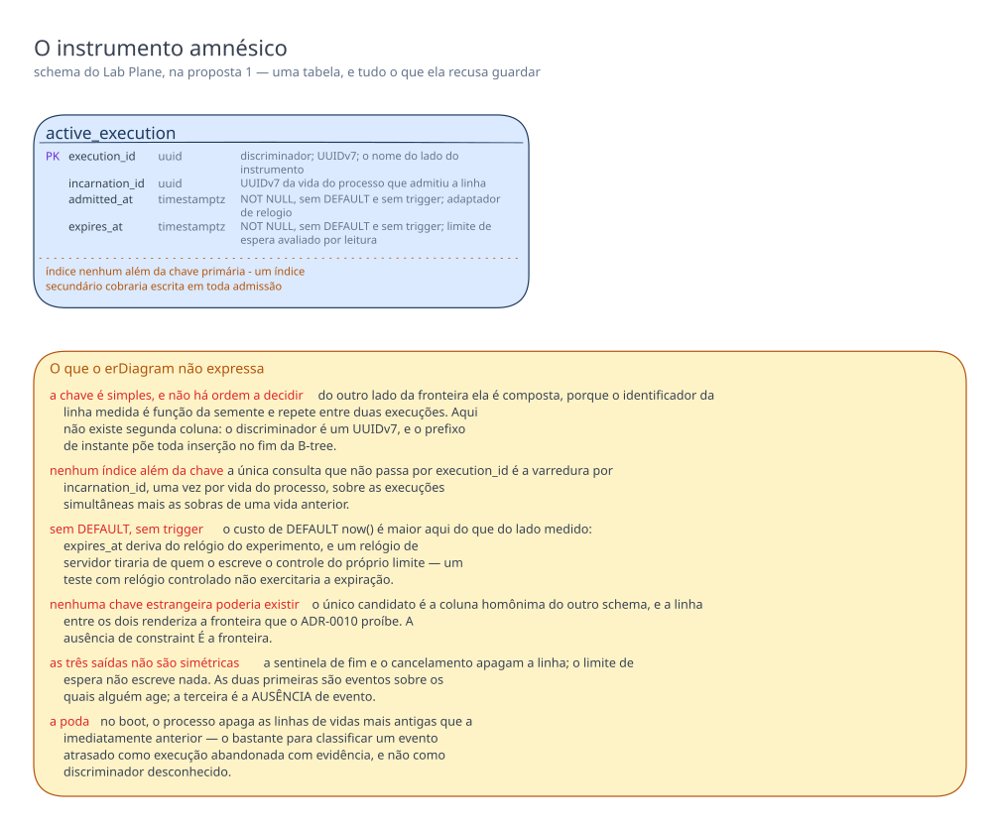

# Proposta 1 — Instrumento amnésico

**A aposta: durabilidade no instrumento é passiva, e não ativa.** O `lab_plane` persiste só
o que o consumidor de CDC precisa para responder "este discriminador está ativo?", e um
reinício no meio de uma execução a invalida por construção, em vez de tentar retomá-la. Ela
otimiza a honestidade do veredito: nenhum estado guardado aqui sobrevive ao processo e faz
um relatório parecer íntegro depois de o instrumento ter piscado.

A palavra "passiva" carrega o desenho. Durabilidade **ativa** grava para poder continuar, e
depois de uma queda lê o próprio registro de volta. Durabilidade **passiva** grava para
responder uma pergunta a terceiros: a linha existe porque outro componente precisa lê-la, e
não porque quem a escreveu pretende voltar a ela. Depois de um reinício, a primeira tenta
salvar a execução, e a segunda declara que ela morreu.

Isto é **proposta**, e não decisão. O dono da forma vigente continua sendo
[`schemas/lab-plane.md`](../../../architecture/schemas/lab-plane.md#o-schema-do-instrumento-lab_plane).

## O problema que este modelo resolve

O consumidor do broker classifica cada evento que descarta em higiene ou invalidação, e a
classificação depende de saber quais discriminadores estão ativos — `R1` a `R4` de
[higiene e invalidação](../../../features/distincao-entre-higiene-e-invalidacao/feature-card.md#regras-de-negócio). O motivo de a resposta não viver em
memória é uma frase das [negativas do ADR-0012](../../../adr/0012-o-broker-no-caminho-do-veredito-e-a-dispensa-que-ele-exigiu.md#negativas), transcrita literalmente:
"Em memória, um reinício apaga a resposta, e a execução seguinte descarta às cegas."

Responder essa pergunta é a única obrigação deste schema, e ela cabe em quatro colunas. O
problema não é preenchê-lo — é resistir a preenchê-lo demais. Semente, estratégia, calibração
e veredito são dados que **uma execução** tem, e que parecem pertencer ao serviço que a
executa; nenhum pertence a este schema. Quem já os declarou de outro dono é o
[ADR-0011](../../../adr/0011-a-topologia-de-servicos-e-o-caderno-de-laboratorio-fora-do-git.md#o-caderno-de-laboratório-sai-do-git), que pôs definição e resultado no
`lab-journal` e
[recusou por escrito o histórico de execução aqui](../../../adr/0011-a-topologia-de-servicos-e-o-caderno-de-laboratorio-fora-do-git.md#histórico-de-execução-dentro-do-lab-plane).
Uma cópia neste schema cria um segundo lugar onde o dado vive, e nada arbitra a divergência.

Há um segundo problema, e é ele que a aposta resolve. Todo dado guardado para permitir
recuperação vira a promessa de que a execução continua depois de o processo cair — promessa
difícil de cumprir e fácil de fingir. Um cursor de LSN, uma contagem parcial de commits e uma
marca de invalidação bastam para reabrir uma execução e produzir um relatório de aparência
íntegra sobre uma janela em que o instrumento esteve ausente: nela o escalonador não
escalonou, o injetor não injetou, nenhuma observação foi emitida, e o buraco não deixa
registro que o relatório pudesse citar. Esta proposta torna essa costura **inexprimível**.

## O modelo

Uma execução está ativa quando `incarnation_id` é o da vida corrente do processo **e** o
instante do adaptador de relógio ainda não alcançou `expires_at`. A vida corrente nasce no
boot e mora em memória; nenhuma escrita é necessária para uma linha deixar de valer. Nenhuma
coluna registra o que a execução mediu.

**`incarnation_id` é a coluna que faz a aposta funcionar.** Cada vida do processo gera uma
identidade nova ao subir e a mantém só em memória; admitir uma execução grava essa identidade
na linha. O predicado compara as duas, e é essa comparação — não um campo de estado, não uma
rotina de limpeza — que torna morta, no instante do boot, toda execução admitida antes da
queda. A invalidação por reinício deixa de ser um passo que alguém precisa lembrar de
executar.

Os três casos do consumidor: linha da vida corrente e dentro do prazo responde "ativa", e um
discriminador não reconhecido ali invalida a execução, como `R1` exige; linha de vida anterior
responde "não ativa", e o evento é higiene, porque não há veredito em voo para invalidar;
ausência de linha responde o mesmo, e é o caso de quem saiu pela sentinela ou pelo
cancelamento.

**`expires_at` é o limite de espera de `R7` escrito como dado, e não como evento.** A linha
não é apagada quando o prazo passa: ela só deixa de casar com o predicado. Isso tira do
desenho uma thread de expiração, uma tarefa agendada e a pergunta de o que acontece quando
essa tarefa não roda — e paga deixando linhas vencidas até a poda do boot seguinte.

A tabela abaixo é a outra metade do desenho, e é tão normativa quanto o `erDiagram`: um
modelo amnésico que não nomeasse as amnésias seria indistinguível de um incompleto.

| O que não entra no `lab_plane`                       | Onde o dado já vive                                                                                                                                                                                                                 | Por que a ausência é a decisão                                                                                                                                                                                                                                    |
|------------------------------------------------------|-------------------------------------------------------------------------------------------------------------------------------------------------------------------------------------------------------------------------------------|-------------------------------------------------------------------------------------------------------------------------------------------------------------------------------------------------------------------------------------------------------------------|
| configuração da execução e semente                   | o comando que a abre, e o caderno do `lab-journal` ([ADR-0011](../../../adr/0011-a-topologia-de-servicos-e-o-caderno-de-laboratorio-fora-do-git.md#o-caderno-de-laboratório-sai-do-git))                                            | uma cópia aqui divergiria da declarada, e o instrumento não teria como arbitrar qual das duas rodou                                                                                                                                                               |
| pontos de injeção de falha, barreiras e agendamento  | a mesma definição, em memória durante a execução ([ADR-0001, a fronteira](../../../adr/0001-o-passo-como-unidade-de-execucao.md#a-fronteira))                                                                                       | são entrada declarada antes de executar; depois de uma queda não há tentativa a retomar, e reler o agendamento não reconstrói a intercalação perdida                                                                                                              |
| log de observações, evento a evento                  | `lab-journal`, pelo buffer e pela thread de publicação ([ADR-0017](../../../adr/0017-a-persistencia-antecipada-do-log-de-observacoes-e-o-buffer-que-a-alimenta.md#o-runtime-publica-por-um-buffer-em-memória-numa-thread-separada)) | o caminho já está decidido; um segundo registro aqui duplicaria o que o consumidor grava, e somaria I/O ao mesmo PostgreSQL                                                                                                                                       |
| veredito, taxas, limite de confiança e coincidências | o relatório, no `lab-journal` ([card de execução](../../../features/execucao-de-experimento/feature-card.md#integrações-e-contratos-afetados))                                                                                      | `R6` proíbe a tabela registrar o que uma execução mediu, e o [ADR-0011](../../../adr/0011-a-topologia-de-servicos-e-o-caderno-de-laboratorio-fora-do-git.md#histórico-de-execução-dentro-do-lab-plane) já recusou o histórico aqui                                |
| calibração do denominador                            | memória da sessão do experimento ([ADR-0002](../../../adr/0002-o-dominio-minimo-e-os-dois-oraculos.md#a-calibração-do-denominador))                                                                                                 | a calibração precede a execução medida; se o processo cai entre as duas, a sessão recomeça inteira, e uma calibração salva atestaria um denominador de outra sessão                                                                                               |
| estratégia de concorrência e nível de isolamento     | a definição, e o relatório ([`R16` e `R17`](../../../features/execucao-de-experimento/feature-card.md#regras-de-negócio))                                                                                                           | o filtro não os consulta, e o nível não entra sequer na carga declarada ([ADR-0018](../../../adr/0018-cada-controle-roda-sob-o-seu-proprio-nivel.md#decisão))                                                                                                     |
| cursor de LSN e marca-d'água de contiguidade         | memória do consumidor, por execução ([ADR-0012](../../../adr/0012-o-broker-no-caminho-do-veredito-e-a-dispensa-que-ele-exigiu.md#decisão))                                                                                          | depois de um reinício nenhum veredito está em voo, e a conferência de contiguidade não teria a quem servir                                                                                                                                                        |
| contagem de descartes e marca de invalidação         | memória da execução ([`R1` e `R3`](../../../features/distincao-entre-higiene-e-invalidacao/feature-card.md#regras-de-negócio))                                                                                                      | as duas só precisam sobreviver até o veredito sair; se o processo cai antes, não há veredito a contaminar, e guardá-las esbarraria em `R6`                                                                                                                        |
| outbox do relatório para o `lab-journal`             | nenhum — a mensagem sai pelo mesmo caminho assíncrono da observação                                                                                                                                                                 | o [ADR-0017](../../../adr/0017-a-persistencia-antecipada-do-log-de-observacoes-e-o-buffer-que-a-alimenta.md#negativas) já aceitou perder o buffer quando o `lab-plane` morre; dar durabilidade só ao relatório protegeria a conclusão de uma execução já inválida |
| contador de workers ativos, e o sinal de fim         | o escalonador, em memória ([ADR-0005](../../../adr/0005-a-forma-do-escalonador.md#o-contador-de-ativos-sinaliza-o-fim-da-execução))                                                                                                 | o contador zera junto com o processo, e um valor salvo apontaria workers que não existem mais                                                                                                                                                                     |

## O que o diagrama não expressa

O `erDiagram` anota por comentário de coluna o que não tem sintaxe própria — a ausência de
`DEFAULT` e de trigger, e a origem de cada instante. O resto fica de fora, e cada ausência
abaixo é decisão, e não esquecimento.

**A chave é simples, e não há ordem de coluna a decidir.** Do outro lado da fronteira ela é
composta, e o discriminador vem primeiro porque o identificador da linha medida é função da
semente e repete entre duas execuções dela; aqui não existe segunda coluna. O discriminador é
um UUIDv7, e o prefixo de instante põe toda inserção no fim da B-tree.

**Não há índice além do da chave primária.** A única consulta que não passa por
`execution_id` é a varredura por `incarnation_id`, uma vez por vida do processo, sobre as
execuções simultâneas mais as sobras de uma vida anterior. Um índice secundário cobraria
escrita em toda admissão — imediatamente antes de a janela medida abrir — para poupá-la.

**Nenhuma coluna tem `DEFAULT`, e nenhuma trigger toca a tabela.** Os dois instantes vêm da
aplicação, pelo adaptador de relógio, pelo critério de papel do valor do
[ADR-0015](../../../adr/0015-a-chave-o-discriminador-de-execucao-e-as-colunas-de-tempo.md#as-colunas-de-tempo-e-a-fonte-do-relógio-por-papel-do-valor). O custo de
`DEFAULT now()` é maior aqui do que do lado medido: `expires_at` deriva do relógio do
experimento, e um relógio de servidor tiraria de quem o escreve o controle do próprio
limite — um teste com relógio controlado não exercitaria a expiração.

**Não há chave estrangeira, e nenhuma poderia existir.** O único candidato é a coluna homônima
do outro schema, e uma linha entre os dois renderiza a fronteira que o
[ADR-0010](../../../adr/0010-a-fronteira-de-schema-e-o-cdc-como-fonte-do-veredito.md#decisão) proíbe — motivo de os dois diagramas nunca partilharem canvas
([`schemas/README.md`](../../../architecture/schemas/README.md#a-ausência-de-linha-entre-os-dois-diagramas-é-a-decisão)). A
ausência de constraint **é** a fronteira.

**As três saídas da lista não são simétricas.** A sentinela de fim e o cancelamento apagam a
linha; o limite de espera não escreve nada. As duas primeiras são eventos sobre os quais
alguém age; a terceira é a **ausência** de evento, e transformá-la em escrita exigiria pôr no
instrumento um agente vigiando o relógio.

**A poda também não aparece.** No boot, o processo apaga as linhas de vidas mais antigas que
a imediatamente anterior — o bastante para classificar um evento atrasado de execução
abandonada com evidência, e não como discriminador desconhecido.

| O que o diagrama não expressa                      | O que este modelo decide                                                                                                                                          | Evidência                                                                                                                                                                                                              |
|----------------------------------------------------|-------------------------------------------------------------------------------------------------------------------------------------------------------------------|------------------------------------------------------------------------------------------------------------------------------------------------------------------------------------------------------------------------|
| ordem de coluna na chave                           | não há ordem a decidir: a chave é `execution_id` sozinho, e o UUIDv7 põe toda inserção no fim da B-tree, como do lado medido                                      | [`schemas/sut.md`](../../../architecture/schemas/sut.md#o-que-o-diagrama-do-sut-não-desenha)                                                                                                                           |
| índice                                             | nenhum além do da chave primária; a varredura por `incarnation_id` roda uma vez por vida do processo, sobre a lista de execuções simultâneas                      | nenhuma decisão anterior o alcança; é escolha desta proposta                                                                                                                                                           |
| ausência de `DEFAULT`                              | os dois instantes vêm da aplicação, pelo adaptador de relógio; `DEFAULT now()` usaria o relógio do servidor e tiraria do experimento o controle do próprio limite | [ADR-0015](../../../adr/0015-a-chave-o-discriminador-de-execucao-e-as-colunas-de-tempo.md#as-colunas-de-tempo-e-a-fonte-do-relógio-por-papel-do-valor)                                                                 |
| ausência de trigger                                | nenhuma trigger toca a tabela; a escrita que esquecer a coluna falha alto, e uma trigger reintroduziria o relógio do servidor por outra porta                     | [ADR-0015](../../../adr/0015-a-chave-o-discriminador-de-execucao-e-as-colunas-de-tempo.md#as-colunas-de-tempo-e-a-fonte-do-relógio-por-papel-do-valor)                                                                 |
| ausência de chave estrangeira                      | nenhuma poderia existir: o único candidato mora no outro schema, e a linha entre os dois renderiza a fronteira proibida                                           | [ADR-0010](../../../adr/0010-a-fronteira-de-schema-e-o-cdc-como-fonte-do-veredito.md#decisão) e [`schemas/README.md`](../../../architecture/schemas/README.md#a-ausência-de-linha-entre-os-dois-diagramas-é-a-decisão) |
| as três saídas da lista, e a assimetria entre elas | a sentinela de fim e o cancelamento apagam a linha; o limite de espera não escreve nada, e a linha só deixa de casar com o predicado                              | [`R7`](../../../features/distincao-entre-higiene-e-invalidacao/feature-card.md#regras-de-negócio)                                                                                                                      |
| a poda das linhas de vidas anteriores              | acontece no boot, e guarda a vida imediatamente anterior à corrente                                                                                               | nenhuma decisão anterior o alcança; é escolha desta proposta                                                                                                                                                           |

## Decisões assumidas

| O que assumi                                                                                                    | Alternativa que ficou de fora                                          | O que muda no modelo se a pessoa decidir o contrário                                                                                                                                                                                    |
|-----------------------------------------------------------------------------------------------------------------|------------------------------------------------------------------------|-----------------------------------------------------------------------------------------------------------------------------------------------------------------------------------------------------------------------------------------|
| Um reinício invalida toda execução admitida por uma vida anterior do processo.                                  | retomar a execução a partir do banco e do backlog do broker            | a tabela ganha o estado que a retomada exige — cursor de LSN, contagens parciais e marca de invalidação —, e a aposta inteira desta proposta desaparece                                                                                 |
| O comando que abre uma execução carrega a definição inteira, e o `lab-plane` nunca lê o banco do `lab-journal`. | o `lab-plane` busca a definição por identificador, no outro serviço    | entra uma coluna com o identificador da definição, e nasce uma travessia de rede que a [matriz](../../../architecture/integrations.md#matriz) não tem hoje                                                                              |
| A identidade da vida do processo é um UUIDv7 não semeado, rótulo de partição como o discriminador.              | derivar a identidade da semente, ou tirá-la de uma `SEQUENCE` do banco | derivar da semente amarra identidade de processo a experimento; a `SEQUENCE` põe no banco a geração de um valor que nenhum papel de veredito consome                                                                                    |
| O limite de espera é dado, e não evento: a linha vence por leitura, sem escrita nenhuma.                        | uma tarefa periódica que apaga a linha vencida                         | aparece escrita periódica no schema, e a expiração passa a depender de a tarefa ter rodado — um veredito passaria a depender do agendador do instrumento                                                                                |
| "Sair da lista" é deixar de casar com o predicado de atividade, e não necessariamente ter a linha apagada.      | as três saídas apagam a linha, sem exceção                             | o limite de espera precisa de um `DELETE` disparado por relógio, e o desenho perde a expiração passiva                                                                                                                                  |
| A poda guarda uma vida anterior: no boot, apaga as linhas de vidas mais antigas que a imediatamente anterior.   | apagar tudo no boot, ou nunca podar                                    | apagar tudo torna um evento atrasado indistinguível de discriminador desconhecido; nunca podar faz a tabela crescer sem teto                                                                                                            |
| Um evento cujo discriminador consta de uma vida anterior é higiene, e não invalidação.                          | invalidar, por simetria com `R1`                                       | invalidar exige um veredito em voo para invalidar, e depois de um reinício não há nenhum; a regra passaria a produzir um rótulo sem destinatário                                                                                        |
| As quatro execuções de um experimento são quatro discriminadores, e a sessão que as liga vive em memória.       | uma tabela de experimento no `lab_plane`, ligando as quatro            | nasce uma segunda tabela, e com ela a pergunta de onde a definição vive — que o [dono da forma](../../../architecture/schemas/lab-plane.md#o-que-o-diagrama-do-lab_plane-não-desenha) registra em aberto                                |
| O relatório atravessa para o `lab-journal` pelo mesmo caminho assíncrono da observação.                         | um outbox no `lab_plane`, com entrega confirmada                       | entram tabela de outbox, estado de entrega e varredura periódica — e o instrumento passa a carregar, dentro de si, o padrão que o laboratório existe para estudar                                                                       |
| A observação continua saindo pelo buffer em memória, sem espelho durável neste schema.                          | gravar a observação aqui antes de publicá-la                           | o `lab_plane` ganha a tabela de log que o [ADR-0017](../../../adr/0017-a-persistencia-antecipada-do-log-de-observacoes-e-o-buffer-que-a-alimenta.md#negativas) pôs no consumidor, e a janela medida paga escrita em banco por fronteira |
| A tabela e as colunas são nomeadas em inglês, na região de pacote do instrumento.                               | nome em português, alinhado ao glossário                               | nada estrutural muda, e o [ADR-0008](../../../adr/0008-os-dois-planos-em-processos-separados.md#decisão) precisaria ser contrariado para que mudasse                                                                                    |

## Trade-offs

- O benefício **nenhum estado do instrumento sobrevive ao processo e finge integridade** foi
  aceito em troca do custo **toda execução interrompida é perdida, inclusive a que estava a
  um evento do fim**. É o par que define a proposta.
- O benefício **a expiração do filtro não depende de tarefa agendada nem de thread viva** foi
  aceito em troca do custo **a linha vencida permanece no banco até a poda do boot seguinte**.
- O benefício **uma tabela só, e nada a sincronizar com o caderno do `lab-journal`** foi
  aceito em troca do custo **um defeito no caminho assíncrono do relatório apaga o veredito
  sem deixar rastro deste lado**.
- O benefício **o filtro responde por dado, e a resposta é a mesma para qualquer leitor** foi
  aceito em troca do custo **a resposta depende do adaptador de relógio, e um relógio
  controlado pelo experimento controla também a expiração do filtro** — o objeto de estudo
  passa a alcançar uma peça do instrumento.
- O benefício **a migração é curta, e o schema não envelhece junto com a definição de
  experimento** foi aceito em troca do custo **toda pergunta sobre o que aconteceu numa
  execução só tem resposta no outro serviço**.

## O que esta proposta NÃO decide

- **A migração que cria a tabela, e o número dela.** A `V1` continua criando só o schema.
- **Onde a definição de experimento vive.** O
  [dono da forma do `lab_plane`](../../../architecture/schemas/lab-plane.md#o-que-o-diagrama-do-lab_plane-não-desenha) registra a
  pergunta em aberto; este modelo só declara não guardar a definição aqui.
- **O contrato do comando de execução, e o formato do relatório**, sem forma em
  [`Q-INT-1`](../../../architecture/integrations.md#perguntas-em-aberto). A suposição de que o comando carrega a definição
  inteira está declarada acima, e não decide o contrato.
- **O que o `lab_journal` guarda, e com que forma.** Este modelo empurra log, veredito,
  definição e calibração para lá; se aquele schema não os acomodar, quem muda é ele.
- **O sink do RabbitMQ, e onde vive a configuração do conector de CDC**, abertos nas
  [negativas do ADR-0012](../../../adr/0012-o-broker-no-caminho-do-veredito-e-a-dispensa-que-ele-exigiu.md#negativas).
- **De onde a contagem de coincidências lê os dados, e como a contiguidade de LSN é
  conferida.** A contagem é exigida pelo
  [ADR-0004](../../../adr/0004-o-estatuto-da-barreira-e-o-diagnostico-da-nao-ocorrencia.md#a-plataforma-conta-coincidências), com a lacuna no
  [card de observação](../../../features/observacao-passo-a-passo/feature-card.md#riscos-e-decisões-pendentes), e a guarda vive no consumidor
  ([ADR-0013](../../../adr/0013-a-proveniencia-da-fonte-como-criterio-da-proibicao-do-oraculo.md#decisão)); aqui só se afirma que nenhuma das duas é persistida.
- **A retenção de longo prazo.** A poda do boot é a única regra de tamanho escrita aqui, e não
  alcança um `lab-plane` que fica meses no ar sem reiniciar.

## Perguntas que ela levanta

1. **A tabela foi escolhida contra a memória porque um reinício apagava a resposta.** Este
   modelo mantém a linha em disco e, ao mesmo tempo, declara morta a execução admitida por
   vida anterior. Se a intenção daquela escolha era que a **execução** sobrevivesse ao
   reinício, e não só a resposta do filtro, esta proposta a contraria de frente — e quem
   desfaz uma regra aprovada por pessoa é a pessoa.
2. **`R7` diz que uma execução sai da lista por exatamente três caminhos.** Este modelo lê
   "sair da lista" como deixar de casar com o predicado, e não como ter a linha apagada. As
   duas leituras produzem esquemas diferentes, e o card não separa uma da outra.
3. **O limite de espera usa o adaptador de relógio injetável.** Se ele for o mesmo
   adaptador que o experimento controla, um relógio congelado num teste impede a expiração;
   se for outro, o instrumento passa a ter dois relógios. Nenhum documento diz qual dos
   dois.
4. **Um veredito produzido e não entregue some sem rastro deste lado.** O caminho
   assíncrono já aceita perder o buffer numa queda; se essa aceitação alcança também o
   relatório, ninguém decidiu.
5. **A vida do processo não cerca uma segunda réplica.** Com duas instâncias, duas vidas se
   consideram correntes ao mesmo tempo, e o predicado responde diferente em cada uma. A
   réplica única é condição declarada, e não garantia: esta proposta depende dela, e não a
   produz.
