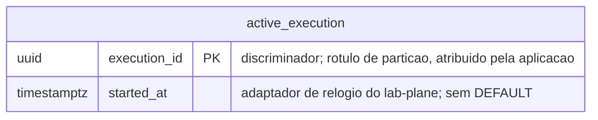

# Proposta 1 — Só a lista de execuções ativas

A aposta é guardar no `lab_plane` só o estado corrente do filtro do consumidor de CDC.
Ela otimiza a fronteira entre o instrumento e o caderno: o que o schema não sabe, ele
não contamina.

## O problema que este modelo resolve

O consumidor do broker responde uma pergunta a cada evento. Este discriminador pertence
a uma execução ativa? A resposta separa invalidação de higiene, e sem ela um descarte
silencioso esconde corrupção real
([`ADR-0012`, Decisão](../../../adr/0012-o-broker-no-caminho-do-veredito-e-a-dispensa-que-ele-exigiu.md#decisão)).
Guardar a lista em memória perde a resposta num reinício, e a execução seguinte descarta
às cegas
([`ADR-0012`, Negativas](../../../adr/0012-o-broker-no-caminho-do-veredito-e-a-dispensa-que-ele-exigiu.md#negativas)).

Duas regras aprovadas delimitam o conteúdo da tabela, em
[`distincao-entre-higiene-e-invalidacao`](../../../features/distincao-entre-higiene-e-invalidacao/feature-card.md#regras-de-negócio).
A `R4` põe a lista numa tabela do `lab_plane`. A `R6` proíbe que ela registre o que uma
execução mediu, pelo histórico que o
[`ADR-0011`](../../../adr/0011-a-topologia-de-servicos-e-o-caderno-de-laboratorio-fora-do-git.md#histórico-de-execução-dentro-do-lab-plane)
recusou manter aqui.

## O modelo

A linha existe enquanto a execução está ativa. Ela sai por um dos três caminhos da `R7`
do mesmo card — a sentinela de fim, o limite de espera ou o cancelamento pela pessoa —,
e sair é apagar a linha.

## O que o diagrama não expressa

**A chave é de uma coluna só**, e por isso não há ordem de coluna a decidir. O índice da
chave primária é o único, e basta: o filtro acessa por igualdade, uma vez por evento.
`execution_id` é o nome que o instrumento dá ao discriminador
([`ADR-0015`](../../../adr/0015-a-chave-o-discriminador-de-execucao-e-as-colunas-de-tempo.md#o-nome-assimétrico-do-discriminador-e-a-tradução-num-ponto-único)).

**Nenhuma coluna tem `DEFAULT`, e nenhum trigger existe.** `gen_random_uuid()` tiraria o
discriminador do controle de quem executa. `now()` usaria o relógio do servidor, contra
a regra de
[relógio injetável](../../../../AGENTS.md#regras-estruturais-que-valem-sempre);
`started_at` vem do adaptador do `lab-plane`.

**Nenhuma chave estrangeira existe, e nenhuma linha alcança o schema medido.** A ausência
de aresta para `resource` é a decisão, e não omissão de desenho
([`schemas/README.md`](../../../architecture/schemas/README.md#a-ausência-de-linha-entre-os-dois-diagramas-é-a-decisão)).

**Não existe coluna de estado, e não existe coluna de prazo.** Uma coluna de estado
tornaria a saída uma transição, e aqui ela é a remoção da linha. Uma coluna de prazo por
linha decidiria que o limite de espera é por execução, e o escopo dele continua
`Pergunta em aberto`
([card, Fora de escopo](../../../features/distincao-entre-higiene-e-invalidacao/feature-card.md#fora-de-escopo)).
O limite compara `started_at` com o instante que o adaptador de relógio devolve.

**A exclusão entre escritas concorrentes é a do próprio PostgreSQL**, sobre uma linha por
execução, num `lab-plane` de réplica única
([`ADR-0012`, Decisão](../../../adr/0012-o-broker-no-caminho-do-veredito-e-a-dispensa-que-ele-exigiu.md#decisão)).
O estado do escalonador não desce para cá: ele continua em memória, atrás do
`ReentrantLock` do
[`ADR-0005`](../../../adr/0005-a-forma-do-escalonador.md#o-escalonador-usa-reentrantlock-para-excluir-acesso-ao-próprio-estado).

## Trade-offs

| O que fica fácil                                                   | O que fica caro ou impossível                                                          |
|--------------------------------------------------------------------|----------------------------------------------------------------------------------------|
| a primeira migração do schema: uma tabela, duas colunas            | reconstruir, depois de um reinício, até onde o consumo do stream já tinha chegado      |
| provar que o instrumento não guarda o que mediu, pela forma        | saber **por qual** dos três caminhos uma execução saiu: a linha some sem deixar rastro |
| o caminho quente do filtro: igualdade por chave primária           | auditar um veredito invalidado, porque as contagens de descarte vivem só no relatório  |
| reverter a escolha: apagar a tabela não perde registro de execução | detectar buraco no stream depois de um reinício, sem marca-d'água de LSN persistida    |

## O que esta proposta NÃO decide

- O valor do limite de espera, e se ele é por execução ou global.
- Se cancelamento e abandono se distinguem em algum registro.
- Onde vive a definição de experimento, decisão que o
  [`schemas/lab-plane.md`](../../../architecture/schemas/lab-plane.md#o-que-o-diagrama-do-lab_plane-não-desenha)
  registra como aberta.
- Onde o `lab-plane` guarda o progresso do consumidor de CDC entre reinícios.
- O nome definitivo das duas colunas, e o das tabelas do instrumento.

## Perguntas que ela levanta

- Uma execução encerrada pelo limite de espera produz veredito? Se produzir, o rótulo
  dela não está na tabela de classificação do
  [`ADR-0004`](../../../adr/0004-o-estatuto-da-barreira-e-o-diagnostico-da-nao-ocorrencia.md#o-zero-é-classificado-e-a-classificação-tem-quatro-valores),
  que tem cinco condições e nenhuma delas nomeia abandono. `Pergunta em aberto`.
- Quem escreve a linha, e quando? A `R7` nomeia os três caminhos de saída, e nenhum
  documento nomeia o ato de entrada.
- Um reinício no meio de uma execução deixa a linha órfã. Quem a remove, e com que
  critério, se a execução que a criou já não existe?
- O consumidor precisa desduplicar por LSN antes do veredito. Com o estado dele em
  memória, um reinício reinicia a desduplicação — isso invalida a execução, ou é
  higiene?

## Por que ela não é a Proposta 2 nem a Proposta 3

Ela recusa as duas compras das outras. Persistir o progresso do consumidor faria de cada
evento uma escrita no mesmo PostgreSQL que hospeda o schema medido. Guardar a série de
transições faria crescer, por execução encerrada, o histórico que o `ADR-0011` tirou
daqui. O preço das duas recusas está na coluna direita dos trade-offs.
