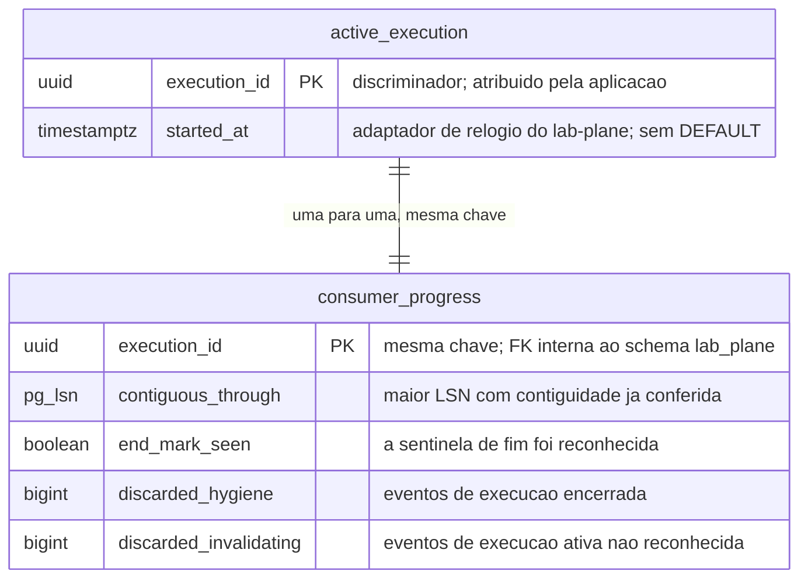

# Proposta 2 — O progresso do consumidor é durável

A aposta é que o `lab_plane` guarde, além de quem está ativo, até onde o consumo do
stream de CDC já chegou. Ela otimiza a sobrevivência do veredito a um reinício do
`lab-plane` no meio de uma execução.

## O problema que este modelo resolve

O oráculo ordena, desduplica e detecta buraco na sequência de LSN antes de calcular o
veredito
([`ADR-0012`, Decisão](../../../adr/0012-o-broker-no-caminho-do-veredito-e-a-dispensa-que-ele-exigiu.md#decisão)).
A soma do predicado exige a mesma contiguidade, sob pena de falso negativo silencioso
([`ADR-0013`](../../../adr/0013-a-proveniencia-da-fonte-como-criterio-da-proibicao-do-oraculo.md#decisão)).
O consumidor também conta todo evento que descarta, por higiene e por invalidação —
`R3` de
[`distincao-entre-higiene-e-invalidacao`](../../../features/distincao-entre-higiene-e-invalidacao/feature-card.md#regras-de-negócio).

Esse progresso vive hoje em lugar nenhum decidido. Se ele mora em memória, um reinício
apaga a marca-d'água e as duas contagens. O consumo recomeça sem saber o que já viu, e a
execução em curso produz um número que ninguém sabe estar errado.

## O modelo

O LSN chega ao `lab-plane` dentro do evento, e não do WAL: o transporte o preserva, e
quem lê a replicação lógica é o conector, em processo próprio e com o papel que tem
`REPLICATION`
([`integrations.md`](../../../architecture/integrations.md#os-papéis-do-postgresql-e-quem-tem-replication)).

## O que o diagrama não expressa

**A única chave estrangeira do desenho é interna ao `lab_plane`**, e liga as duas linhas
da mesma execução. Nenhuma aresta alcança o schema medido, e essa ausência é a decisão
([`schemas/README.md`](../../../architecture/schemas/README.md#a-ausência-de-linha-entre-os-dois-diagramas-é-a-decisão)).

**As duas tabelas partilham a chave, e por isso nenhuma delas tem chave composta.** O
índice da chave primária basta nas duas. Um índice sobre `end_mark_seen` não entra:
a cardinalidade é dois, e o filtro nunca varre por ele.

**Nenhuma coluna tem `DEFAULT`, e nenhum trigger atualiza `contiguous_through`.** Quem
avança a marca-d'água é o consumidor, no mesmo lugar em que confere a contiguidade; um
trigger poria a regra do veredito dentro do banco, fora do teste que a prova.
`started_at` vem do adaptador de relógio, e não de `now()`
([`AGENTS.md`](../../../../AGENTS.md#regras-estruturais-que-valem-sempre)).

**Os dois contadores são absolutos por execução, e não deltas.** Somar delta exigiria
saber quantas vezes o consumidor já escreveu, e um reinício perde essa conta.

**A escrita é serializada pela réplica única**, exigida no mesmo parágrafo do filtro
([`ADR-0012`, Decisão](../../../adr/0012-o-broker-no-caminho-do-veredito-e-a-dispensa-que-ele-exigiu.md#decisão)).
Com duas réplicas, as duas escreveriam a mesma linha e nenhuma saberia o que a outra
consumiu. Nada aqui usa sincronização de JVM: a exclusão é do PostgreSQL, sobre a linha.

## Trade-offs

| O que fica fácil                                                     | O que fica caro ou impossível                                                           |
|----------------------------------------------------------------------|-----------------------------------------------------------------------------------------|
| retomar o consumo depois de um reinício, sem reprocessar o stream    | uma escrita a mais no PostgreSQL por avanço de marca-d'água, durante a janela medida    |
| provar a contiguidade de LSN com evidência que sobrevive ao processo | defender a `R6` do card: as contagens de descarte são resultado, e não estado do filtro |
| pôr as duas contagens de descarte no relatório sem guardá-las em RAM | manter a tabela pequena: ela cresce por execução ativa e por evento consumido           |
| detectar buraco no stream que atravessa um reinício                  | reverter: a marca-d'água vira insumo de veredito assim que o oráculo passar a lê-la     |

## O que esta proposta NÃO decide

- Com que frequência a marca-d'água é gravada: por evento, por lote ou por intervalo.
- Se a linha de progresso sobrevive à saída da execução da lista de ativas.
- Se um buraco de LSN detectado invalida a execução ou apenas a marca como incompleta.
- O tipo da coluna do LSN, e se `pg_lsn` do PostgreSQL é o certo para um valor que chega
  por mensagem, e não por replicação.
- Onde vive a definição de experimento, que o
  [`schemas/lab-plane.md`](../../../architecture/schemas/lab-plane.md#o-que-o-diagrama-do-lab_plane-não-desenha)
  registra como aberta.

## Perguntas que ela levanta

- As duas contagens de descarte são estado corrente do filtro, ou são o que a execução
  mediu? Se forem a segunda coisa, a `R6` as proíbe aqui, e elas precisam de outro lugar.
  `Pergunta em aberto`.
- Uma escrita por evento consumido soma I/O ao mesmo PostgreSQL do sistema medido,
  durante a medição. Isso perturba o fenômeno que o E1 mede?
- Se a marca-d'água for gravada por lote, o que acontece com os eventos entre o último
  lote e a queda? Eles são reprocessados, e a desduplicação os absorve?
- O `end_mark_seen` duplica um fato que a saída da lista de ativas já registra. Duas
  fontes para o mesmo fato divergem quando uma delas falha — qual manda?

## Por que ela não é a Proposta 1 nem a Proposta 3

Ela não é a Proposta 1 porque recusa perder o progresso num reinício, e paga por isso com
escrita durante a janela medida. Não é a Proposta 3 porque guarda **estado comprimido**,
e não a série de fatos: `contiguous_through` diz onde o consumo está, e nunca como chegou
lá. Um post-mortem que pergunte por que uma execução foi invalidada não encontra resposta
aqui.
