# Proposta 3 — O livro-razão do veredito

Um veredito cujo insumo viveu só em memória é alegação, e não evidência: nesta aposta,
tudo que entra na produção dele vira linha durável no schema `lab_plane`, apensável e
nunca reescrita, e o veredito é materializado ao lado da extensão exata do livro-razão de
onde saiu — o que ela otimiza é auditabilidade e sobrevivência a queda, inclusive à queda
proposital que a etapa 6 provoca no próprio instrumento.

Isto é proposta, e não decisão. O dono da forma vigente continua sendo
[`schemas/lab-plane.md`](../../../architecture/schemas/lab-plane.md#o-schema-do-instrumento-lab_plane).

## O problema que este modelo resolve

O schema está vazio, e a única tabela decidida para ele segue sem forma escolhida
([`schemas/README.md`](../../../architecture/schemas/README.md#o-que-muda-esta-pasta)).
Enquanto isso, todo insumo do veredito viveria só em memória: `commits`, coincidências,
descartes e a soma do predicado. Um reinício no meio da execução os apaga sem sinal, e a
etapa 6 mata o `lab-plane` de propósito
([ADR-0017](../../../adr/0017-a-persistencia-antecipada-do-log-de-observacoes-e-o-buffer-que-a-alimenta.md#contexto)).
A guarda de contiguidade de LSN que o oráculo DEVE cumprir antes de somar
([ADR-0013](../../../adr/0013-a-proveniencia-da-fonte-como-criterio-da-proibicao-do-oraculo.md#decisão))
agrava o caso: ela é prova sobre um stream que ninguém guardou, logo presumida em vez de
provada. Aqui cada insumo é linha que permanece, e cada contagem é projeção dela.

## O modelo

Dez tabelas, todas em `lab_plane`. Nenhuma chave estrangeira atravessa schema, e nenhum
outro schema entra neste canvas. Os identificadores vão em inglês
([ADR-0008](../../../adr/0008-os-dois-planos-em-processos-separados.md#decisão)).

```mermaid
erDiagram
    run ||--|{ workload_role : "declara papel e cardinalidade"
    run ||--o{ schedule_constraint : "vazio fora do controle positivo"
    run ||--o{ fault_injection_point : "declara antes de executar"
    run ||--|{ run_lifecycle_event : "apensa; a lista de ativas e projecao daqui"
    run ||--o{ boundary_record : "apensa o que o instrumento decidiu"
    run ||--o{ cdc_event : "apensa depois de traduzir o discriminador"
    run ||--o{ discarded_event : "apensa todo descarte, contado"
    run ||--o| verdict : "materializa, so na execucao medida"
    run ||--o| calibration_result : "materializa, so na calibracao"
    run {
        uuid execution_id PK "UUIDv7 da aplicacao; rotulo de particao"
        uuid serves_execution_id "a medida que esta execucao serve; sem constraint"
        text experiment_ref "referencia opaca a definicao, que vive fora deste schema"
        text run_role "CALIBRATION, NEGATIVE_CONTROL, MEASURED, POSITIVE_CONTROL"
        bigint seed "declarada antes; dela derivam identidade e escalonamento"
        text strategy_label "rotulo opaco; nenhum componente ramifica por ele"
        text isolation_level "o nivel sob o qual ESTA execucao rodou"
        bigint declared_attempts "o N, escrito antes de executar"
        text resolution "HIGH ou LOW"
        text window_open_boundary "F_abre: rotulo, lado e seletor de tentativa"
        text window_close_boundary "F_fecha; nulo quando o veredito nao pode ser zero"
        timestamptz declared_at "adaptador de relogio; sem DEFAULT e sem trigger"
    }
    workload_role {
        uuid execution_id PK "1a coluna da chave"
        text role_name PK "2a coluna da chave"
        int cardinality "a soma das cardinalidades e o numero de workers"
    }
    schedule_constraint {
        uuid execution_id PK "1a coluna da chave"
        bigint constraint_ordinal PK "2a coluna; do escritor, nunca de sequence"
        text origin "DECLARED ou EXPANDED_FROM_RENDEZVOUS"
        text antecedent_role "papel, nunca indice de worker"
        text antecedent_boundary "rotulo, lado e seletor de tentativa"
        text antecedent_event "ARRIVAL ou CROSSING"
        text consequent_role "papel, nunca indice de worker"
        text consequent_boundary "rotulo, lado e seletor de tentativa"
        text consequent_event "ARRIVAL ou CROSSING"
    }
    fault_injection_point {
        uuid execution_id PK "1a coluna da chave"
        bigint point_ordinal PK "2a coluna; do escritor"
        text target_role "papel alvo"
        text boundary "rotulo, lado e seletor de tentativa"
        text fault_kind "declarado antes de executar"
    }
    run_lifecycle_event {
        uuid execution_id PK "1a coluna da chave"
        bigint ordinal PK "2a coluna; monotonico por execucao, do escritor"
        text kind "STARTED, ENDED_BY_SENTINEL, ENDED_BY_WAIT_LIMIT, ENDED_BY_CANCEL, INVALIDATED, LEDGER_RESUMED"
        text reason "nulo quando o kind basta"
        timestamptz recorded_at "adaptador de relogio; sem DEFAULT"
    }
    boundary_record {
        uuid execution_id PK "1a coluna da chave"
        bigint ordinal PK "2a coluna; monotonico por execucao, do escritor"
        text worker_role "papel do worker"
        int worker_index "posicao dentro do papel"
        int attempt_number "toda observacao carrega a tentativa"
        text kind "ATTEMPT_LAUNCHED, WINDOW_OPENED, WINDOW_CLOSED, COMMITTED, ATTEMPT_ABORTED, HELD, RELEASED, FAULT_FIRED, BUFFER_BLOCKED, WORKER_TERMINATED"
        text boundary "rotulo, lado e seletor de tentativa"
        boolean constrained "havia restricao pendente naquela fronteira"
        bigint fault_point_ordinal "so em FAULT_FIRED; sem constraint"
        text contention_key "fato reportado pelo passo, opaco ao runtime"
        timestamptz recorded_at "adaptador de relogio; sem DEFAULT"
    }
    cdc_event {
        uuid execution_id PK "1a coluna; traduzida de partition_id no consumidor"
        text lsn PK "2a coluna; do servidor, antes de qualquer transporte"
        text preceding_lsn "elo da cadeia de contiguidade; nulo quebra a prova"
        uuid observed_partition_id "como chegou, antes da traducao"
        text source_table "resource ou allocation"
        text operation "INSERT ou UPDATE"
        bigint resource_key "o id derivado da semente, como veio no evento"
        bigint value_after "so quando source_table e resource"
        bigint amount "so quando source_table e allocation"
        timestamptz received_at "adaptador de relogio; sem DEFAULT"
    }
    discarded_event {
        uuid processing_execution_id PK "1a coluna; a execucao que o consumidor processava"
        text lsn PK "2a coluna da chave"
        uuid observed_partition_id "o discriminador que veio no evento"
        text classification "HYGIENE ou INVALIDATION"
        text reason "motivo do descarte"
        timestamptz recorded_at "adaptador de relogio; sem DEFAULT"
    }
    verdict {
        uuid execution_id PK "uma linha por execucao medida"
        bigint attempts_launched "o N alcancado"
        bigint commits "passagens por AFTER_COMMIT, por tentativa"
        bigint violations "saida do oraculo exato"
        bigint coincidences "projecao das janelas; nao ha tabela de pares"
        numeric violation_rate "violations / commits"
        numeric abort_rate "(attempts_launched - commits) / attempts_launched"
        numeric zero_upper_bound_95 "so quando violations e zero"
        text zero_classification "INVALID, ILL_DECLARED_WINDOW, PROTECTED, INSUFFICIENT_EXPOSURE, SCHEDULE_NOT_FULFILLED"
        boolean predicate_holds "soma de amount menor ou igual a capacity"
        bigint predicate_sum "a soma obtida"
        text final_commit_lsn "o LSN que o oraculo esperou antes de comparar"
        bigint boundary_record_extent "o ultimo ordinal lido na derivacao"
        timestamptz materialized_at "adaptador de relogio; sem DEFAULT"
    }
    calibration_result {
        uuid execution_id PK "uma linha por calibracao"
        bigint commits "passagens por AFTER_COMMIT, por tentativa"
        bigint value_initial "lido do stream, nunca por SELECT cruzado"
        bigint value_final "lido do stream, nunca por SELECT cruzado"
        boolean matched "commits igual a value_final menos value_initial"
        timestamptz materialized_at "adaptador de relogio; sem DEFAULT"
    }
```

## O que o diagrama não expressa

- **Ordem da chave composta.** O discriminador vem sempre primeiro — `(execution_id,
  ordinal)` e `(execution_id, lsn)` —, pelo mesmo motivo do lado medido: o prefixo de
  instante do UUIDv7 põe toda inserção no fim da B-tree, e toda leitura do livro-razão é
  por execução.
- **Índice.** `erDiagram` não expressa nenhum, e dois são aditivos: `(execution_id,
  kind)` sobre `boundary_record`, porque `commits` conta um `kind` só entre dez; e
  `(processing_execution_id, classification)` sobre `discarded_event`, porque o relatório
  separa higiene de invalidação.
- **Ausência de `DEFAULT`.** Nenhuma coluna tem. Todo instante vem do adaptador de
  relógio, e `execution_id` vem da aplicação, e não de `gen_random_uuid()`: o mesmo valor
  precisa ser escrito como `partition_id` do outro lado da fronteira, e um default deste
  schema não alcança o outro.
- **Ausência de trigger.** Nenhuma linha do livro-razão é atualizada, então um trigger de
  `updated_at` não teria o que atualizar. As duas materializações nascem uma vez, depois
  do fim da execução.
- **Ausência de chave estrangeira.** `run.serves_execution_id` e
  `boundary_record.fault_point_ordinal` referenciam sem constraint, e a órfã é verificada
  em vez de impedida. O motivo aqui não é o lock na janela medida, porque o livro-razão
  escreve fora dela: é ordem de chegada. Um evento de CDC PODE chegar depois de a
  execução deixar a lista de ativas, e uma constraint recusaria exatamente a linha que
  prova a higiene.

## Decisões assumidas

| O que assumi                                                                                           | Alternativa que ficou de fora                                  | O que muda se a pessoa decidir o contrário                                                                                                                     |
| ------------------------------------------------------------------------------------------------------ | -------------------------------------------------------------- | -------------------------------------------------------------------------------------------------------------------------------------------------------------- |
| `execution_id` é UUIDv7 atribuído pela aplicação                                                       | `gen_random_uuid()` no banco, ou derivar da semente            | com geração no banco, o valor não alcança `sut.partition_id` e o consumidor perde o que traduzir; derivado da semente, duas execuções da mesma semente colidem |
| a lista de execuções ativas é projeção de `run` mais `run_lifecycle_event`                             | uma coluna `status` em `run`, atualizada a cada transição      | com `status`, a linha passa a ser reescrita, o livro-razão deixa de ser apensável, e a saída da lista some do registro                                         |
| o livro-razão guarda só a fronteira que entra no veredito                                              | persistir aqui as 900 a 1500 observações da execução           | vira segunda cópia integral do log, torna o `lab-journal` redundante e dobra o I/O que o ADR-0017 já admite                                                    |
| o persistidor drena o **mesmo** buffer em memória do ADR-0017                                          | buffer próprio, ou escrita síncrona dentro do passo            | a escrita síncrona põe I/O na janela medida; um segundo buffer dobra o que uma queda perde e faz o runtime enfileirar duas vezes                               |
| a contiguidade é provada por encadeamento, em `cdc_event.preceding_lsn`                                | aritmética sobre o LSN, ou confiança no transporte             | o LSN é deslocamento em bytes, e não sucessor; sem elo, um buraco fica indistinguível de um evento grande                                                      |
| `verdict` guarda a extensão do livro-razão que ele leu                                                 | guardar só o número do veredito                                | sem a extensão, a re-derivação não sabe se leu mais ou menos que a original, e a conferência não conclui nada                                                  |
| coincidência é projeção de `WINDOW_OPENED`/`WINDOW_CLOSED`, sem tabela de pares                        | materializar os pares coincidentes                             | o número de pares é quadrático no número de tentativas, e ele é recomputável; materializar troca prova por espaço                                              |
| o reinício apensa `LEDGER_RESUMED` a toda execução que ainda estava ativa                              | reconstruir a lista em silêncio                                | sem a marca, o buraco deixado pelo buffer perdido fica invisível, e vira o falso negativo silencioso que o repositório recusa                                  |
| o ordinal é atribuído pelo escritor, em memória                                                        | `bigserial`, ou `nextval` no `DEFAULT`                         | `nextval` é valor gerado pelo banco, e o ordinal entra na prova de completude que sustenta o veredito                                                          |
| `run` carrega o nível de isolamento e a estratégia da **própria** execução                             | um nível e uma estratégia por experimento                      | um nível por experimento não representa o controle negativo rodando sob nível diferente do medido                                                              |
| `experiment_ref` é referência opaca, sem forma e sem constraint                                        | modelar a definição de experimento aqui                        | onde a definição vive não está decidido; se ela vier para cá, `run` deixa de ser a declaração e vira a definição                                               |
| os tipos SQL do instrumento são `uuid`, `bigint`, `int`, `text`, `numeric`, `boolean` e `timestamptz`  | qualquer outro conjunto, `numeric` para contagem inclusive     | nenhum tipo deste lado foi decidido; trocar o conjunto muda o `erDiagram` e nada mais deste desenho                                                            |
| `discarded_event` guarda uma linha por descarte, e não um contador                                     | um contador por classificação, incrementado                    | o contador reescreve linha e perde o `lsn` de cada descarte, que é o que permite auditar uma invalidação depois                                                |

## Trade-offs

- Ganha-se **veredito re-derivável e contiguidade provada**; custa-se **I/O do
  instrumento no mesmo PostgreSQL do sistema medido**, a perturbação que o ADR-0017 já
  nomeia nas
  [negativas](../../../adr/0017-a-persistencia-antecipada-do-log-de-observacoes-e-o-buffer-que-a-alimenta.md#negativas).
- Ganha-se **a lista de execuções ativas sobrevivendo ao reinício**; custa-se **uma
  projeção a manter no caminho de todo evento de CDC**, que só a réplica única do
  [ADR-0012](../../../adr/0012-o-broker-no-caminho-do-veredito-e-a-dispensa-que-ele-exigiu.md#decisão)
  permite guardar em memória.
- Ganha-se **o evento auditável, com o discriminador como chegou ao lado do traduzido**,
  na tradução de ponto único do
  [ADR-0015](../../../adr/0015-a-chave-o-discriminador-de-execucao-e-as-colunas-de-tempo.md#o-nome-assimétrico-do-discriminador-e-a-tradução-num-ponto-único);
  custa-se **uma sombra dos dados do sistema medido dentro do schema do instrumento**.
- Ganha-se **nenhuma linha reescrita**; custa-se **o livro-razão crescer por tentativa, e
  nada aqui decidir quando ele é podado**.

## O que esta proposta NÃO decide

A forma do `lab_journal`, nem onde a definição de experimento vive. O formato do
relatório, nem como os formatos de veredito convivem nele. A capacidade do buffer e a
vazão da thread de publicação, que o
[ADR-0017](../../../adr/0017-a-persistencia-antecipada-do-log-de-observacoes-e-o-buffer-que-a-alimenta.md#negativas)
deixa sem número e este desenho herda. O tipo do evento de bloqueio no conjunto fechado
do [ADR-0007](../../../adr/0007-o-log-de-observacoes-forma-ordem-e-onde-vive.md#a-forma-de-um-evento):
`BUFFER_BLOCKED` é `kind` deste livro-razão, e não tipo daquele conjunto. Quando o
livro-razão é podado, e por quem. Nenhuma migração nasce desta proposta.

## Perguntas que ela levanta

**A colisão com regra aprovada por pessoa, e ela é dupla.** A `R6` de
[distinção entre higiene e invalidação](../../../features/distincao-entre-higiene-e-invalidacao/feature-card.md#regras-de-negócio)
diz que a tabela de execuções ativas NÃO DEVE registrar o que uma execução mediu. Este
desenho mantém a letra: `run` e `run_lifecycle_event` não carregam medida nenhuma, e toda
medida vive em tabelas separadas. Ele colide com o motivo que a própria regra invoca — o
[ADR-0011](../../../adr/0011-a-topologia-de-servicos-e-o-caderno-de-laboratorio-fora-do-git.md#histórico-de-execução-dentro-do-lab-plane)
descartou histórico de execução dentro do `lab-plane`, e um livro-razão do veredito é
histórico de execução dentro do `lab-plane`. Não resolvo nenhuma das duas.

**A proveniência sobrevive à transcrição?** O
[ADR-0013](../../../adr/0013-a-proveniencia-da-fonte-como-criterio-da-proibicao-do-oraculo.md#decisão)
fixou que a proibição alcança fonte produzida pelo instrumento, e que o WAL não é uma
delas. `cdc_event` é cópia do WAL escrita pelo instrumento. Se o oráculo somar dali, ele
soma de uma tabela que o instrumento escreveu, e nenhum documento diz se a proveniência
do WAL sobrevive à transcrição.

**O elo de contiguidade existe?** `preceding_lsn` pressupõe que o conector exponha o LSN
do evento imediatamente anterior. As
[negativas do ADR-0012](../../../adr/0012-o-broker-no-caminho-do-veredito-e-a-dispensa-que-ele-exigiu.md#negativas)
registram que nem a sobrevivência do próprio LSN ao transporte foi provada por teste. Se
o elo não existir, a coluna não é escrevível como desenhada.
