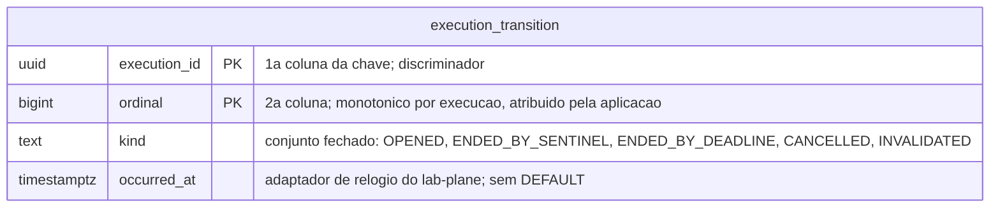

# Proposta 3 — O log de transições, e o estado derivado

A aposta é guardar fatos apensáveis do ciclo de vida de cada execução, e derivar a lista
de ativas deles. Ela otimiza a auditoria: por qual caminho uma execução saiu deixa de ser
informação perdida.

## O problema que este modelo resolve

Uma execução sai da lista de ativas por três caminhos, e por nenhum outro: a sentinela de
fim, o limite de espera e o cancelamento pela pessoa. É a `R7` de
[`distincao-entre-higiene-e-invalidacao`](../../../features/distincao-entre-higiene-e-invalidacao/feature-card.md#regras-de-negócio).
Se a saída for a remoção de uma linha, os três caminhos deixam o mesmo rastro — nenhum.
Se cancelamento e abandono se distinguem no registro é `Pergunta em aberto`
([card, Fora de escopo](../../../features/distincao-entre-higiene-e-invalidacao/feature-card.md#fora-de-escopo)),
e um desenho que apaga a linha decide essa pergunta pelo silêncio.

O mesmo vale para a invalidação. A `R1` manda invalidar a execução ativa cujo evento não
é reconhecido, e nenhuma regra diz onde esse fato fica registrado.

## O modelo

Uma execução está ativa quando existe `OPENED` para ela e não existe nenhuma transição
terminal. A lista de ativas é essa consulta, e não uma tabela.

## O que o diagrama não expressa

**A ordem da chave composta é `(execution_id, ordinal)`**, e não a inversa. O acesso do
filtro é sempre por execução, e o prefixo da chave é o que ele usa; invertida, toda
consulta varreria a árvore inteira.

**O `ordinal` não é um instante**, e sim um contador monotônico por execução, atribuído
pela aplicação. É o argumento que tirou o relógio da ordem do cursor do `lab-journal`
([`ADR-0016`](../../../adr/0016-o-streaming-e-o-replay-do-log-de-observacoes.md#o-cursor-é-campo-próprio-monotônico-por-execução)):
dois instantes na mesma resolução colidem.

**Nenhum índice além do da chave primária entra.** Perguntar "esta execução está ativa?"
é perguntar por ausência de linha terminal, e a chave sozinha responde varrendo as
transições daquela execução — poucas, por construção. Se deixarem de ser poucas, a
resposta pede uma tabela materializada, que traz de volta o estado corrente recusado
aqui.

**`kind` é um conjunto fechado**, e acrescentar um valor é decisão nova — a mesma forma
do conjunto fechado de tipos do log de observações
([`ADR-0007`](../../../adr/0007-o-log-de-observacoes-forma-ordem-e-onde-vive.md#a-forma-de-um-evento)).

**Nenhuma linha é atualizada, e nenhuma é apagada.** Sem `UPDATE` no caminho quente, duas
escritas nunca disputam a mesma linha. Nenhuma coluna tem `DEFAULT`, e nenhum trigger
existe: `occurred_at` vem do adaptador de relógio, nunca de `now()`
([`AGENTS.md`](../../../../AGENTS.md#regras-estruturais-que-valem-sempre)).

**Nenhuma chave estrangeira sai deste schema**, e a ausência de aresta para o sistema
medido é a decisão
([`schemas/README.md`](../../../architecture/schemas/README.md#a-ausência-de-linha-entre-os-dois-diagramas-é-a-decisão)).

## Trade-offs

| O que fica fácil                                                | O que fica caro ou impossível                                             |
|-----------------------------------------------------------------|---------------------------------------------------------------------------|
| distinguir os três caminhos de saída, sem coluna nova           | defender a `R6`: a tabela cresce por execução encerrada, e vira histórico |
| auditar por que um veredito foi invalidado, e quando            | responder "está ativa?" por lookup: a resposta é derivação, e não linha   |
| escrever sem `UPDATE`, e sem disputa de linha no caminho quente | podar: sem política de retenção, o schema do instrumento cresce sem teto  |
| acrescentar um caminho de saída novo: entra um valor de `kind`  | manter `kind` fechado, porque cada valor novo é decisão arquitetural      |

## O que esta proposta NÃO decide

- A política de retenção das transições, nem quem as remove.
- Se a lista de ativas ganha, depois, uma tabela materializada ao lado do log.
- O valor do limite de espera, e se ele é por execução ou global.
- Onde vive o progresso do consumidor de CDC entre reinícios: este desenho o deixa fora.
- Onde vive a definição de experimento, que o
  [`schemas/lab-plane.md`](../../../architecture/schemas/lab-plane.md#o-que-o-diagrama-do-lab_plane-não-desenha)
  registra como aberta.

## Perguntas que ela levanta

- Um log de transições por execução é o histórico que o
  [`ADR-0011`](../../../adr/0011-a-topologia-de-servicos-e-o-caderno-de-laboratorio-fora-do-git.md#histórico-de-execução-dentro-do-lab-plane)
  recusou pôr no `lab-plane`, ou é estado operacional do filtro? A `R6` do card depende
  da resposta, e ela não está escrita em documento nenhum. `Pergunta em aberto`.
- `INVALIDATED` é transição terminal? Se for, a execução sai da lista por um quarto
  caminho, e a `R7` diz que os caminhos são três e nenhum outro.
- O `ordinal` é atribuído pela aplicação, num processo de réplica única. Se a réplica
  única cair como garantia, dois processos atribuem o mesmo ordinal — o que acontece?
- Quem lê este log, além do próprio filtro? Se o relatório o ler, ele atravessa para o
  `lab-journal`, e nenhum contrato formaliza essa travessia.

## Por que ela não é a Proposta 1 nem a Proposta 2

Ela recusa que a saída seja um `DELETE` sem rastro, como na Proposta 1: o motivo da saída
é o que ela existe para guardar. E não persiste progresso de consumo, como a Proposta 2 —
a marca-d'água de LSN fica em memória, e um reinício a perde. Ela troca a recuperação pela
explicação; a Proposta 2 faz o inverso.
