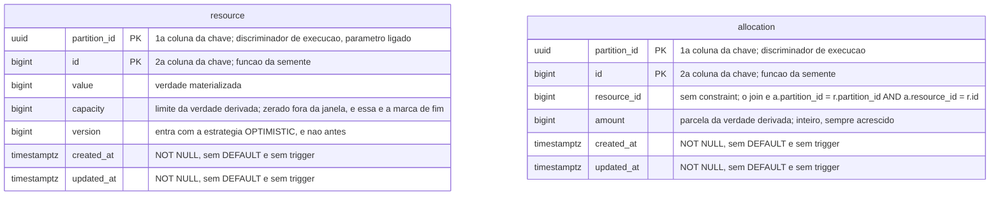

# Proposta 1 — o domínio nu, e o instrumento paga

**A aposta:** o schema `sut` carrega as duas entidades medidas e nada que exista para
facilitar a medição, e todo custo de observar recai sobre o instrumento. Ela otimiza a
fidelidade à regra pedagógica e à premissa de que o sistema medido é indistinguível de um
sistema de produção ingênuo.

Isto é **proposta**, e não decisão. O dono da forma vigente continua sendo
[`schemas/sut.md`](../../../architecture/schemas/sut.md#o-schema-do-sistema-medido-sut).

## O problema que este modelo resolve

O oráculo NÃO DEVE consultar o schema medido: ele lê o WAL por replicação lógica, pelo
[ADR-0010](../../../adr/0010-a-fronteira-de-schema-e-o-cdc-como-fonte-do-veredito.md#decisão).
Quem desenha estas tabelas decide, por isso, quais vereditos podem existir — o que o
`INSERT` e o `UPDATE` não puserem no WAL, nenhuma consulta recupera depois. A tentação é
pôr no sistema medido a estrutura que barateia o oráculo: a soma corrente numa coluna, uma
tabela de marca, um contador de tentativas. Cada uma ensina a solução antes do problema.
Este modelo recusa todas.

## O modelo

Um canvas, um schema. O do instrumento não aparece aqui, e a ausência de linha entre os
dois é a decisão, em
[`schemas/README.md`](../../../architecture/schemas/README.md#a-ausência-de-linha-entre-os-dois-diagramas-é-a-decisão).

## O que o diagrama não expressa

**A ordem da chave composta.** `(partition_id, id)`, discriminador primeiro, nas duas
tabelas. O `erDiagram` marca `PK` sem dizer a ordem, e é ela que torna todo evento do WAL
atribuível a uma execução sem consultar mais nada.

**O índice, e a ausência dos outros.** Um só, `(partition_id, resource_id)` sobre
`allocation`, com o plano efetivo do braço `SERIALIZABLE` publicado no relatório, pelo
[ADR-0015](../../../adr/0015-a-chave-o-discriminador-de-execucao-e-as-colunas-de-tempo.md#sem-chave-estrangeira-em-allocationresource_id).
Nenhum índice sobre `updated_at`, e nenhum desenhado para o oráculo: ele não consulta.

**A ausência de `DEFAULT` e de trigger.** Nenhuma coluna recebe valor do banco.
`created_at` e `updated_at` vêm do adaptador de relógio, pelo
[ADR-0015](../../../adr/0015-a-chave-o-discriminador-de-execucao-e-as-colunas-de-tempo.md#as-colunas-de-tempo-e-a-fonte-do-relógio-por-papel-do-valor);
`id` não vem de `SERIAL` nem de `nextval`, pelo
[ADR-0002](../../../adr/0002-o-dominio-minimo-e-os-dois-oraculos.md#a-identidade-das-entidades-é-atribuída-pela-aplicação);
`partition_id` não vem de `gen_random_uuid()`.

**A ausência de chave estrangeira, de `CHECK` e de `UNIQUE`.** `allocation.resource_id`
não referencia `resource.id`, pelo
[ADR-0015](../../../adr/0015-a-chave-o-discriminador-de-execucao-e-as-colunas-de-tempo.md#sem-chave-estrangeira-em-allocationresource_id);
nada limita `amount`, e nada limita quantos recursos uma execução tem. Verificação no
banco recusaria a anomalia em vez de exibi-la, que é a alternativa D do
[ADR-0002](../../../adr/0002-o-dominio-minimo-e-os-dois-oraculos.md#o-oráculo-do-predicado).

**A ausência de `REPLICA IDENTITY` declarada e de `PUBLICATION` na migração.** As duas
tabelas ficam no padrão, que é a chave primária; como o discriminador está dentro dela,
todo evento é atribuível sem `FULL`. A publicação pertence ao papel de replicação, e é
provisionada junto do conector, que roda em processo próprio, pela
[matriz](../../../architecture/integrations.md#matriz).

## O que o WAL destas duas tabelas dá ao oráculo

| Evento no WAL                             | O que o oráculo extrai                                       | Evidência                                                                                                                                          |
|-------------------------------------------|--------------------------------------------------------------|----------------------------------------------------------------------------------------------------------------------------------------------------|
| `INSERT` de `resource`, fora da janela    | `value_initial`, a `capacity` declarada, e a partição existe | [ADR-0010](../../../adr/0010-a-fronteira-de-schema-e-o-cdc-como-fonte-do-veredito.md#decisão)                                                      |
| `UPDATE` de `resource.value`              | a série inteira de valores; o último é `value_final`         | [ADR-0010](../../../adr/0010-a-fronteira-de-schema-e-o-cdc-como-fonte-do-veredito.md#decisão)                                                      |
| `INSERT` de `allocation`                  | `Σ amount`, somado sob a guarda de contiguidade de LSN       | [ADR-0013](../../../adr/0013-a-proveniencia-da-fonte-como-criterio-da-proibicao-do-oraculo.md#decisão)                                             |
| `UPDATE` de `resource.capacity` para zero | a marca de fim, e com ela a condição de término da soma      | [ADR-0015](../../../adr/0015-a-chave-o-discriminador-de-execucao-e-as-colunas-de-tempo.md#a-janela-medida-não-se-correlaciona-ao-stream-por-tempo) |
| `UPDATE` de `resource.version`            | nada que entre em veredito                                   | [ADR-0006](../../../adr/0006-a-forma-da-estrategia-de-concorrencia.md#decisão)                                                                     |

Os dois oráculos ficam calculáveis inteiros, e `commits` continua vindo da fronteira
`AFTER_COMMIT`, e não daqui
([ADR-0002](../../../adr/0002-o-dominio-minimo-e-os-dois-oraculos.md#o-oráculo-exato)). Um
ganho vem de graça: o WAL é história, e não retrato, e a violação que aparece no meio da
execução aparece no stream — a invisibilidade que o
[ADR-0002](../../../adr/0002-o-dominio-minimo-e-os-dois-oraculos.md#negativas) nomeia vira
propriedade da fórmula, e não da fonte.

## O que o WAL destas duas tabelas não dá

| O que falta                                  | Por que o schema não repõe                                                                                                       |
|----------------------------------------------|----------------------------------------------------------------------------------------------------------------------------------|
| qual worker escreveu cada evento             | não há coluna de autor; a atribuição vem da timeline, que NÃO DEVE alimentar veredito                                            |
| tentativa abortada, deadlock, `40001`        | transação que não commita não entra no WAL; a curva do E4 é contada no runtime                                                   |
| `commits − successes`, o dual write          | os dois números são do instrumento — [ADR-0009](../../../adr/0009-a-classificacao-do-dual-write-e-a-regiao-de-pacote.md#decisão) |
| leitura defasada, stale read, projeção velha | leitura não escreve, e não há segunda representação do estado no núcleo                                                          |
| a duração de cada passo                      | `updated_at` marca a escrita, e nenhuma estratégia a lê como token                                                               |

O mesmo, por grupo da taxonomia do laboratório. Os grupos são classificados pela causa,
e não pela tecnologia: é a fonte de não determinismo que determina o que a plataforma
precisa saber controlar. A tabela abaixo traz os seis, e por isso não aponta para fora.

| Grupo               | O que estas duas tabelas sustentam                     | Onde nasce a estrutura que falta                            |
|---------------------|--------------------------------------------------------|-------------------------------------------------------------|
| A — intercalação    | E1, E2, E3 e E5 por inteiro; `version` entra com o E3  | nada falta                                                  |
| B — entrega         | nada; o fenômeno vive no canal                         | no broker, nunca no schema                                  |
| C — escrita parcial | o dual write, pelo par de contagens do instrumento     | outbox, inbox e chave de deduplicação, na migração da etapa |
| D — saturação       | nada; não existe estado errado a ler                   | na medida de fila e de latência, fora do banco              |
| E — posse no tempo  | nada; não há dono nem prazo em coluna                  | lease e fencing token, na migração da etapa 11              |
| transversal         | a partição, que separa duas execuções da mesma semente | no log de observações e no replay                           |

A linha do grupo C é a que mais custa, e é deliberada: o experimento em que commit e
publicação são independentes vem antes de existir tabela de outbox.

## Decisões assumidas

| O que assumi                                                                                                                                 | Alternativa que ficou de fora                                               | O que muda se a pessoa decidir o contrário                                                                                                                                                                                                                                                     |
|----------------------------------------------------------------------------------------------------------------------------------------------|-----------------------------------------------------------------------------|------------------------------------------------------------------------------------------------------------------------------------------------------------------------------------------------------------------------------------------------------------------------------------------------|
| `version` entra em `resource`, `bigint NOT NULL`, escrita pela aplicação, introduzida pelo ADR de estratégias de concorrência                | `version` também em `allocation`, ou `updated_at` lido como token de versão | uma coluna a mais em `allocation`; ler `updated_at` é proibido pelo [ADR-0015](../../../adr/0015-a-chave-o-discriminador-de-execucao-e-as-colunas-de-tempo.md#as-colunas-de-tempo-e-a-fonte-do-relógio-por-papel-do-valor)                                                                     |
| a marca de fim é `capacity = 0`, escrita pelo sistema medido depois da quiescência                                                           | tabela própria de marca, coluna `closed`, ou `DELETE` da linha do recurso   | tabela ou coluna própria põem no schema estrutura que só a medição usa, e a aposta cai; o `DELETE` deixa toda alocação órfã                                                                                                                                                                    |
| o oráculo lê `capacity` do `INSERT` de seeding, e nunca do último evento                                                                     | comparar `Σ amount` contra a capacidade corrente                            | com a corrente, toda execução fechada acusa violação — falha alta, e errada                                                                                                                                                                                                                    |
| o `INSERT` do estado inicial é escrito pelo sistema medido, a comando do instrumento, fora da janela                                         | o instrumento inserir direto no schema `sut`                                | o instrumento escrevendo ali quebra a fronteira do [ADR-0010](../../../adr/0010-a-fronteira-de-schema-e-o-cdc-como-fonte-do-veredito.md#decisão)                                                                                                                                               |
| `partition_id` chega como parâmetro ligado, produzido no instrumento                                                                         | `DEFAULT gen_random_uuid()`                                                 | o valor passa a nascer no banco, e o prefixo ordenado do UUIDv7 se perde junto                                                                                                                                                                                                                 |
| nenhum `UNIQUE (partition_id)`: quantos recursos a execução tem é declaração dela                                                            | um recurso por execução, imposto pelo schema                                | o experimento com dois recursos deixa de ser representável sem migração                                                                                                                                                                                                                        |
| a órfã de `allocation.resource_id` é verificada no stream: alocação cujo `resource_id` não teve `INSERT` de recurso antes, na mesma partição | verificar por consulta ao fim, ou repor a chave estrangeira                 | a consulta é proibida pelo [ADR-0010](../../../adr/0010-a-fronteira-de-schema-e-o-cdc-como-fonte-do-veredito.md#decisão), e a chave estrangeira pelo [ADR-0015](../../../adr/0015-a-chave-o-discriminador-de-execucao-e-as-colunas-de-tempo.md#sem-chave-estrangeira-em-allocationresource_id) |
| um único índice, `(partition_id, resource_id)` em `allocation`                                                                               | índice sobre `updated_at`, ou índice para a consulta de confirmação         | qualquer índice a mais muda o plano do braço `SERIALIZABLE`, que vai publicado no relatório                                                                                                                                                                                                    |
| `REPLICA IDENTITY` fica no padrão                                                                                                            | `FULL` nas duas tabelas                                                     | `FULL` é `ALTER TABLE` numa tabela medida por causa da medição, e multiplica o volume de WAL                                                                                                                                                                                                   |
| a `PUBLICATION` não entra na migração do `sut`                                                                                               | declará-la junto das tabelas                                                | o serviço medido passa a declarar, no próprio versionamento, que é medido                                                                                                                                                                                                                      |
| nenhuma tabela de outbox, deduplicação ou lease no núcleo; cada uma nasce na migração do experimento que a estuda                            | núcleo permanente já com as três                                            | a regra pedagógica cai, e o schema entrega a solução antes do problema                                                                                                                                                                                                                         |
| `amount` é inteiro e sempre acrescido, sem `CHECK` e sem coluna de estado                                                                    | `CHECK (amount > 0)`, ou `released_at` para a liberação                     | o `CHECK` recusa a anomalia em vez de exibi-la; a liberação vira experimento com migração própria                                                                                                                                                                                              |

A forma da marca de fim não tem decisão registrada, e a linha que declara isso vive só na
fila de decisões. Transcrição literal dela, que esta proposta não cita por identificador
nem por link: "A forma da marca — tabela própria, coluna em tabela existente, ou outra —
não foi escolhida, nem quem a emite dentro do sistema medido. O que ficou fixado é que ela
é escrita **pelo sistema medido**, fora da janela medida". A escolha por `capacity = 0` é
minha, e é a única que não acrescenta estrutura.

## Trade-offs

| O benefício aceito                                            | O custo que veio junto                                                                 |
|---------------------------------------------------------------|----------------------------------------------------------------------------------------|
| o sistema medido é indistinguível de um sistema ingênuo       | o oráculo reconstrói tudo do WAL cru, e cada fenômeno novo custa código no instrumento |
| a regra pedagógica sobrevive item por item do briefing        | grupos inteiros ficam sem sustentação no estado, e o veredito deles vem de outro lugar |
| a marca de fim não custa coluna nem tabela                    | o sistema medido faz uma escrita cujo propósito é ser reconhecida — a única concessão  |
| o índice único mantém o plano do `SERIALIZABLE` interpretável | nenhuma consulta de depuração é barata, e nenhuma é para ser feita                     |
| a migração do núcleo nunca muda por causa de um experimento   | o schema medido vira a soma de muitas migrações de experimento                         |

## O que esta proposta NÃO decide

Quem apaga as linhas de uma execução encerrada, e quando. A função que deriva `id` da
semente. O limite de espera do stream. O nível de isolamento de cada braço. A composição
dos formatos de veredito, que o
[ADR-0002](../../../adr/0002-o-dominio-minimo-e-os-dois-oraculos.md#o-que-este-adr-não-decide)
já declara não decidir. E a forma do schema do instrumento, com dono próprio em
[`schemas/README.md`](../../../architecture/schemas/README.md#o-que-muda-esta-pasta).

## Perguntas que ela levanta

**A contiguidade de LSN é verificável sobre um stream filtrado?** O LSN é deslocamento em
bytes no WAL do cluster, e o banco da entrega é compartilhado
([matriz](../../../architecture/integrations.md#matriz)). Salto legítimo e buraco ficam
indistinguíveis sem um critério que o
[ADR-0013](../../../adr/0013-a-proveniencia-da-fonte-como-criterio-da-proibicao-do-oraculo.md#decisão)
não dá.

**Um evento de `UPDATE` carrega a coluna que não mudou, sob `REPLICA IDENTITY` padrão?** A
marca de fim depende de o evento trazer `capacity` quando só `value` mudou. Se não trouxer,
ela exige `FULL` — `ALTER TABLE` numa tabela medida por causa da medição.

**Transação transmitida em progresso, e abortada depois, chega ao consumidor?** A
decodificação lógica sabe transmitir transação grande antes do commit. Se a opção estiver
ligada em qualquer ponto do transporte, o oráculo PODE somar um `INSERT` que o banco
desfez.
