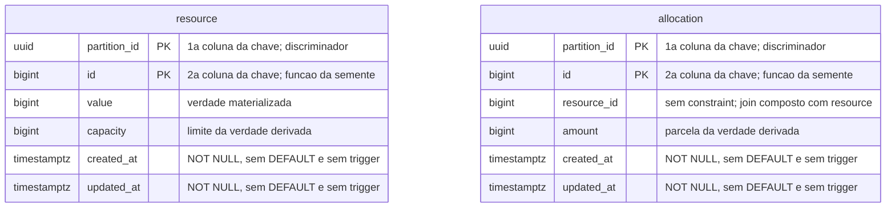

# Proposta 1 — O domínio nu

A aposta central é que o schema `sut` não ganha nada além do que os ADRs aceitos já
fixaram, e que todo mecanismo faltante é pago fora dele; ela otimiza a distância entre o
sistema medido e o instrumento que o mede.

Esta é uma proposta, e não uma decisão. O dono da forma vigente continua sendo
[`schemas/sut.md`](../../../architecture/schemas/sut.md#o-schema-do-sistema-medido-sut),
e nada aqui o altera.

## O problema que este modelo resolve

O sistema medido é o suspeito. Toda coluna que existe para facilitar a medição muda o que
está sendo medido. O risco é concreto e já foi pago uma vez: `updated_at` é metadado de
auditoria, e lê-la seria optimistic locking escrito sem a palavra
([ADR-0015, As colunas de tempo](../../../adr/0015-a-chave-o-discriminador-de-execucao-e-as-colunas-de-tempo.md#as-colunas-de-tempo-e-a-fonte-do-relógio-por-papel-do-valor)).

Esta proposta resolve isso pela recusa. Nenhuma tabela, coluna, constraint ou trigger
entra no schema `sut` por conveniência do oráculo. O que o oráculo precisar e não achar,
ele obtém do WAL, do endpoint de confirmação ou de código próprio.

## O modelo

## O que o diagrama não expressa

**A ordem da chave composta é `(partition_id, id)`, e o discriminador vem primeiro.** O
`erDiagram` marca as duas colunas como `PK` e não diz qual precede a outra; a ordem decide
qual prefixo da B-tree serve as leituras.

**Não há chave estrangeira em `allocation.resource_id`**, pelo
[ADR-0015](../../../adr/0015-a-chave-o-discriminador-de-execucao-e-as-colunas-de-tempo.md#sem-chave-estrangeira-em-allocationresource_id).
O que a substitui é o join por duas colunas, `a.partition_id = r.partition_id AND
a.resource_id = r.id`. Sem as duas, a consulta cruza execuções.

**Há um índice aditivo `(partition_id, resource_id)` sobre `allocation`**, e o `erDiagram`
não expressa índice nenhum. Ele é a diferença entre o `40001` do `SERIALIZABLE` vir do
predicate lock ou da varredura sequencial.

**Nenhuma das quatro colunas de tempo tem `DEFAULT`, e nenhuma tabela tem trigger.** A
escrita que esquecer a coluna falha alto, e o valor vem do adaptador de relógio.

**Nenhuma coluna de identidade é gerada pelo banco**: sem `SERIAL`, `IDENTITY`, `nextval`
nem `gen_random_uuid()`, pelo
[ADR-0002](../../../adr/0002-o-dominio-minimo-e-os-dois-oraculos.md#a-identidade-das-entidades-é-atribuída-pela-aplicação).

**Não existe `version`**, e esta proposta não a antecipa. Ela entra quando `OPTIMISTIC`
nascer, junto da política que a lê
([ADR-0006, Decisão](../../../adr/0006-a-forma-da-estrategia-de-concorrencia.md#decisão)).

**Não existe tabela, coluna nem visão que sirva ao oráculo.** Essa ausência é a proposta
inteira, e é a única que nenhum desenho consegue mostrar.

## Trade-offs

| O que fica fácil                                                      | O que fica caro ou impossível                                                                    |
|-----------------------------------------------------------------------|--------------------------------------------------------------------------------------------------|
| provar que o esquema não sabe que está sendo medido                   | o oráculo não tem condição de término escrita no schema, e a soma do predicado depende de acordo |
| escrever a migração hoje: nada aqui está em aberto além do que já era | a órfã de `allocation` continua sem lugar de verificação                                         |
| trocar o transporte de CDC sem tocar em tabela nenhuma                | toda pergunta nova do oráculo vira código do instrumento, e não coluna                           |
| a regra pedagógica fica visível na ausência, e não numa nota          | o consolidado que o endpoint de confirmação devolve precisa ser recalculado a cada consulta      |

## O que esta proposta NÃO decide

Onde a órfã de `allocation.resource_id` é verificada. Onde vive a marca de fim que o
oráculo do predicado reconhece
([card da proteção inerte](../../../features/deteccao-de-protecao-inerte/feature-card.md#regras-de-negócio)).
Quem escreve o estado inicial de cada execução, e quem limpa as linhas da execução
anterior. Que colunas `OPTIMISTIC` acrescenta. A forma do endpoint de confirmação
([card de divergência entre fontes](../../../features/deteccao-de-divergencia-entre-fontes/feature-card.md#regras-de-negócio)).

## Por que ela não é a Proposta 2 nem a Proposta 3

A Proposta 2 trata a emissão do WAL como parte do modelo, e escolhe o que cada evento
carrega. Esta trata o WAL como consequência, e aceita o que o padrão do PostgreSQL
entregar. A Proposta 3 põe a marca de fim numa terceira tabela do próprio schema medido;
esta a recusa pelo mesmo motivo que recusa qualquer outra coluna de conveniência.

## Perguntas que ela levanta

- **Pergunta em aberto.** Sem marca de fim no schema, o que dá condição de término à soma
  do oráculo do predicado? O card exige a marca, e esta proposta não a coloca em lugar
  nenhum.
- **Pergunta em aberto.** O consolidado por recurso do endpoint de confirmação exige
  contar órfãs. Sem chave estrangeira e sem tabela auxiliar, essa contagem é um `SELECT`
  do próprio sistema medido, e o custo dela dentro de uma execução grande não foi medido.
- **Pergunta em aberto.** Duas execuções da mesma semente não colidem mais, e ninguém
  apaga a partição antiga. Quantas execuções cabem antes de o índice deixar de ajudar não
  foi apurado.
