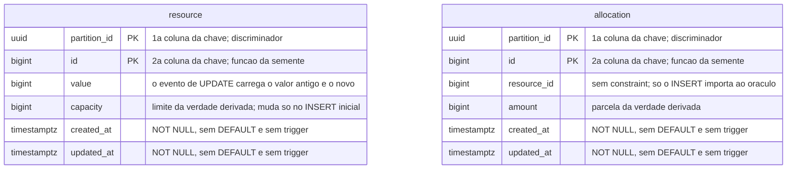

# Proposta 2 — O WAL como esquema do oráculo

A aposta central é que o modelo de dados do sistema medido não termina na tabela: ele
termina no evento que a tabela emite, e é ali — na identidade de replicação e no escopo da
publicação — que se escolhe o que o oráculo consegue calcular. Ela otimiza o poder de
diagnóstico do instrumento sem acrescentar uma coluna sequer.

Proposta, e não decisão. O dono da forma vigente continua sendo
[`schemas/sut.md`](../../../architecture/schemas/sut.md#o-schema-do-sistema-medido-sut).

## O problema que este modelo resolve

O oráculo **NÃO DEVE** fazer `SELECT` neste schema; ele lê o WAL por replicação lógica
([ADR-0010, Decisão](../../../adr/0010-a-fronteira-de-schema-e-o-cdc-como-fonte-do-veredito.md#decisão)).
Daí decorre uma consequência que nenhum documento vigente trata como decisão: o que o
oráculo enxerga não é a tabela, é o **evento**. Uma coluna que existe e não é emitida não
existe para ele.

O veredito exato é a diferença entre dois extremos, e a anomalia intermediária não deixa
rastro: duas escritas que leram o mesmo `value` e gravaram o mesmo resultado são
indistinguíveis, no stream, de uma só. Esta proposta as separa emitindo, em cada `UPDATE`
de `resource`, também o valor anterior da linha.

## O modelo

## O que o diagrama não expressa

**A decisão inteira desta proposta é invisível acima, e isso é o argumento.** A forma das
duas tabelas é a da Proposta 1, item por item: chave, índice aditivo, ausência de chave
estrangeira, de `DEFAULT`, de trigger, de identidade gerada pelo banco e de `version`.

**`resource` publica a linha antiga por inteiro em cada `UPDATE`, e `allocation` não.** O
oráculo do contador precisa de recência, e o do predicado precisa de completude
([ADR-0013, Decisão](../../../adr/0013-a-proveniencia-da-fonte-como-criterio-da-proibicao-do-oraculo.md#decisão));
só o primeiro ganha alguma coisa com o valor anterior, e pagar por ele nas duas tabelas
seria custo sem uso.

**A publicação nomeia as duas tabelas, e nenhuma outra.** Uma publicação por schema
inteiro incluiria, sem aviso, qualquer tabela nova — e a Proposta 3 acrescenta uma.

**O valor anterior não é coluna, e por isso nenhuma estratégia de concorrência pode
lê-lo.** É a diferença entre esta proposta e acrescentar `version`: o instrumento ganha o
sinal, o sistema medido não. A regra pedagógica continua de pé
([ADR-0002, Decisão](../../../adr/0002-o-dominio-minimo-e-os-dois-oraculos.md#decisão)).

**O veredito não muda.** `perdidas = commits − (value_final − value_inicial)` continua
sendo a fórmula
([ADR-0002, O oráculo exato](../../../adr/0002-o-dominio-minimo-e-os-dois-oraculos.md#o-oráculo-exato)).
O que o valor anterior produz é diagnóstico, e não um segundo número de veredito.

## Trade-offs

| O que fica fácil                                                    | O que fica caro ou impossível                                                          |
|---------------------------------------------------------------------|----------------------------------------------------------------------------------------|
| apontar **qual** par de escritas se sobrescreveu, e não só quantas  | o WAL de `resource` cresce, e ele é escrito dentro da transação que o experimento mede |
| a timeline ganha o valor lido por cada escrita, sem coluna nova     | o instrumento passa a depender de uma propriedade de emissão que nenhum ADR fixa       |
| provar por evidência independente que `PESSIMISTIC` não sobrescreve | o custo de emissão difere entre as estratégias comparadas, e ninguém o mediu           |
| trocar a fonte do diagnóstico sem migração de tabela                | a configuração vira parte do modelo, e some de qualquer `erDiagram`                    |

## O que esta proposta NÃO decide

Onde a configuração de replicação é declarada: migração do serviço medido, provisionamento
do banco, ou o conector. O lugar da configuração do conector já é
[`Pergunta em aberto`](../../../architecture/integrations.md#fonte-decidida-fonte-implementada-e-fonte-configurada-são-três-coisas-separadas).
Se o valor anterior vira regra de um Feature Card ou permanece ferramenta de
investigação. Onde a órfã é verificada
([ADR-0015](../../../adr/0015-a-chave-o-discriminador-de-execucao-e-as-colunas-de-tempo.md#sem-chave-estrangeira-em-allocationresource_id)).

## Por que ela não é a Proposta 1 nem a Proposta 3

A Proposta 1 aceita o que a emissão padrão entregar e paga cada lacuna em código do
instrumento. Esta escolhe a emissão, e a trata como parte do modelo. A Proposta 3 resolve
a lacuna do término da soma pondo uma tabela nova no schema medido; esta não toca no
conjunto de tabelas, e deixa aquela lacuna aberta.

## Perguntas que ela levanta

- **Pergunta em aberto.** Esta proposta assume que a replicação lógica do PostgreSQL emite
  a linha antiga de um `UPDATE` apenas quando a tabela é configurada para isso, e só as
  colunas da chave em caso contrário. Nenhum documento deste repositório fixa esse
  comportamento, e ele precisa ser confirmado contra a versão em uso antes de a proposta
  ser aceita.
- **Pergunta em aberto.** Emitir mais dentro da janela medida é efeito de observação. O
  quanto isso desloca o número que o E1 publica não foi medido, e a calibração
  ([ADR-0002](../../../adr/0002-o-dominio-minimo-e-os-dois-oraculos.md#a-calibração-do-denominador))
  compara `commits` com a diferença de `value`, e não custos de emissão.
- **Pergunta em aberto.** Um diagnóstico derivado do stream que contradiga a fórmula do
  veredito é decisão arquitetural nova, e não detalhe de implementação. Qual dos dois
  prevalece, se divergirem, ninguém decidiu.
