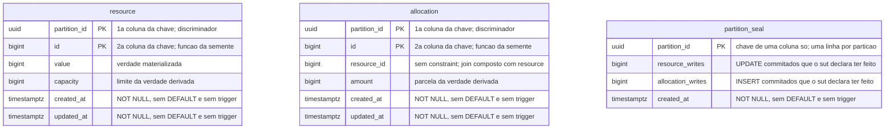

# Proposta 3 — A janela vira linha

A aposta central é que a fronteira de uma execução deixa de ser protocolo e vira dado: uma
terceira tabela do schema `sut` recebe, depois que os workers param, a linha que fecha a
janela e declara quantas escritas o sistema medido acredita ter feito. Ela otimiza a
capacidade de o oráculo terminar e conferir completude lendo uma fonte só.

Proposta, e não decisão. O dono da forma vigente continua sendo
[`schemas/sut.md`](../../../architecture/schemas/sut.md#o-schema-do-sistema-medido-sut).

## O problema que este modelo resolve

O oráculo do predicado **DEVE** somar até reconhecer no stream a marca de fim, escrita
pelo sistema medido fora da janela medida
([card da proteção inerte, R9](../../../features/deteccao-de-protecao-inerte/feature-card.md#regras-de-negócio)),
e a janela termina quando o oráculo reconhece essa marca
([ADR-0015](../../../adr/0015-a-chave-o-discriminador-de-execucao-e-as-colunas-de-tempo.md#a-janela-medida-não-se-correlaciona-ao-stream-por-tempo)).
Nenhuma tabela do schema medido carrega essa marca hoje, e a matriz registra que
`resource` e `allocation` sequer existem
([matriz](../../../architecture/integrations.md#matriz)).

Esta proposta dá lugar à marca. E aproveita a mesma linha para carregar a contagem de
escritas: com ela, a completude do stream deixa de depender só da contiguidade de LSN
([ADR-0013](../../../adr/0013-a-proveniencia-da-fonte-como-criterio-da-proibicao-do-oraculo.md#decisão)),
e passa a ter conferência aritmética contra um número que o próprio sistema medido
declarou.

## O modelo

## O que o diagrama não expressa

**Não há linha entre `partition_seal` e as outras duas, e a ausência é a decisão.** Nenhuma
chave estrangeira liga as três tabelas, pelo mesmo motivo que já vale entre `allocation` e
`resource`
([ADR-0015](../../../adr/0015-a-chave-o-discriminador-de-execucao-e-as-colunas-de-tempo.md#sem-chave-estrangeira-em-allocationresource_id)):
o lock que a constraint adquire cairia dentro da janela medida.

**A chave do selo tem uma coluna só.** As outras duas são `(partition_id, id)`, com o
discriminador primeiro; aqui não existe segunda coluna, porque existe no máximo uma linha
por partição — e é a unicidade dessa chave que impede duas marcas de fim para a mesma
execução.

**A linha é escrita depois de os workers pararem, e nunca durante.** Escrita nenhuma do
selo entra na janela que o experimento mede.

**As três colunas de tempo continuam sem `DEFAULT` e sem trigger**, e o valor vem do
adaptador de relógio
([ADR-0015](../../../adr/0015-a-chave-o-discriminador-de-execucao-e-as-colunas-de-tempo.md#as-colunas-de-tempo-e-a-fonte-do-relógio-por-papel-do-valor)).
O selo não tem `updated_at`: uma linha imutável que ganhasse a coluna afirmaria uma
atualização que nunca acontece.

**Nada aqui acrescenta `version`, e nada aqui é lido por estratégia de concorrência.** O
selo é invisível para `increment` e para `allocate`.

## Trade-offs

| O que fica fácil                                                        | O que fica caro ou impossível                                                       |
|-------------------------------------------------------------------------|-------------------------------------------------------------------------------------|
| o oráculo termina a soma sem canal fora do stream                       | o schema medido ganha uma tabela que nenhuma operação do domínio lê                 |
| a perda de evento vira aritmética, e não só buraco de LSN               | o sistema medido passa a contar as próprias escritas, que é trabalho de instrumento |
| a fronteira `lab-plane` → `system-under-test` por HTTP fica dispensável | o selo viaja pelo mesmo transporte, e não é testemunho independente dele            |
| uma execução sem selo é distinguível de uma execução em curso           | uma falha injetada antes do selo deixa a janela aberta para sempre                  |

## O que esta proposta NÃO decide

Quem escreve a linha do selo, e por qual caminho o sistema medido sabe que os workers
pararam. Se a contagem é por tabela, como desenhado, ou um número só. Quem apaga a
partição antiga. Se o endpoint de confirmação
([card de divergência entre fontes](../../../features/deteccao-de-divergencia-entre-fontes/feature-card.md#regras-de-negócio))
continua necessário depois do selo, ou se os dois convivem.

## Por que ela não é a Proposta 1 nem a Proposta 2

A Proposta 1 recusa qualquer elemento de esquema que sirva ao oráculo, e deixa o término
da soma sem lugar. A Proposta 2 muda o que o evento carrega, e não o conjunto de tabelas.
Esta é a única das três que acrescenta uma tabela, e é a única que paga o preço de pôr no
sistema medido uma estrutura que só o instrumento consome.

## Perguntas que ela levanta

- **Pergunta em aberto.** Uma tabela que existe só para o oráculo contraria a exigência de
  que o sistema medido não saiba que está sendo medido? O ADR-0015 pagou esse custo pela
  metade com o nome assimétrico do discriminador
  ([ADR-0015](../../../adr/0015-a-chave-o-discriminador-de-execucao-e-as-colunas-de-tempo.md#o-nome-assimétrico-do-discriminador-e-a-tradução-num-ponto-único)),
  e uma tabela inteira é mais que um nome.
- **Pergunta em aberto.** `resource_writes` e `commits` medem coisas próximas por caminhos
  diferentes — um é contado pelo sistema medido, o outro por passagens em `AFTER_COMMIT`
  ([ADR-0002](../../../adr/0002-o-dominio-minimo-e-os-dois-oraculos.md#o-oráculo-exato)).
  Qual prevalece quando divergirem ninguém decidiu, e a divergência entre os dois PODE ser
  exatamente o dual write.
- **Pergunta em aberto.** Contar escritas commitadas exige que o sistema medido saiba
  quais tentativas commitaram. Se ele consegue saber isso sem repetir o mecanismo de
  fronteira do instrumento não foi apurado.
