# Proposta 3 — O catálogo permanente de mecanismos

A aposta é que o schema `sut` nasça com uma tabela por família de mecanismo do roadmap,
todas inertes até o experimento acioná-las, porque o que produz o fenômeno é o caminho
que a operação medida percorre, e nunca a ausência da tabela. Ela otimiza a
comparabilidade entre execuções: o schema para de mudar entre o experimento que estuda
o problema e o que estuda a solução, e a forma da tabela deixa de ser variável escondida
na comparação.

Isto é proposta, e não decisão. O dono da forma vigente continua sendo
[`schemas/sut.md`](../../../architecture/schemas/sut.md#o-schema-do-sistema-medido-sut).

## O problema que este modelo resolve

Um schema que cresce por migração ao longo do roadmap põe a própria forma dentro da
comparação. A execução que estuda o dual write roda contra um banco sem estrutura de
outbox; a que estuda a solução roda contra um banco com ela. As duas diferem em duas
coisas ao mesmo tempo — o caminho da operação e a forma do banco —, e nenhum relatório
separa uma da outra.

Este modelo remove a segunda. As seis tabelas nascem juntas, e a migração para de
acontecer entre experimentos. Entre a execução do problema e a da solução muda uma coisa
só: quais statements a operação medida emite.

O grupo de controle depende disso. `NONE` é obrigatória, e o resultado dela só significa
alguma coisa se ela rodar contra o mesmo banco das demais.

## O modelo

```mermaid
erDiagram
    resource {
        uuid partition_id PK "1a coluna da chave; discriminador de execucao"
        bigint id PK "2a coluna da chave; funcao da semente"
        bigint value "verdade materializada; unica fonte do oraculo exato"
        bigint capacity "limite da verdade derivada"
        bigint version "inerte em 0; so OPTIMISTIC le e escreve"
        bigint fence_token "inerte em 0; so o experimento de fencing escreve"
        timestamptz created_at "NOT NULL, sem DEFAULT e sem trigger"
        timestamptz updated_at "NOT NULL, sem DEFAULT e sem trigger"
    }
    allocation {
        uuid partition_id PK "1a coluna da chave; discriminador de execucao"
        bigint id PK "2a coluna da chave; funcao da semente"
        bigint resource_id "sem constraint; o join e a.partition_id = r.partition_id AND a.resource_id = r.id"
        bigint amount "parcela da verdade derivada"
        timestamptz created_at "NOT NULL, sem DEFAULT e sem trigger"
        timestamptz updated_at "NOT NULL, sem DEFAULT e sem trigger"
    }
    outbox {
        uuid partition_id PK "1a coluna da chave; discriminador de execucao"
        bigint id PK "2a coluna da chave; funcao da semente"
        bigint aggregate_id "sem constraint; aponta para resource.id"
        jsonb payload "corpo do evento; o driver liga texto, o WAL carrega jsonb normalizado"
        timestamptz published_at "UNICA coluna anulavel do schema; NULL ate o relay publicar"
        timestamptz created_at "NOT NULL, sem DEFAULT e sem trigger"
    }
    inbox {
        uuid partition_id PK "1a coluna da chave; discriminador de execucao"
        text idempotency_key PK "2a coluna da chave; funcao da semente, nunca gerada pelo banco"
        bigint aggregate_id "sem constraint; aponta para resource.id"
        timestamptz created_at "NOT NULL, sem DEFAULT e sem trigger"
    }
    lease {
        uuid partition_id PK "1a coluna da chave; discriminador de execucao"
        bigint resource_id PK "2a coluna da chave; uma posse por recurso por execucao"
        text holder "identidade do worker; funcao da semente"
        bigint fencing_token "monotonico na execucao; comparado contra resource.fence_token"
        timestamptz expires_at "adaptador de relogio; nunca now()"
        timestamptz created_at "NOT NULL, sem DEFAULT e sem trigger"
        timestamptz updated_at "NOT NULL, sem DEFAULT e sem trigger"
    }
    resource_projection {
        uuid partition_id PK "1a coluna da chave; discriminador de execucao"
        bigint resource_id PK "2a coluna da chave; uma linha por recurso por execucao"
        bigint value "copia defasada de resource.value; NAO carrega soma alguma"
        timestamptz created_at "NOT NULL, sem DEFAULT e sem trigger"
        timestamptz updated_at "NOT NULL, sem DEFAULT e sem trigger"
    }
```

### O que "inerte" significa, em linhas e em escritas

Inerte não é um estado do banco: é a ausência de escrita. Uma tabela inerte tem zero
linhas porque nenhum statement da operação medida a nomeia. Uma coluna inerte não pode
ter zero linhas — ela existe em toda linha da tabela —, e por isso paga um preço que a
tabela não paga.

| Grau               | Linhas                       | Escritas                                           | O que sai no WAL                                     |
|--------------------|------------------------------|----------------------------------------------------|------------------------------------------------------|
| tabela inerte      | zero                         | nenhuma, em execução nenhuma                       | nada; a relação não aparece no stream                |
| coluna inerte      | as da tabela que a carrega   | uma só, no `INSERT` de seeding, com o valor neutro | o valor neutro, imóvel, em todo evento daquela linha |
| mecanismo acionado | cresce por passo da operação | as da linha abaixo, na tabela seguinte             | os eventos da tabela seguinte                        |

**A regra que sustenta a palavra "inerte" é uma só, e ela é executável:** a operação
medida NÃO DEVE emitir `SELECT *`, e NÃO DEVE nomear numa lista de `SET` coluna que a
estratégia em execução não use. Com listas de coluna explícitas, o texto do statement e
os valores ligados não mudam por a coluna existir no catálogo, e o critério de igualdade
de traço do
[ADR-0002](../../../adr/0002-o-dominio-minimo-e-os-dois-oraculos.md#o-critério-de-igualdade-entre-dois-traços-de-sql)
não a enxerga. Sem essa regra, "inerte" é falso, e a
[alternativa I daquele ADR](../../../adr/0002-o-dominio-minimo-e-os-dois-oraculos.md#alternativa-i--manter-version-no-esquema-declarada-sem-política)
volta a valer inteira.

### O que cada mecanismo faz aparecer no WAL quando ativo

O oráculo não consulta este schema: ele lê o WAL por replicação lógica, pelo
[ADR-0010](../../../adr/0010-a-fronteira-de-schema-e-o-cdc-como-fonte-do-veredito.md#decisão).
Por isso a coluna abaixo é restrição de primeira ordem, e não ilustração — o que não
entrar no WAL não existe para o instrumento.

| Tabela                | Ativa, o que entra no stream                                                                                              | Quem lê hoje                                                                                                             |
|-----------------------|---------------------------------------------------------------------------------------------------------------------------|--------------------------------------------------------------------------------------------------------------------------|
| `resource`            | `INSERT` do estado inicial e um `UPDATE` por commit                                                                       | o oráculo exato: `value_initial` e `value_final`                                                                         |
| `allocation`          | um `INSERT` por alocação aceita                                                                                           | o oráculo do predicado, somando os `INSERT`                                                                              |
| `outbox`              | `INSERT` **dentro** da transação do `UPDATE` de `resource`, e um `UPDATE` de `published_at` **fora** dela                 | nenhum oráculo decidido; a moldura `BEGIN`/`COMMIT` é a evidência de que a escrita foi atômica                           |
| `inbox`               | um `INSERT` por entrega aceita; a entrega repetida aborta na chave e **não** produz evento nenhum                         | nenhum oráculo decidido; a contagem de eventos de domínio contra a de linhas de `inbox` mede a deduplicação sem `SELECT` |
| `lease`               | `INSERT` na aquisição e `UPDATE` na renovação; a expiração **não** produz evento, porque ninguém escreve para ela ocorrer | nenhum oráculo decidido; a expiração é inferida do `expires_at` do último evento                                         |
| `resource_projection` | `INSERT` no seeding e um `UPDATE` por aplicação do projetor, em transação própria                                         | nenhum oráculo decidido; a divergência contra `resource.value` é o fenômeno, e não o defeito                             |

**A segunda representação do estado não corrompe nenhum dos dois oráculos, por três
motivos independentes.** O evento de CDC carrega a identidade da relação, e o oráculo
exato filtra por `resource` — uma linha de projeção não é uma linha de `resource`. O
projetor nunca escreve `resource`, e por isso não move `value_initial` nem `value_final`.
E a projeção **não** carrega `Σ amount`: materializar a soma numa coluna foi descartado
pelo
[ADR-0013](../../../adr/0013-a-proveniencia-da-fonte-como-criterio-da-proibicao-do-oraculo.md#o-sistema-medido-materializar-a-soma-numa-coluna),
e esta proposta não a reabre.

Quem mantém a projeção é um projetor **dentro do sistema medido**, em transação própria.
O `lab-plane` escrevendo ali seria o instrumento gravando no schema medido, e derrubaria
a fronteira do
[ADR-0010](../../../adr/0010-a-fronteira-de-schema-e-o-cdc-como-fonte-do-veredito.md#decisão).

## O que o diagrama não expressa

**A ordem da chave composta.** As seis chaves são `(partition_id, <segunda coluna>)`,
com o discriminador **primeiro**, pelo mesmo motivo das duas tabelas vigentes: ele é um
UUIDv7, e o prefixo de instante põe toda inserção no fim da B-tree
([`schemas/sut.md`](../../../architecture/schemas/sut.md#o-que-o-diagrama-do-sut-não-desenha)).
A ordem também deixa cada execução contígua na árvore, o que é o que torna barato apagar
uma execução inteira. O nome `partition_id` é o do lado medido, e nunca `execution_id`
([ADR-0015](../../../adr/0015-a-chave-o-discriminador-de-execucao-e-as-colunas-de-tempo.md#o-nome-assimétrico-do-discriminador-e-a-tradução-num-ponto-único)).

**A ausência de chave estrangeira, em todas as seis.** Nenhuma linha do desenho as liga,
e a ausência de linha é a decisão. O motivo do
[ADR-0015](../../../adr/0015-a-chave-o-discriminador-de-execucao-e-as-colunas-de-tempo.md#sem-chave-estrangeira-em-allocationresource_id)
generaliza: o `FOR KEY SHARE` que um `INSERT` com chave estrangeira adquire colide com o
`FOR UPDATE` de `PESSIMISTIC`. Uma chave estrangeira de `outbox` para `resource` é pior
que a de `allocation`, porque o `INSERT` de outbox roda dentro da transação exata que o
experimento de dual write mede. Os joins que substituem cada uma repetem sempre o
discriminador — `x.partition_id = r.partition_id AND x.resource_id = r.id` —, e sem ele
a consulta cruza execuções.

**Os índices.** Dois são aditivos e nenhum aparece no desenho, porque `erDiagram` não
expressa índice: `(partition_id, resource_id)` sobre `allocation`, já publicado, e
`(partition_id, published_at)` sobre `outbox`, que o relay varre a cada ciclo. Sem o
segundo, o `40001` do braço `SERIALIZABLE` viria da varredura sequencial, e ninguém
distinguiria a causa ao ler o número. O índice **não** é parcial: um índice parcial muda
o que o relay percorre entre um braço e outro, e vira variável escondida na mesma
comparação que esta proposta existe para limpar.

**A ausência de `DEFAULT` e de trigger, em todas as colunas das seis tabelas.** Toda
escrita nomeia toda coluna, e a que esquecer falha alto. Isso alcança as inertes:
`version` e `fence_token` recebem o zero no `INSERT` de seeding, e não por `DEFAULT`.
Alcança também o outbox: **nenhum trigger o escreve.** Um trigger de outbox roda dentro
da janela medida, que é o argumento pelo qual o
[ADR-0015](../../../adr/0015-a-chave-o-discriminador-de-execucao-e-as-colunas-de-tempo.md#as-colunas-de-tempo-e-a-fonte-do-relógio-por-papel-do-valor)
já recusou trigger em `updated_at`. E alcança o relógio: `expires_at`, `published_at` e
as dez colunas de tempo vêm do adaptador injetável, nunca de `now()` ou
`clock_timestamp()`.

**A ausência de `CHECK` que impeça a violação.** Nenhuma constraint recusa
`Σ amount > capacity`, nem uma segunda escrita sob `version` desatualizada. O laboratório
existe para mostrar a anomalia acontecendo, e o
[ADR-0002](../../../adr/0002-o-dominio-minimo-e-os-dois-oraculos.md#alternativa-d--a-verificação-vive-no-banco)
já descartou o banco como oráculo. A única unicidade declarada é a chave primária de
`inbox`, e ela **é** o mecanismo de deduplicação, e não uma proteção acessória.

**A ausência de qualquer coluna que diga qual mecanismo está ligado.** Nenhuma tabela
tem `mode`, `enabled` ou equivalente. A ativação é rótulo opaco de configuração do
experimento, como a estratégia de concorrência do
[ADR-0006](../../../adr/0006-a-forma-da-estrategia-de-concorrencia.md#decisão), e vive na
definição de experimento, fora do Git
([ADR-0011](../../../adr/0011-a-topologia-de-servicos-e-o-caderno-de-laboratorio-fora-do-git.md#o-caderno-de-laboratório-sai-do-git)).
Uma coluna dessas poria vocabulário do instrumento dentro do sistema medido.

**A ausência do outro schema neste canvas.** Nenhuma tabela do `lab_plane` aparece aqui,
e nenhuma linha atravessa a fronteira: uma linha desenhada entre os dois renderiza
exatamente a chave estrangeira que a fronteira proíbe
([`schemas/README.md`](../../../architecture/schemas/README.md#a-ausência-de-linha-entre-os-dois-diagramas-é-a-decisão)).

## Decisões assumidas

| O que assumi                                                                                                                                                                               | Alternativa que ficou de fora                                                              | O que muda no modelo se a pessoa decidir o contrário                                                                                                                                                                          |
|--------------------------------------------------------------------------------------------------------------------------------------------------------------------------------------------|--------------------------------------------------------------------------------------------|-------------------------------------------------------------------------------------------------------------------------------------------------------------------------------------------------------------------------------|
| O domínio medido deixa de ter só duas entidades: quatro tabelas de mecanismo entram, por um ADR que estende o [ADR-0002](../../../adr/0002-o-dominio-minimo-e-os-dois-oraculos.md#decisão) | uma migração por etapa do roadmap, criando cada tabela no commit que introduz o mecanismo  | a proposta inteira cai; o schema volta a mudar entre experimentos, e a forma da tabela volta a ser variável da comparação                                                                                                     |
| `version` entra em `resource`, inerte em zero, pelo ADR que a exige — [ADR-0006](../../../adr/0006-a-forma-da-estrategia-de-concorrencia.md#decisão), que na versão final já existe        | `version` nasce só no commit que introduz `OPTIMISTIC`, na letra do ADR-0002 e do ADR-0006 | `resource` perde uma coluna, e `OPTIMISTIC` volta a exigir migração antes de rodar; a comparação entre `NONE` e `OPTIMISTIC` passa a ter duas variáveis                                                                       |
| A operação medida NÃO DEVE emitir `SELECT *` nem nomear coluna que a estratégia não use                                                                                                    | liberar `SELECT *` e listas de `SET` amplas                                                | "inerte" deixa de ser verdade: a coluna entra no traço de SQL, e o argumento técnico contra a alternativa I do ADR-0002 volta a valer                                                                                         |
| As seis tabelas entram na publicação de CDC                                                                                                                                                | publicar só `resource` e `allocation`                                                      | outbox, inbox, posse e projeção ficam inobserváveis sem `SELECT`, que o ADR-0010 proíbe; os fenômenos das etapas 6, 7, 9 e 11 perdem evidência                                                                                |
| `fence_token` entra em `resource`, inerte em zero                                                                                                                                          | o token vive só em `lease`                                                                 | o fencing deixa de fenciar: sem o lado escrito guardar o maior token visto, o escritor com posse expirada não é recusado, e a etapa 11 fica sem experimento de token                                                          |
| A projeção é mantida por um projetor **dentro** do sistema medido, em transação própria                                                                                                    | o `lab-plane` mantém a projeção                                                            | o instrumento passa a escrever no schema medido, e a fronteira do ADR-0010 cai; o defeito do projetor vira resultado de consistência                                                                                          |
| `resource_projection` projeta `resource.value` e **não** carrega `Σ amount`                                                                                                                | projetar também a soma das alocações                                                       | contradiz o descarte de "o sistema medido materializar a soma numa coluna" no [ADR-0013](../../../adr/0013-a-proveniencia-da-fonte-como-criterio-da-proibicao-do-oraculo.md#o-sistema-medido-materializar-a-soma-numa-coluna) |
| Nenhuma coluna declara qual mecanismo está ligado; a ativação é rótulo opaco de configuração                                                                                               | uma coluna `mode` por tabela, ou uma tabela de configuração no `sut`                       | vocabulário do instrumento entra no schema medido, pelo mesmo motivo que `execution_id` foi recusado ali                                                                                                                      |
| Nenhum `DEFAULT` em coluna nenhuma, inclusive nas inertes                                                                                                                                  | `DEFAULT 0` em `version` e `fence_token`                                                   | o `INSERT` de seeding para de nomeá-las, e fica byte a byte idêntico com e sem o catálogo — ganho real, recusado para manter a regra de que a escrita esquecida falha alto                                                    |
| Nenhum trigger escreve o outbox                                                                                                                                                            | outbox por trigger `AFTER UPDATE` em `resource`                                            | o trigger roda dentro da janela medida, e o E1 passa a medir o trigger junto do lost update                                                                                                                                   |
| `published_at` é anulável, e é a única coluna anulável do schema                                                                                                                           | uma segunda tabela de publicados, sem coluna anulável                                      | some do WAL a transição `NULL` → instante, que é o evento que separa "commitado" de "publicado"; o relay passa a ser medido por duas relações                                                                                 |
| `outbox.payload` é `jsonb`, e `inbox.idempotency_key` é `text` derivada da semente                                                                                                         | `payload` como `text`; chave de idempotência como `uuid`                                   | `text` preserva a ordem das chaves no WAL, e `jsonb` a normaliza; `uuid` empurraria para `gen_random_uuid()`, que a regra de aleatoriedade semeada proíbe                                                                     |
| Índice aditivo `(partition_id, published_at)` sobre `outbox`, não parcial                                                                                                                  | nenhum índice, ou um índice parcial `WHERE published_at IS NULL`                           | sem índice, o `40001` do braço `SERIALIZABLE` fica inatribuível; parcial, o relay percorre coisas diferentes entre braços e cria variável escondida                                                                           |
| `lease` guarda uma linha por recurso por execução, e a chave o impõe                                                                                                                       | histórico de posses, com `id` próprio e uma linha por aquisição                            | a renovação deixa de ser `UPDATE` e vira `INSERT`, e a evidência de expiração no WAL muda de forma                                                                                                                            |
| `resource_projection` não tem `id` próprio: a chave é `(partition_id, resource_id)`                                                                                                        | `id` derivado da semente, como nas outras                                                  | uma linha por par execução-recurso deixa de ser garantida pela chave, e passa a depender do projetor                                                                                                                          |
| As dez colunas de tempo das quatro tabelas novas vêm do adaptador de relógio                                                                                                               | `now()` nas colunas de mecanismo, por serem metadado                                       | `expires_at` sai do controle do experimento, e a expiração de lease e o clock skew do grupo E ficam impossíveis de testar                                                                                                     |

## Trade-offs

### A colisão com a regra pedagógica, e o que a paga

A regra da raiz manda nunca introduzir a solução antes do problema, e este desenho põe a
estrutura de quatro soluções no schema desde o primeiro `CREATE TABLE`. A colisão é
real, e ela não é integral.

**Onde ela não acontece.** Estrutura inerte não é solução introduzida. Um `outbox` que
existe e nunca é lido não conserta dual write nenhum, e uma `inbox` vazia não deduplica
nada. O que resolve o problema é o caminho que a operação percorre, e ele continua sendo
escrito depois de a anomalia ter sido vista. A sequência
`PROBLEMA → CAUSA → SOLUÇÃO → TRADE-OFF` continua inteira **na sequência dos
experimentos**, que é onde ela ensina.

**Onde ela acontece, e é preciso dizer.** A regra também vale sobre o artefato que se
lê, e o ADR-0002 recusou `version` por um segundo motivo que não é técnico: com a coluna
no lugar, `OPTIMISTIC` vira a continuação natural do modelo e `ATOMIC_UPDATE` vira o
desvio, quando os dois deveriam chegar ao E3 empatados
([ADR-0002](../../../adr/0002-o-dominio-minimo-e-os-dois-oraculos.md#justificativa)).
Esse argumento sobrevive a esta proposta, e vale seis vezes: quem abrir a migração
encontra `outbox`, `inbox`, `lease`, projeção, `version` e `fence_token` antes de ter
visto anomalia nenhuma, e cada um deles sugere a resposta antes da pergunta.

**O que paga o custo.** Uma coisa só: o grupo de controle passa a ser comparável. `NONE`
e `OPTIMISTIC` rodam contra bytes idênticos de catálogo, e a diferença entre os dois
vereditos deixa de ter a forma da tabela dentro dela. Quem achar que a leitura ingênua
da migração vale mais que isso deve recusar esta proposta inteira, e não uma tabela dela.

| Benefício aceito                                                                         | Custo aceito em troca                                                                                                 |
|------------------------------------------------------------------------------------------|-----------------------------------------------------------------------------------------------------------------------|
| o schema para de mudar entre experimentos, e a comparação perde uma variável escondida   | quem lê a migração vê a solução antes do problema, seis vezes                                                         |
| todo mecanismo do roadmap é observável pelo WAL, sem uma exceção à fronteira de schema   | a publicação de CDC carrega quatro relações que nenhum oráculo decidido lê, e o stream engorda em toda execução       |
| a deduplicação é provada pela chave primária, sem consulta e sem contagem no instrumento | a evidência da recusa é a **ausência** de evento, e ausência não se distingue de perda no transporte sem outra guarda |
| a projeção defasada existe sem tocar `resource`, e os dois oráculos ficam intactos       | há um segundo lugar onde a verdade vive, e quem depurar precisa saber qual tabela está lendo                          |
| a expiração de lease é controlável, porque `expires_at` vem do adaptador                 | toda escrita de mecanismo depende do adaptador de relógio, por colunas que nenhum oráculo lê                          |
| as colunas inertes não entram no traço de SQL                                            | a proibição de `SELECT *` vira requisito do laboratório, e nenhuma guarda executável a impõe hoje                     |

## O que esta proposta NÃO decide

- **Qual oráculo lê cada mecanismo.** Quatro linhas da tabela do WAL dizem "nenhum
  oráculo decidido", e nenhuma delas é fechada aqui. A divergência entre
  `resource_projection.value` e `resource.value` precisa de um oráculo próprio, e ele
  não é o da divergência entre fontes que a
  [matriz](../../../architecture/integrations.md#matriz) já registra.
- **Quem apaga uma execução, e quando.** O catálogo torna o descarte por partição
  barato, e não decide se ele acontece.
- **O formato do relatório** quando um mecanismo ativo e um oráculo antigo convivem.
- **A verificação da linha órfã**, que o
  [ADR-0015](../../../adr/0015-a-chave-o-discriminador-de-execucao-e-as-colunas-de-tempo.md#sem-chave-estrangeira-em-allocationresource_id)
  deixou em aberto e que esta proposta multiplica por quatro, ao criar três novas
  colunas que apontam para `resource.id` sem constraint.
- **A ordem em que as tabelas são criadas**, que é irrelevante sem chave estrangeira.

## Perguntas que ela levanta

- **Uma transação abortada pode deixar rastro no stream de replicação lógica?** A
  evidência da deduplicação depende de a entrega repetida, que aborta na chave primária
  de `inbox`, não produzir evento nenhum. Com o decode de transações em curso ligado no
  protocolo do `pgoutput`, o consumidor PODE receber um par de início e aborto de stream
  para uma transação que estourou a memória de decode. Se isso alcança este caso, e sob
  qual configuração, não sei afirmar.
- **O que "contiguidade de LSN" significa quando a publicação tem seis relações?** A
  guarda do
  [ADR-0013](../../../adr/0013-a-proveniencia-da-fonte-como-criterio-da-proibicao-do-oraculo.md#decisão)
  exige conferir a contiguidade antes de somar, e LSN é deslocamento em bytes no WAL, e
  não contador. Se o critério de contiguidade sobrevive a um stream com quatro relações
  a mais é fato sobre o PostgreSQL, e não escolha de desenho.
- **A ordem dos eventos de duas relações escritas na mesma transação é preservada no
  stream?** A moldura `BEGIN`/`COMMIT` prova que o `INSERT` de outbox e o `UPDATE` de
  `resource` foram atômicos. Que eles cheguem na ordem em que os statements rodaram é
  outra afirmação, e ela sustenta o diagnóstico do dual write.
- **A identidade de réplica padrão basta para as seis?** O oráculo exato lê o valor novo
  de `resource.value`, e nenhum caso desta proposta pede o valor antigo. Se algum
  mecanismo passar a exigir o anterior, `REPLICA IDENTITY FULL` entra, e o custo dela em
  volume de WAL sob a carga do E4 não está medido.
