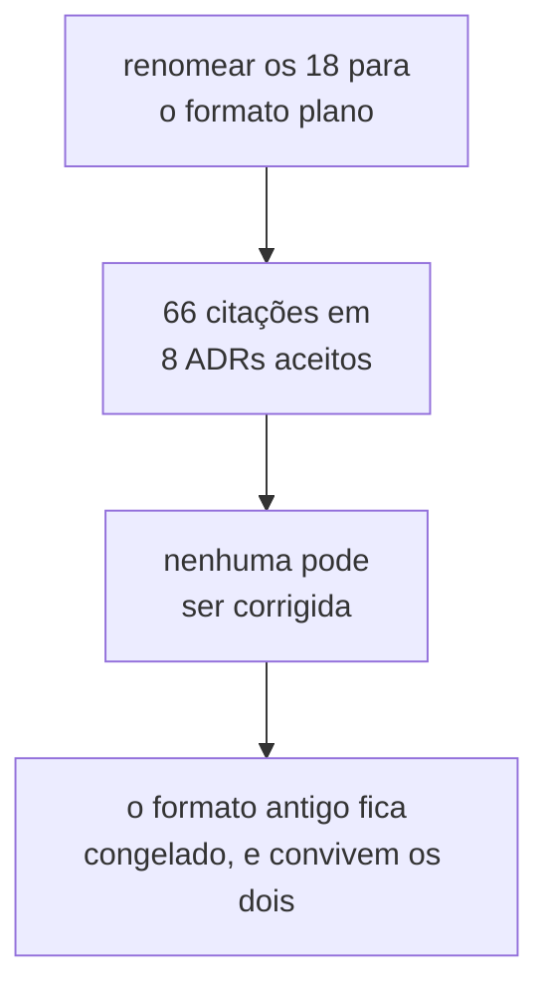

# Questões

Questões levantadas durante o debate de um ADR da série corrente, cuja resposta pertence a
uma decisão diferente da que as levantou. Cada uma vive num arquivo próprio nesta pasta,
para que uma decisão futura, um Feature Card ou um Example Mapping possa referenciá-la
diretamente, sem depender de uma âncora dentro de `adr/README.md`.

O processo de debate que produz uma questão está descrito em
[`adr/README.md`](../adr/README.md#processo-de-debate). Este arquivo documenta apenas o
que acontece **depois** que uma questão nasce.

## De onde uma questão vem

Uma questão nasce na seção `## Questões em aberto` de um ADR ainda `Proposto`. Se a
resposta pertence a outra decisão, ela recebe status `encaminhado` e, no ato da aceitação
do ADR de origem, é transportada para um arquivo nesta pasta — **inteira, não
resumida**.
O ADR de destino precisa nascer com o problema que motivou a entrada dele na
[fila de decisões](../adr/fila-de-decisoes.md). Um resumo é a mesma perda, mais
devagar.

## Identificador

**Desde 2026-08-05, pela decisão `A2`, o identificador é plano: `Q-NNNN`, sem sufixo.**
Ele não codifica mais a origem. A origem é a coluna `Origem` do índice abaixo, que já
existia e passa a ser o único lugar onde ela vive.

**A sequência nova começa em `Q-0019`**, para não colidir visualmente com os dezoito
identificadores existentes. O número é atribuído no ato da criação do arquivo, e o dono
da atribuição é este índice.

**Cite uma questão pelo identificador**, nunca por "a questão K do ADR-NNNN" — aquela
seção deixa de existir quando o ADR é aceito, e a citação passaria a apontar para nada.

### O formato antigo `Q-NNNN-K` fica congelado como legado

Nele, `NNNN` era o ADR de origem e `K` o número que a questão tinha na seção `## Questões
em aberto` dele. **Os dezoito identificadores existentes não são renomeados**, e o
formato não é reutilizado, não é estendido, e nenhuma questão nova o recebe.

O motivo é medido. `Q-NNNN-K` aparece 255 vezes em `docs/` e no `AGENTS.md` da raiz, e
**66 dessas ocorrências estão dentro dos oito ADRs aceitos** — 11 no ADR-0001, 14 no
ADR-0002, 16 no ADR-0007, e assim por diante. O corpo de um ADR aceito não pode ser
editado. Renomear produziria 66 citações mortas dentro de artefato imutável.

O custo aceito é que dois formatos convivem no índice por tempo indeterminado. A coluna
`ID` os distingue à vista, e nenhum leitor precisa saber a regra para ler a tabela.

Descartadas três alternativas. Um prefixo próprio `Q-ARQ-K`, por criar um terceiro
espaço de nomes ao lado de `Q-NNNN-K` e `Q-INT-*`. `NNNN` passando a ser o de
**destino**,
porque uma questão cujo destino é linha de fila sem número de ADR seguiria inatribuível.
E a questão permanecer como linha de fila, porque a fila não é citável de forma estável.

## Ciclo de vida

Uma questão nasce com status `pendente`. Ela
**não** é apagada quando alguém a resolve: o
status passa a `resolvida por ADR-NNNN`, e o arquivo dela abre nomeando a subseção do ADR
onde a decisão está. O enunciado permanece porque ele registra o que estava em jogo antes
da decisão — e é isso que um leitor futuro não consegue reconstruir a partir do ADR de
destino.

O custo dessa escolha é que o índice abaixo cresce e passa a listar questão viva ao lado
de questão morta. A coluna `Status` é a única marca que as separa, e ela é obrigatória
por isso.

O enunciado transportado é reescrito num ponto só, no momento em que o arquivo é criado:
as referências internas ao ADR de origem. "Este ADR", "aqui" e "a questão 3" não
significam nada fora do documento em que foram escritas, e passam a nomear o ADR e o
identificador.

## Índice

| ID                        | Questão                                                                           | Origem       | Destino na fila              | Status                 |
|---------------------------|-----------------------------------------------------------------------------------|--------------|------------------------------|------------------------|
| [`Q-0001-1`](Q-0001-1.md) | O endereço da fronteira precisa sobreviver à edição da operação                   | ADR-0001     | Experiment                   | `pendente`             |
| [`Q-0001-2`](Q-0001-2.md) | O compartilhamento por colaborador injetado continua sem guarda                   | ADR-0001     | estratégias de concorrência  | resolvida por ADR-0006 |
| [`Q-0001-3`](Q-0001-3.md) | O critério de igualdade entre dois traços de SQL não está definido                | ADR-0001     | o domínio mínimo             | resolvida por ADR-0002 |
| [`Q-0001-4`](Q-0001-4.md) | O escalonador precisa de um protocolo de desistência                              | ADR-0001     | a forma do escalonador       | resolvida por ADR-0005 |
| [`Q-0002-1`](Q-0002-1.md) | A comparação por valor depende de regras que nenhum teste verifica                | ADR-0002     | arquitetura mínima e guardas | `pendente`             |
| [`Q-0002-2`](Q-0002-2.md) | Quem declara que a execução terminou, e o oráculo lê antes ou depois disso        | ADR-0002     | a forma do escalonador       | resolvida por ADR-0005 |
| [`Q-0002-3`](Q-0002-3.md) | Os dois oráculos descrevem apenas o estado final quiescente                       | ADR-0002     | os dois formatos de veredito | `pendente`             |
| [`Q-0002-4`](Q-0002-4.md) | O estado inicial não é estabelecido por ninguém                                   | ADR-0002     | Experiment                   | `pendente`             |
| [`Q-0003-1`](Q-0003-1.md) | Um worker que nunca chega trava o agendamento, e a recusa por texto não o alcança | ADR-0003     | a forma do escalonador       | resolvida por ADR-0005 |
| [`Q-0003-2`](Q-0003-2.md) | Um agendamento sobre uma tentativa que talvez não ocorra                          | ADR-0003     | a forma do escalonador       | resolvida por ADR-0005 |
| [`Q-0003-3`](Q-0003-3.md) | Duas execuções do mesmo experimento não têm critério de igualdade                 | ADR-0003     | os dois formatos de veredito | resolvida por ADR-0007 |
| [`Q-0003-8`](Q-0003-8.md) | O `N` declarado antes não fecha com uma estratégia que retenta                    | ADR-0003     | Experiment                   | `pendente`             |
| [`Q-0004-2`](Q-0004-2.md) | Nada obriga o passo a reportar a chave de contenção                               | ADR-0004     | arquitetura mínima e guardas | `pendente`             |
| [`Q-0004-3`](Q-0004-3.md) | Comparar janelas exige um instante comparável entre workers                       | ADR-0004     | o log de observações         | `pendente`             |
| [`Q-0004-4`](Q-0004-4.md) | A regra de parada colide com a exigência de nascer entregando                     | ADR-0004     | entrega contínua no homelab  | `pendente`             |
| [`Q-0004-5`](Q-0004-5.md) | O terceiro formato de veredito precisa caber ao lado dos dois já previstos        | ADR-0004     | os dois formatos de veredito | `pendente`             |
| [`Q-0004-8`](Q-0004-8.md) | O limite `3/N` pressupõe ensaios independentes                                    | ADR-0004     | os dois formatos de veredito | `pendente`             |
| [`Q-0005-1`](Q-0005-1.md) | O critério de "falha não recuperada pela estratégia" não está definido            | ADR-0005     | estratégias de concorrência  | resolvida por ADR-0006 |
| [`Q-0019`](Q-0019.md)     | Quatro das seis contradições são divergência entre ADR e plano                    | contra-aval. | os dois ADRs do lote 1       | `pendente`             |
| [`Q-0020`](Q-0020.md)     | Duas colisões de vocabulário que a rodada não confessou                           | contra-aval. | o ADR de vocabulário         | `pendente`             |
| [`Q-0021`](Q-0021.md)     | A quarentena do Bloco 3 é sub-inclusiva                                           | contra-aval. | Experiment                   | `pendente`             |
| [`Q-0022`](Q-0022.md)     | O limiar de SSE de `D-UI-09` não foi medido                                       | contra-aval. | interface web                | `pendente`             |
| [`Q-0023`](Q-0023.md)     | A doutrina do gatilho foi aplicada uma vez e suspensa cinco                       | contra-aval. | arquitetura mínima e guardas | `pendente`             |
| [`Q-0024`](Q-0024.md)     | `D-ARQ-12` não tem jurisdição sobre um ADR de outro repositório                   | contra-aval. | entrega contínua no homelab  | `pendente`             |
| [`Q-0025`](Q-0025.md)     | `D-DAT-02` apaga um fenômeno em vez de observá-lo                                 | contra-aval. | modelo de dados mínimo       | `pendente`             |
| [`Q-0026`](Q-0026.md)     | `D-MSG-05` decide antes de saber onde um experimento roda                         | contra-aval. | mensageria e etapa 5         | `pendente`             |
| [`Q-0027`](Q-0027.md)     | `D-MSG-10` gastaria uma aprovação para ratificar a regra vigente                  | contra-aval. | mensageria e etapa 5         | `pendente`             |
| [`Q-0028`](Q-0028.md)     | Decisões em silêncio, termos sem glossário e números sem origem                   | contra-aval. | arquitetura mínima e guardas | `pendente`             |
