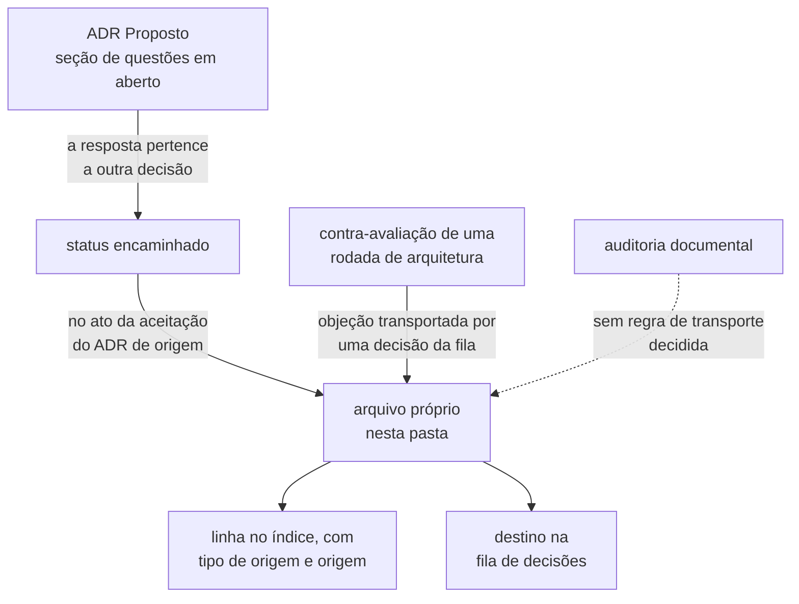
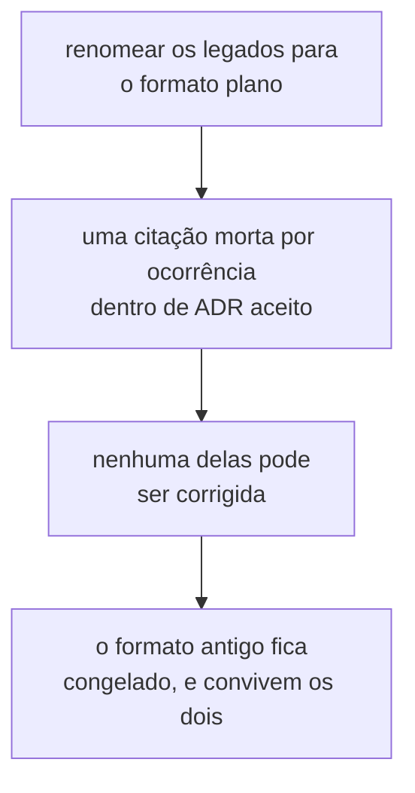

# Questões

Uma questão é uma pergunta encaminhada: ela nasceu no debate de um artefato, e a
resposta pertence a uma decisão diferente da que a levantou. Cada uma vive num arquivo
próprio nesta pasta, para que uma decisão futura, um Feature Card ou um Example Mapping
possa referenciá-la diretamente, sem depender de uma âncora dentro de outro documento.

**Este arquivo é o dono do identificador de questão e do inventário de questões.** A
gramática está na seção [`Identificador`](#identificador); o inventário, na seção
[`Índice`](#índice). Nenhum outro documento **DEVE** declarar formato, quantidade ou
estado de questão — quem precisar deles cita este arquivo pela âncora. Um guia que
repita a gramática ou o total passa a envelhecer em silêncio na primeira questão nova, e
é exatamente esse envelhecimento que esta divisão de donos existe para impedir.

## De onde uma questão vem

Duas origens têm regra de transporte escrita, e o índice registra a origem de cada
questão na coluna `Tipo de origem`. Uma terceira já tem linha no índice **sem** ter
regra, e quem a nomeia é a seção
[`Origem nova`](#origem-nova-e-o-que-ainda-não-tem-regra).

**`ADR proposto`.** A questão nasce na seção `## Questões em aberto` de um ADR ainda
`Proposto`. Se a resposta pertence a outra decisão, ela recebe status `encaminhado` e,
no ato da aceitação do ADR de origem, é transportada para um arquivo nesta pasta —
**inteira, não resumida**. O ADR de destino precisa nascer com o problema que motivou a
entrada dele na [fila de decisões](../adr/fila-de-decisoes.md). Um resumo é a mesma
perda, mais devagar. O processo de debate que produz a questão está em
[`adr/README.md`](../adr/README.md#processo-de-debate), e a coluna `Origem` guarda o ADR
e o número que a questão tinha na seção dele.

**`contra-avaliação`.** A questão nasce como objeção de um agente adversarial contra uma
rodada de arquitetura, e é transportada por uma decisão da fila quando aquela rodada é
arquivada. A coluna `Origem` guarda a data da rodada e o número da objeção. **Uma
objeção não é veredito**: ela foi produzida por instrução de refutar a rodada inteira,
sem buscar equilíbrio, e as citações que a sustentam não foram checadas uma a uma. Por
isso toda questão desta origem carrega o campo `Verificação da objeção` no próprio
arquivo — o valor dele vive lá, e não aqui, como em [`Q-0019`](Q-0019.md).



Este arquivo documenta apenas o que acontece **depois** que uma questão nasce. Enquanto
ela for seção de um ADR proposto ou objeção dentro do documento de uma rodada, ela não
tem arquivo e não é citável por identificador.

### Origem nova, e o que ainda não tem regra

Nem toda pergunta do repositório vira questão desta pasta, e o critério de entrada de
uma origem nova não foi decidido.

- **As perguntas em aberto de um Example Mapping ficam no próprio arquivo** e nunca
  foram transportadas. O bloco é obrigatório lá, por
  [`docs/AGENTS.md`](../AGENTS.md#example-mapping).
- **As perguntas de integração usam outro espaço de nomes, `Q-INT-N`**, e vivem em
  [`architecture/integrations.md`](../architecture/integrations.md#perguntas-em-aberto).
  Elas **NÃO DEVEM** entrar neste índice, e este arquivo não é dono daquele formato.
- **Uma questão levantada por auditoria, por Feature Card ou por qualquer outro artefato
  não tem regra de transporte.** É `Pergunta em aberto`: quem decidir precisa dizer se a
  origem entra e com que `Tipo de origem`. Enquanto não houver decisão, um arquivo que
  não declare de onde veio entra no índice como `origem não declarada` — a origem **NÃO
  DEVE** ser deduzida do número, do título nem do destino. **O caso concreto já
  existe:** sete questões extraídas de [`CONTEXT.md`](../CONTEXT.md) em 2026-08-07
  entraram no índice com o `Tipo de origem` descritivo `auditoria documental`, e o
  parágrafo que segue a tabela explica por que aquele rótulo não é decisão.

## Identificador

**Questão nova recebe `Q-NNNN`** — plano, quatro dígitos, sem sufixo. `Q-0029`, nunca
`Q-0029-1`. Decidido em 2026-08-05, pela decisão `A2`. O identificador não codifica mais
a origem, porque quem a codifica são as colunas `Tipo de origem` e `Origem` do índice.

**O próximo número é o sucessor do maior `Q-NNNN` da tabela do índice.** Ele é atribuído
no ato da criação do arquivo, e o dono da atribuição é este índice. Número não é
reciclado: uma questão resolvida mantém o dela para sempre. A sequência plana começou em
`Q-0019`, deixando os números abaixo dela sem colisão visual com os identificadores
legados.

**Cite uma questão pelo identificador**, nunca por "a questão K do ADR-NNNN" — aquela
seção deixa de existir quando o ADR é aceito, e a citação passaria a apontar para nada.
A forma da citação é a mesma nos dois formatos: o identificador em code span, com link
relativo ao arquivo — `` [`Q-0029`](Q-0029.md) `` de dentro desta pasta, e
`` [`Q-0029`](questions/Q-0029.md) `` de `docs/`. Nenhum leitor precisa conhecer a regra
para ler a tabela: a coluna `ID` distingue os dois formatos à vista.

### O formato antigo `Q-NNNN-K` fica congelado como legado

Nele, `NNNN` era o ADR de origem e `K` o número que a questão tinha na seção
`## Questões em aberto` dele. **Os identificadores legados não são renomeados**, e o
formato não é reutilizado, não é estendido, e nenhuma questão nova o recebe. Quais são
eles é a tabela do índice que diz, e não este parágrafo.

`K` tem lacunas de propósito. Só a questão que recebeu status `encaminhado` foi
transportada, e um número ausente significa que aquela questão não o recebeu.

O motivo do congelamento é medido, e a medição se refaz — não se cita de memória, porque
o número sobe a cada documento que cita uma questão legada. Em 2026-08-07 o formato
aparecia 500 vezes em `docs/` e no `AGENTS.md` da raiz, e **148 dessas ocorrências
estavam dentro de ADRs aceitos**, cujo corpo não pode ser editado. Renomear produziria
uma citação morta para cada uma delas, dentro de artefato imutável. Os dois comandos
abaixo refazem a contagem:

```bash
git grep -ohE 'Q-000[0-9]-[0-9]+' -- docs AGENTS.md | wc -l
git grep -ohE 'Q-000[0-9]-[0-9]+' -- 'docs/adr/0*.md' | wc -l
```



O custo aceito é que dois formatos convivem no índice por tempo indeterminado.

Descartadas três alternativas. Um prefixo próprio `Q-ARQ-K`, por criar um terceiro
espaço de nomes ao lado de `Q-NNNN-K` e `Q-INT-*`. `NNNN` passando a ser o de
**destino**, porque uma questão cujo destino é linha de fila sem número de ADR seguiria
inatribuível. E a questão permanecer como linha de fila, porque a fila não é citável de
forma estável.

## Ciclo de vida

Uma questão nasce com status `pendente`. Ela **não** é apagada quando alguém a resolve:
o status passa a `resolvida por ADR-NNNN`, e o arquivo dela abre nomeando a subseção do
ADR onde a decisão está. O enunciado permanece porque ele registra o que estava em jogo
antes da decisão — e é isso que um leitor futuro não consegue reconstruir a partir do
ADR de destino.

**O arquivo da questão é a fonte do status, e o índice o copia.** Quando os dois
divergirem, o arquivo vence e a linha do índice é corrigida — nunca o contrário.

Uma questão **PODE** ser resolvida em parte, quando um ADR responde só uma das metades
do enunciado. O status vira `resolvida por ADR-NNNN, em parte`, e é o arquivo que
declara qual metade o ADR fechou e qual destino a outra mantém na fila.

O custo dessa escolha é que o índice abaixo cresce e passa a listar questão viva ao lado
de questão morta. A coluna `Status` é a única marca que as separa, e ela é obrigatória
por isso.

O enunciado transportado é reescrito num ponto só, no momento em que o arquivo é criado:
as referências internas ao documento de origem. "Este ADR", "aqui" e "a questão 3" não
significam nada fora do documento em que foram escritas, e passam a nomear o documento e
o identificador.

## Índice

**A tabela é o inventário completo: uma linha por arquivo `Q-*.md` desta pasta, e
nenhuma linha sem arquivo.** Quem precisar de quantas questões existem, de quantas
seguem pendentes ou de quais são, conta as linhas. Nenhum parágrafo deste arquivo repete
esses números, e nenhum outro documento **DEVE** repeti-los: um total escrito em prosa
envelhece na primeira questão nova, sem que ninguém perceba.

| ID                        | Questão                                                                           | Tipo de origem       | Origem                   | Destino na fila              | Status                             |
|---------------------------|-----------------------------------------------------------------------------------|----------------------|--------------------------|------------------------------|------------------------------------|
| [`Q-0001-1`](Q-0001-1.md) | O endereço da fronteira precisa sobreviver à edição da operação                   | ADR proposto         | ADR-0001, q. 1           | Experiment                   | `pendente`                         |
| [`Q-0001-2`](Q-0001-2.md) | O compartilhamento por colaborador injetado continua sem guarda                   | ADR proposto         | ADR-0001, q. 2           | estratégias de concorrência  | `resolvida por ADR-0006`           |
| [`Q-0001-3`](Q-0001-3.md) | O critério de igualdade entre dois traços de SQL não está definido                | ADR proposto         | ADR-0001, q. 3           | o domínio mínimo             | `resolvida por ADR-0002`           |
| [`Q-0001-4`](Q-0001-4.md) | O escalonador precisa de um protocolo de desistência                              | ADR proposto         | ADR-0001, q. 4           | a forma do escalonador       | `resolvida por ADR-0005`           |
| [`Q-0002-1`](Q-0002-1.md) | A comparação por valor depende de regras que nenhum teste verifica                | ADR proposto         | ADR-0002, q. 1           | arquitetura mínima e guardas | `pendente`                         |
| [`Q-0002-2`](Q-0002-2.md) | Quem declara que a execução terminou, e o oráculo lê antes ou depois disso        | ADR proposto         | ADR-0002, q. 2           | a forma do escalonador       | `resolvida por ADR-0005`           |
| [`Q-0002-3`](Q-0002-3.md) | Os dois oráculos descrevem apenas o estado final quiescente                       | ADR proposto         | ADR-0002, q. 3           | os dois formatos de veredito | `pendente`                         |
| [`Q-0002-4`](Q-0002-4.md) | O estado inicial não é estabelecido por ninguém                                   | ADR proposto         | ADR-0002, q. 4           | Experiment                   | `pendente`                         |
| [`Q-0003-1`](Q-0003-1.md) | Um worker que nunca chega trava o agendamento, e a recusa por texto não o alcança | ADR proposto         | ADR-0003, q. 1           | a forma do escalonador       | `resolvida por ADR-0005`           |
| [`Q-0003-2`](Q-0003-2.md) | Um agendamento sobre uma tentativa que talvez não ocorra                          | ADR proposto         | ADR-0003, q. 2           | a forma do escalonador       | `resolvida por ADR-0005`           |
| [`Q-0003-3`](Q-0003-3.md) | Duas execuções do mesmo experimento não têm critério de igualdade                 | ADR proposto         | ADR-0003, q. 3           | os dois formatos de veredito | `resolvida por ADR-0007, em parte` |
| [`Q-0003-8`](Q-0003-8.md) | O `N` declarado antes não fecha com uma estratégia que retenta                    | ADR proposto         | ADR-0003, q. 8           | Experiment                   | `pendente`                         |
| [`Q-0004-2`](Q-0004-2.md) | Nada obriga o passo a reportar a chave de contenção                               | ADR proposto         | ADR-0004, q. 2           | arquitetura mínima e guardas | `pendente`                         |
| [`Q-0004-3`](Q-0004-3.md) | Comparar janelas exige um instante comparável entre workers                       | ADR proposto         | ADR-0004, q. 3           | o log de observações         | `pendente`, escopo reduzido        |
| [`Q-0004-4`](Q-0004-4.md) | A regra de parada colide com a exigência de nascer entregando                     | ADR proposto         | ADR-0004, q. 4           | entrega contínua no homelab  | `pendente`                         |
| [`Q-0004-5`](Q-0004-5.md) | O terceiro formato de veredito precisa caber ao lado dos dois já previstos        | ADR proposto         | ADR-0004, q. 5           | os dois formatos de veredito | `pendente`                         |
| [`Q-0004-8`](Q-0004-8.md) | O limite `3/N` pressupõe ensaios independentes                                    | ADR proposto         | ADR-0004, q. 8           | os dois formatos de veredito | `pendente`                         |
| [`Q-0005-1`](Q-0005-1.md) | O critério de "falha não recuperada pela estratégia" não está definido            | ADR proposto         | ADR-0005, q. 1           | estratégias de concorrência  | `resolvida por ADR-0006`           |
| [`Q-0019`](Q-0019.md)     | Quatro das seis contradições são divergência entre ADR e plano                    | contra-avaliação     | 2026-08-03, R1           | os dois ADRs do lote 1       | `pendente`                         |
| [`Q-0020`](Q-0020.md)     | Duas colisões de vocabulário que a rodada não confessou                           | contra-avaliação     | 2026-08-03, R3 (b) e (c) | o ADR de vocabulário         | `pendente`                         |
| [`Q-0021`](Q-0021.md)     | A quarentena do Bloco 3 é sub-inclusiva                                           | contra-avaliação     | 2026-08-03, R4           | Experiment                   | `pendente`                         |
| [`Q-0022`](Q-0022.md)     | O limiar de SSE de `D-UI-09` não foi medido                                       | contra-avaliação     | 2026-08-03, R6           | interface web                | `pendente`                         |
| [`Q-0023`](Q-0023.md)     | A doutrina do gatilho foi aplicada uma vez e suspensa cinco                       | contra-avaliação     | 2026-08-03, R7           | arquitetura mínima e guardas | `pendente`                         |
| [`Q-0024`](Q-0024.md)     | `D-ARQ-12` não tem jurisdição sobre um ADR de outro repositório                   | contra-avaliação     | 2026-08-03, R8           | entrega contínua no homelab  | `pendente`                         |
| [`Q-0025`](Q-0025.md)     | `D-DAT-02` apaga um fenômeno em vez de observá-lo                                 | contra-avaliação     | 2026-08-03, R9           | modelo de dados mínimo       | `pendente`                         |
| [`Q-0026`](Q-0026.md)     | `D-MSG-05` decide antes de saber onde um experimento roda                         | contra-avaliação     | 2026-08-03, R10          | mensageria e etapa 5         | `pendente`                         |
| [`Q-0027`](Q-0027.md)     | `D-MSG-10` gastaria uma aprovação para ratificar a regra vigente                  | contra-avaliação     | 2026-08-03, R11          | mensageria e etapa 5         | `pendente`                         |
| [`Q-0028`](Q-0028.md)     | Decisões em silêncio, termos sem glossário e números sem origem                   | contra-avaliação     | 2026-08-03, R13          | arquitetura mínima e guardas | `pendente`                         |
| [`Q-0029`](Q-0029.md)     | O glossário não tem dono aprovador                                                | auditoria documental | CONTEXT.md, P1           | não declarada                | `pendente`                         |
| [`Q-0030`](Q-0030.md)     | Um termo do glossário pode contradizer um ADR aceito?                             | auditoria documental | CONTEXT.md, P2           | não declarada                | `pendente`                         |
| [`Q-0031`](Q-0031.md)     | `JVM_LOCK` está no glossário congelado e fora do ADR-0006                         | auditoria documental | CONTEXT.md, P3           | não declarada                | `pendente`                         |
| [`Q-0032`](Q-0032.md)     | `worker` não tem definição em ADR aceito                                          | auditoria documental | CONTEXT.md, P4           | não declarada                | `pendente`                         |
| [`Q-0033`](Q-0033.md)     | Dois nomes ingleses não são forçados pela tradução                                | auditoria documental | CONTEXT.md, P7           | não declarada                | `pendente`                         |
| [`Q-0034`](Q-0034.md)     | A conversão de vocabulário não alcança o corpus                                   | auditoria documental | CONTEXT.md, P8           | não declarada                | `pendente`                         |
| [`Q-0035`](Q-0035.md)     | `experiment` é palavra estabelecida sem conceito decidido                         | auditoria documental | CONTEXT.md, P5           | não declarada                | `pendente`                         |

Toda a origem `contra-avaliação` da tabela vem da mesma rodada, a de 2026-08-03, cujo
documento foi arquivado em
[`contra-avaliacao.md`](../adr/arquivo/proposta-2026-08-03/contra-avaliacao.md), e foi
transportada pela decisão `D-3` em 2026-08-05.

Toda a origem `auditoria documental` da tabela vem da mesma extração, a de 2026-08-07:
a seção `## Perguntas em aberto` de [`CONTEXT.md`](../CONTEXT.md) foi esvaziada pelo
achado
[`A-09`](../audits/2026-08-06-coerencia-e-limites-documentais.md#a-09--contextmd-é-glossário-proposta-decisão-e-backlog-ao-mesmo-tempo),
e as sete perguntas que não tinham identificador ganharam arquivo aqui. A coluna
`Origem` guarda o rótulo que cada uma tinha naquela seção, de `P1` a `P8`.

**Uma das oito não virou arquivo novo, e uma virou pela metade.** `P6` já tinha o dela,
[`Q-0004-3`](Q-0004-3.md), e nada foi criado. `P5` foi transportada em duas partes: a
parte do que `N` conta já estava em [`Q-0003-8`](Q-0003-8.md), e o resto — o estatuto da
palavra `experiment` e o conjunto das três questões que mudam o escopo daquela decisão —
virou [`Q-0035`](Q-0035.md), que declara a divisão no próprio arquivo. `Q-0003-8` **não**
foi editada por causa disso: ela é a fonte do status dela, e o enunciado transportado de
um ADR aceito não muda porque outra questão passou a citá-lo.

**O rótulo `auditoria documental` é descritivo, e não uma regra decidida.** Ele foi
escrito porque cada um dos sete arquivos declara de onde veio, e a seção
[`Origem nova`](#origem-nova-e-o-que-ainda-não-tem-regra) proíbe deduzir origem. Se a
origem `auditoria` entra nesta pasta, e com que `Tipo de origem`, continua sem decisão —
estas sete linhas são o caso concreto que a motiva, e quem decidir pode renomear o
rótulo. A coluna `Destino na fila` delas é `não declarada` pelo mesmo motivo: o material
extraído não nomeia linha de fila para nenhuma das sete, e deduzi-la seria inventar
decisão. `Q-0035` é o caso em que a tentação é maior: o enunciado dela cita "a fila,
posição 8" sem nomear a linha, e converter posição em nome continua sendo dedução.

`Q-0003-3` é a única questão resolvida em parte. O ADR-0007 fechou a metade de execução
de controle; a metade medida segue em aberto, e é o destino dela que a linha registra.
As duas metades estão declaradas em campos separados no [próprio arquivo](Q-0003-3.md).
