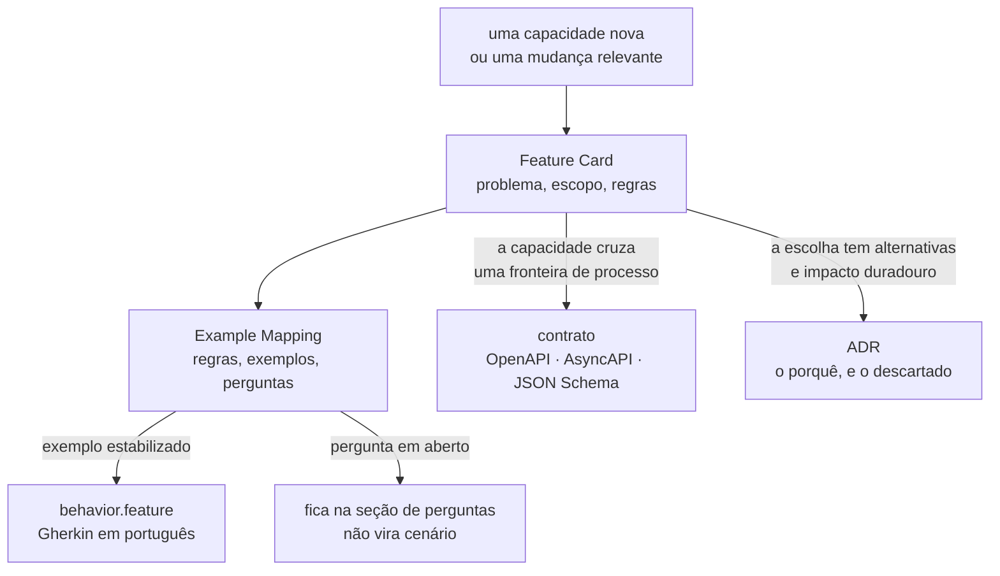

# Processo de especificação

Como uma funcionalidade deste laboratório é especificada, e o que cada artefato responde.

Adotado em 2026-08-01. Substitui o ADR como forma principal de documentação; **não**
revoga o processo de ADR, descrito em [`adr/README.md`](adr/README.md).

## O que mudou, e por quê

Até 2026-08-01 o repositório tinha uma prática só: escrever ADRs. O resultado mensurável
é 3.874 linhas de documentação para zero linha de código.

O problema não é o volume. É que os ADRs passaram a carregar três coisas de naturezas
diferentes no mesmo documento:

| O que está escrito lá                                             | O que é              |
|-------------------------------------------------------------------|----------------------|
| "o passo é a unidade de execução, e não o método linear"          | decisão arquitetural |
| `perdidas = commits − (value_final − value_inicial)`              | regra de negócio     |
| a tabela de cinco condições que classifica um veredito zero       | tabela de decisão    |

Só a primeira tem alternativas plausíveis e impacto arquitetural duradouro. As outras
duas são **comportamento**: elas descrevem o que a plataforma faz, não o que foi
escolhido em vez de quê. Comportamento escrito como prosa argumentativa não vira teste, e
o argumento que o sustentava esconde a regra que interessa a quem for implementar.

A separação é essa. **O ADR guarda o porquê da escolha; o Feature Card guarda o quê do
comportamento.**

## Os quatro artefatos, e quando cada um entra



### Feature Card — o padrão

Todo trabalho relevante começa por um card em `features/<slug>/feature-card.md`.

Um card cobre uma **capacidade**, nunca um endpoint, uma classe ou uma tarefa técnica.
Neste repositório a capacidade é experimental: "detectar a atualização perdida" é uma
capacidade; "expor `POST /experiments`" não é.

O card tem no máximo **700 palavras** e contém, nesta ordem: problema e resultado
esperado; atores e gatilho; escopo; fora de escopo; regras de negócio; integrações e
contratos afetados; riscos e decisões pendentes; critérios de pronto; links.

Um card que ultrapasse 700 palavras está cobrindo mais de uma capacidade. Divida.

### Example Mapping — onde as dúvidas ficam visíveis

Cada card tem um `example-mapping.md` com quatro blocos: história, regras, exemplos
concretos, perguntas em aberto. Um quinto bloco registra o que foi **adiado de
propósito**, com o gatilho que o retoma.

Os exemplos existem para revelar o que a regra não disse: fronteira, erro, repetição,
concorrência, idempotência e consistência. Um exemplo que apenas reafirma a regra em
outras palavras não acrescenta nada.

> **Não converta exemplo em Gherkin antes de as perguntas estarem explícitas.** Um
> cenário escrito sobre uma regra em debate congela a versão errada dela, e o custo de
> descobrir isso aparece no primeiro teste vermelho que ninguém sabe interpretar.

### BDD — só o que estabilizou

`behavior.feature` traz os exemplos cujas regras ninguém está mais debatendo.

- Gherkin em **português** (`# language: pt`), como o resto do repositório.
- Comportamento **externo e observável**. Nome de classe, de tabela e de coluna não
  aparecem num cenário; o veredito, a contagem e a recusa aparecem.
- Poucos cenários. Por regra: o fluxo principal, uma falha relevante, e um caso de borda
  quando ele mudar o resultado.
- **Nenhuma dependência de BDD entra por causa disso.** Enquanto não houver código, os
  arquivos `.feature` são a especificação viva. Cada cenário nomeia o teste que o
  verifica, ou declara que o teste ainda não existe.

### Contratos — só o que existe

OpenAPI, AsyncAPI e JSON Schema descrevem o que atravessa uma fronteira de processo.

Um contrato é criado **quando a interface existir**, nunca antes. Um esquema escrito para
uma API que ninguém expôs documenta uma intenção, e intenção pertence ao card.

O que estiver formalizado num contrato NÃO DEVE ser repetido em Markdown. O contrato é a
fonte; o card faz link para ele.

O estado atual dos contratos e os gatilhos que os criam estão em
[`contracts/README.md`](contracts/README.md).

### ADR — só decisão arquitetural durável

Um ADR continua sendo escrito quando a decisão atende aos quatro critérios de
[`adr/README.md`](adr/README.md): tem alternativas plausíveis, tem impacto arquitetural
duradouro, cria restrição futura e representa um trade-off.

O teste prático que separa os dois artefatos:

| Pergunta                                                     | Sim → ADR | Sim → Feature Card |
|--------------------------------------------------------------|-----------|--------------------|
| Existe uma alternativa que alguém defenderia com argumento?  | sim       | —                  |
| A escolha restringe o que se pode construir depois?          | sim       | —                  |
| A frase descreve o que o sistema faz, e é verificável?       | —         | sim                |
| Um teste poderia falhar por causa dela?                      | —         | sim                |

Uma regra que caiba nas duas colunas indica um ADR carregando comportamento. Escreva o
ADR com o porquê, e o card com o quê, e faça o card citar o ADR.

**Os ADRs aceitos não mudam.** `ADR-0001`, `ADR-0002` e `ADR-0004` estão `Aceito` e nunca
são editados nem apagados — a regra de imutabilidade de `adr/README.md` continua valendo
sem alteração. Os Feature Cards os citam por caminho e linha; eles não os substituem.

### SDD — só para mudança de alto risco

Um documento de desenho completo é escrito apenas quando a mudança for de alto risco,
atravessar mais de um processo, ou alterar contrato com consumidor conhecido. Nas três
condições o card sozinho não carrega o suficiente para revisão.

Nenhuma das três se aplica ao MVP: um processo, um banco, nenhum consumidor externo.

## Regras que valem para todo artefato

**Escopo e fora de escopo são obrigatórios.** Um card sem "fora de escopo" não delimita
nada, e a primeira discordância aparece na revisão do código.

**Nada que importa pode existir apenas na conversa.** A regra dura do processo de ADR vale
igual aqui. Uma objeção levantada durante o refinamento é escrita na seção de perguntas em
aberto do Example Mapping **no mesmo turno em que aparece**.

**Evidência com caminho e linha.** Toda afirmação sobre comportamento existente cita o
arquivo e a linha que a sustenta. O que não puder ser confirmado entra como `Pergunta em
aberto`, nunca como fato.

**A LLM propõe; o humano aprova.** Um assistente gera perguntas, contraexemplos e lacunas.
Regra de negócio e decisão são aprovadas por pessoa, explicitamente.

**Documento curto, ligado, sem repetição.** Prefira um link a um parágrafo repetido. A
mesma regra escrita em dois lugares diverge no primeiro dia em que alguém edita um deles.

**As convenções de escrita do repositório continuam valendo:** português do Brasil com
acentuação correta, voz ativa, uma ideia por frase, linhas quebradas em ~88 colunas,
requisito normativo em RFC 2119 traduzida (`DEVE`, `NÃO DEVE`, `DEVERIA`, `PODE`), sem
emojis e sem linguagem de marketing. A lista de palavras proibidas está em
[`adr/README.md`](adr/README.md), seção `## Convenções`.

## Onde os artefatos vivem

```
docs/
  specification-process.md      este documento
  features/
    README.md                   índice das capacidades
    <slug>/
      feature-card.md           a capacidade
      example-mapping.md        regras, exemplos, perguntas
      behavior.feature          Gherkin em português
  contracts/
    README.md                   estado dos contratos e gatilhos
    openapi/                    vazio até uma API HTTP existir
    asyncapi/                   vazio até mensageria existir
  architecture/
    integrations.md             matriz de integrações
  adr/                          decisões arquiteturais (inalterado)
  experiments/                  resultados de execução (inalterado)
```

`experiments/` guarda resultados; a definição de um experimento é outra coisa, e onde ela
vive é uma tensão aberta — [`plano-do-laboratorio.md`](plano-do-laboratorio.md), seção 11,
tensão 1.

## O que este processo não decide

**O destino da fila de decisões de `adr/README.md`.** Onze decisões estão enfileiradas
lá, e algumas são comportamento disfarçado de arquitetura. Podá-la é decisão consciente,
e ela não foi tomada.

**Se um Feature Card pode contradizer um ADR aceito.** Não aconteceu ainda. Quando
acontecer, o caminho provável é um ADR novo que substitua o antigo — mas a regra não está
escrita.

**Quem aprova um card.** O processo de ADR exige aprovação explícita e nomeada. O
equivalente para um card não foi definido.
