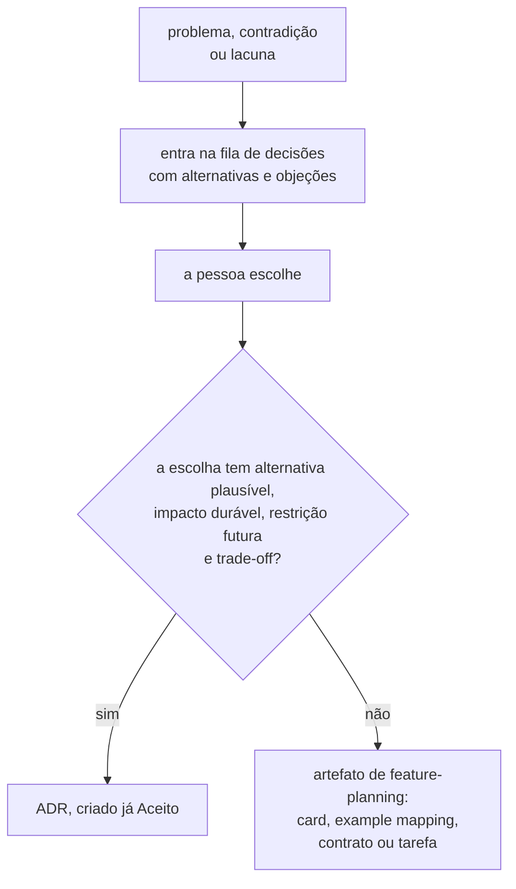
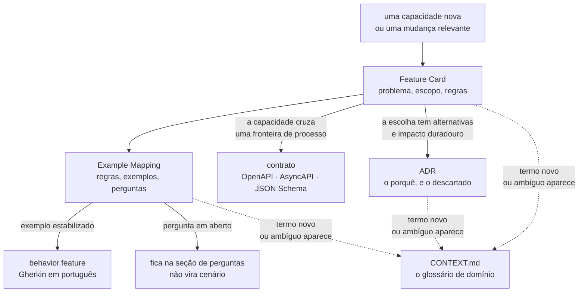
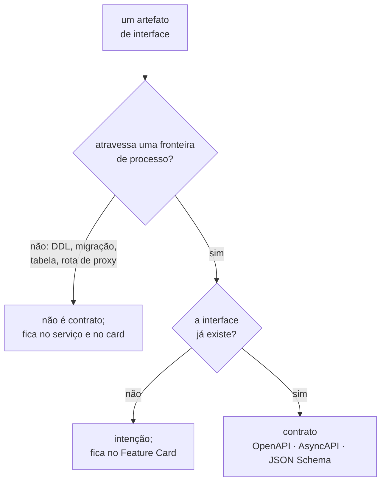
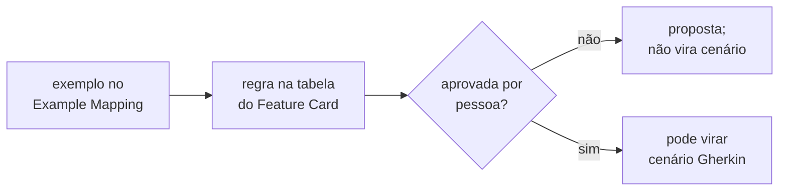
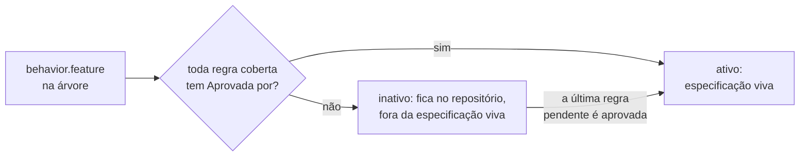

# Processo de especificação

Como uma funcionalidade deste laboratório é especificada, e o que cada artefato responde.

Adotado em 2026-08-01. Substitui o ADR como forma principal de documentação; **não**
revoga o processo de ADR, descrito em [`adr/README.md`](adr/README.md).

**Este documento é a fonte normativa de processo e de lifecycle.** Skill, agente,
validador e instrução local **aplicam** o que está aqui, ou remetem a esta página. Nenhum
deles introduz variante de limite, de citação, de aprovação ou de alteração de ADR — uma
divergência entre uma skill e esta página é defeito da skill, e o caminho é corrigi-la.

Quatro assuntos têm dono próprio, e este documento os aponta em vez de os repetir:

| Assunto                      | Dono                                                   |
|------------------------------|--------------------------------------------------------|
| enforcement dos limites      | `check_artifact_limits.py`                             |
| mecânica de alteração de ADR | [`adr/README.md`](adr/README.md#índice)                |
| fronteira entre processos    | [integrations.md](architecture/integrations.md#matriz) |
| identificador de questão     | [`questions/README.md`](questions/README.md#índice)    |

## O que mudou, e por quê

Até 2026-08-01 o repositório tinha uma prática só: escrever ADRs. O resultado mensurável,
**naquela data**, era 3.874 linhas de documentação para zero linha de código. O número é
o retrato do dia em que o processo mudou, e não o estado de hoje.

O problema não é o volume. É que os ADRs passaram a carregar três coisas de naturezas
diferentes no mesmo documento:

| O que está escrito lá                                             | O que é              |
|-------------------------------------------------------------------|----------------------|
| "o passo é a unidade de execução, e não o método linear"          | decisão arquitetural |
| `perdidas = commits − (value_final − value_inicial)`              | regra de negócio     |
| a tabela de cinco condições que classifica um veredito zero       | tabela de decisão    |

Só a primeira tem alternativas plausíveis e impacto arquitetural duradouro. As outras
duas são **comportamento**: elas descrevem o que a plataforma faz, não o que foi
escolhido em vez de quê. Comportamento escrito como prosa argumentativa não vira teste, e
o argumento que o sustentava esconde a regra que interessa a quem for implementar.

A separação é essa. **O ADR guarda o porquê da escolha; o Feature Card guarda o quê do
comportamento.**

## A decisão vem antes do artefato

Adotado em 2026-08-04. Substitui a prática de enfileirar ADRs.

O que se enfileira é **decisão**, e não ADR. Uma decisão entra na fila com o problema
que a exige, as alternativas e as objeções levantadas contra cada uma. Ela sai da fila
quando a pessoa escolhe. Só então o artefato é escolhido.



Três regras seguem disso.

- **Escrever ADR NÃO É obrigatório.** O ADR surge durante o planejamento, quando a
  escolha atende aos quatro critérios de [`adr/README.md`](adr/README.md). Uma escolha
  que não os atende gera artefato de [`features/`](features/README.md), e nenhum ADR.
- **Um ADR nasce `Aceito`.** Ele registra decisão já tomada, e não decisão em debate. O
  estado `Proposto` continua disponível e deixa de ser o caminho padrão.
- **O debate acontece na fila, não no ADR.** Objeção, alternativa descartada e pendência
  são escritas na linha da fila **no mesmo turno em que aparecem**.

**O custo desta troca.** O **corpo** de um ADR que nasce `Aceito` não é reescrito à
vontade: ele só muda pelas formas que o
[índice de ADRs](adr/README.md#a-emenda-e-o-adendo-decididos-em-2026-08-05) permite, e
nenhuma delas reabre o corpo para reescrever o argumento — o patch conserta citação,
caminho e erro material, nunca a tese. Uma objeção que aparecer depois de o ADR estar
escrito custa um documento novo. Por isso a linha da fila carrega o peso do
debate — ela é o único lugar em que uma objeção ainda cabe sem custar um documento.

## Os cinco artefatos, e quando cada um entra



### Feature Card — o padrão

Todo trabalho relevante começa por um card em `features/<slug>/feature-card.md`.

Um card cobre uma **capacidade**, nunca um endpoint, uma classe ou uma tarefa técnica.
Neste repositório a capacidade é experimental: "detectar a atualização perdida" é uma
capacidade; "expor `POST /experiments`" não é.

O card contém, nesta ordem: problema e resultado esperado; atores e gatilho; escopo; fora
de escopo; regras de negócio; integrações e contratos afetados; riscos e decisões
pendentes; critérios de pronto; links.

**O card tem no máximo 5.500 caracteres de prosa.** Diagrama, bloco de código e tabela
**NÃO** entram na contagem, e a isenção vale para todo artefato `.md` com limite. Um card
acima do limite cobre mais de uma capacidade: divida-o, e tire o corte da prosa, nunca da
evidência.

A unidade era **palavras** até 2026-08-06, e a medição cobrava o texto dentro das
tabelas. A troca foi decidida em 2026-08-06, e quem a aplica é o
`check_artifact_limits.py` invocado logo abaixo. A razão: as convenções deste
repositório exigem um diagrama para todo fluxo e uma linha de tabela com evidência e
aprovador para toda regra, e um limite que contasse os dois punia o cumprimento da
regra. **A pendência de um card com 761 palavras contra 700 deixou de existir** junto
com a unidade que a media; ela não é dívida aberta deste processo.

**O medidor é o script, e nenhuma outra medição vale** — nem `wc`, nem contagem de
palavras, nem tamanho bruto do arquivo, nem estimativa por leitura:

```bash
python .claude/skills/feature-planning/scripts/check_artifact_limits.py \
  --root . --file docs/features/<slug>/feature-card.md
```

Ele imprime a contagem de prosa e, entre parênteses, o tamanho bruto. Um número que não
saiu dele não é evidência de limite. Uma skill, um agente ou uma instrução local que
declare outro teto, outra unidade ou outro medidor está desatualizado em relação a esta
seção, e o caminho é corrigi-lo — nunca abrir uma variante.

### Example Mapping — onde as dúvidas ficam visíveis

Cada card tem um `example-mapping.md` com quatro blocos: história, regras, exemplos
concretos, perguntas em aberto. Um quinto bloco registra o que foi **adiado de
propósito**, com o gatilho que o retoma.

**O Example Mapping NÃO tem teto.** A ausência de teto foi decidida em 2026-08-06, e
quem a aplica é o `check_artifact_limits.py`, o mesmo medidor do card: o
artefato cresce por exemplo acrescentado, e acrescentar exemplo **é o trabalho dele** —
um limite ali transforma "achei mais um contraexemplo" em "preciso apagar um dos
antigos". O verificador o isenta **por nome**, e não pela ausência de entrada, porque sem
a isenção o arquivo cairia no teto genérico de `.md`. O custo está aceito e nomeado: é o
único artefato de [`features/`](features/README.md) sem freio nenhum.

Os exemplos existem para revelar o que a regra não disse: fronteira, erro, repetição,
concorrência, idempotência e consistência. Um exemplo que apenas reafirma a regra em
outras palavras não acrescenta nada.

> **Não converta exemplo em Gherkin antes de as perguntas estarem explícitas.** Um
> cenário escrito sobre uma regra em debate congela a versão errada dela, e o custo de
> descobrir isso aparece no primeiro teste vermelho que ninguém sabe interpretar.

### BDD — só o que estabilizou

`behavior.feature` traz os exemplos cujas regras ninguém está mais debatendo.

- Gherkin em **português** (`# language: pt`), como o resto do repositório.
- Comportamento **externo e observável**. Nome de classe, de tabela e de coluna não
  aparecem num cenário; o veredito, a contagem e a recusa aparecem.
- Poucos cenários. Por regra: o fluxo principal, uma falha relevante, e um caso de borda
  quando ele mudar o resultado.
- **Nenhuma dependência de BDD entra por causa disso.** Cada cenário nomeia o teste que o
  verifica, ou declara que o teste ainda não existe.
- **Um `.feature` só é especificação viva se as regras que ele cobre estiverem
  aprovadas.** Um arquivo que não satisfaça isso fica **inativo**, e a regra de transição
  está em
  [`Quem aprova o que`](#quem-aprova-o-que-decidido-em-2026-08-05).

### Contratos — só o que existe

OpenAPI, AsyncAPI e JSON Schema descrevem o que atravessa uma fronteira de processo.

**Contrato é o que atravessa uma fronteira de processo, e nada além disso.** Duas
consequências, e as duas são normativas.

**O DDL de um serviço NÃO É contrato.** Migração Flyway, tabela, índice e coluna
descrevem o estado interno de **um** processo, e nenhum outro processo os lê: o
[ADR-0010](adr/0010-a-fronteira-de-schema-e-o-cdc-como-fonte-do-veredito.md#decisão)
proíbe um serviço de acessar o schema de outro, e é essa proibição que torna o esquema
privado por construção. Inventariar DDL como contrato convida exatamente o `SELECT`
cruzado que aquele ADR fechou. O esquema de um serviço é descrito pelas migrações dele e
pelo card que as motiva — nunca por `contracts/`.

**Uma rota de proxy do frontend também não é contrato.** Ela é configuração de
desenvolvimento, e não interface publicada por um processo.

Um contrato é criado **quando a interface existir**, nunca antes. Um esquema escrito para
uma API que ninguém expôs documenta uma intenção, e intenção pertence ao card.



O que estiver formalizado num contrato NÃO DEVE ser repetido em Markdown. O contrato é a
fonte; o card faz link para ele.

O estado atual dos contratos e os gatilhos que os criam estão em
[`contracts/README.md`](contracts/README.md). Aquele inventário aplica esta regra; ele
não a redefine.

### ADR — só decisão arquitetural durável

Um ADR continua sendo escrito quando a decisão atende aos quatro critérios de
[`adr/README.md`](adr/README.md): tem alternativas plausíveis, tem impacto arquitetural
duradouro, cria restrição futura e representa um trade-off.

O teste prático que separa os dois artefatos:

| Pergunta                                                     | Sim → ADR | Sim → Feature Card |
|--------------------------------------------------------------|-----------|--------------------|
| Existe uma alternativa que alguém defenderia com argumento?  | sim       | —                  |
| A escolha restringe o que se pode construir depois?          | sim       | —                  |
| A frase descreve o que o sistema faz, e é verificável?       | —         | sim                |
| Um teste poderia falhar por causa dela?                      | —         | sim                |

Uma regra que caiba nas duas colunas indica um ADR carregando comportamento. Escreva o
ADR com o porquê, e o card com o quê, e faça o card citar o ADR.

#### O que muda num ADR aceito, e o que nunca muda

**A imutabilidade alcança o corpo, e não o arquivo inteiro.** Corpo é tudo a partir da
primeira seção `##`: contexto, problema, decisão, justificativa, consequências,
trade-offs e alternativas. Ele NÃO DEVE ser editado nem apagado, porque editá-lo apaga o
que se pensava na data da decisão.

**"Um ADR aceito é imutável", dito sem essa qualificação, é falso.** Existem formas
regradas de alterá-lo, e escrever a regra absoluta leva a produzir ADR novo onde uma
emenda bastava, ou a recusar um patch que a pessoa autorizou.

**Quais são essas formas, e como executar cada uma, é do índice de ADRs — e este
documento não as enumera.** A lista, a mecânica do rastro, a fronteira que separa regra
acessória de decisão principal, as regras do adendo e o livro-razão do patch estão em
[`adr/README.md`](adr/README.md#a-emenda-e-o-adendo-decididos-em-2026-08-05) e em
[`adr/README.md`](adr/README.md#a-revogação-da-imutabilidade-decidida-em-2026-08-07).
Este documento fixa que a alteração é regrada; aquele índice diz por quais formas.

**A enumeração saiu daqui porque envelheceu em silêncio.** Ela declarava quatro formas e
que "nenhuma quinta forma existe" depois de a revogação de 2026-08-07 já ter criado o
patch — e como este documento é para onde os outros mandam ir, um agente que o lesse
recusaria um patch autorizado. Duas listas da mesma coisa não têm como não divergir; a
saída não é sincronizá-las, é ter uma.

Os Feature Cards citam ADR por **caminho e âncora**; um card nunca substitui um ADR.
Quantos ADRs existem e em que estado, o [índice](adr/README.md#índice) diz — este
documento não repete a contagem.

### Glossário de domínio — CONTEXT.md

`CONTEXT.md` registra a linguagem ubíqua do laboratório. Ele é diferente dos outros
quatro artefatos porque não é acionado por uma capacidade nova — é mantido
continuamente, toda vez que um termo se cristaliza durante o refinamento de um Feature
Card, de um Example Mapping ou do debate de um ADR.

**O arquivo existe**, em [`CONTEXT.md`](CONTEXT.md). A criação preguiçosa que este
processo previa já aconteceu: o primeiro termo entrou em disputa, o glossário nasceu, e
esta seção deixou de descrever um arquivo ausente.

Uma entrada do glossário tem quatro partes, e nada além delas:

| Parte              | O que carrega                                      |
|--------------------|----------------------------------------------------|
| termo              | a palavra vigente, no idioma que o glossário fixa  |
| definição breve    | uma frase que distingue o termo do vizinho próximo |
| status ou sinônimo | vigente, ambíguo ou a evitar, e o que o substitui  |
| link de origem     | o artefato que fixou o termo, por caminho e âncora |

**O que NÃO DEVE entrar no glossário**, e para onde cada coisa vai:

| Conteúdo                           | Destino                                     |
|------------------------------------|---------------------------------------------|
| alternativa de nome, com o debate  | [fila de decisões](adr/fila-de-decisoes.md) |
| decisão proposta, não tomada       | a mesma fila, na linha que a enfileira      |
| ata de rodada, histórico de debate | o ADR que saiu dela, ou o arquivo histórico |
| backlog e pendência                | [`questions/`](questions/README.md)         |
| regra de negócio                   | Feature Card                                |
| detalhe de implementação           | o código, ou o card que o descreve          |

O motivo é o mesmo que separa ADR de Feature Card. Um glossário que também guarda
proposta, alternativa e pendência dá o **mesmo estatuto** ao termo vigente e ao termo em
disputa, e quem o consulta para escrever uma frase não distingue os dois. O glossário
responde "que palavra eu uso"; ele não responde "por que esta e não a outra", e não
mantém lista do que falta fazer.

O formato e a skill que mantêm este artefato estão em
`.claude/skills/domain-modeling/references/context-format.md`.

### SDD — só para mudança de alto risco

Um documento de desenho completo é escrito apenas quando a mudança for de alto risco,
atravessar mais de um processo, ou alterar contrato com consumidor conhecido. Nas três
condições o card sozinho não carrega o suficiente para revisão.

Quais mudanças satisfazem alguma das três depende de quantos processos existem e de quem
consome o quê. Esse fato não vive aqui: a fronteira entre processos é a
[matriz de integrações](architecture/integrations.md#matriz), e este processo apenas
consulta o que ela diz.

## Regras que valem para todo artefato

**Escopo e fora de escopo são obrigatórios.** Um card sem "fora de escopo" não delimita
nada, e a primeira discordância aparece na revisão do código.

**Nada que importa pode existir apenas na conversa.** A regra dura do processo de ADR vale
igual aqui. Uma objeção levantada durante o refinamento é escrita na seção de perguntas em
aberto do Example Mapping **no mesmo turno em que aparece**.

**Evidência com caminho e âncora.** Toda afirmação sobre comportamento existente cita o
arquivo e a **âncora GFM** do título que a sustenta, na forma
`<arquivo>.md#<slug-do-título>`. É a decisão `C-1`, de 2026-08-05, registrada na
[política de citação da raiz](../AGENTS.md#ao-trabalhar-aqui): um número de linha
envelhece em silêncio na primeira edição do alvo, e passa a apontar para outro texto sem
avisar ninguém.

Cite **por linha apenas quando o alvo não tiver título que a alcance** — dentro de um
bloco Mermaid, por exemplo. A forma `arquivo.md:N` permanece nos ADRs aceitos, cujo corpo
não pode ser corrigido, e ali ela é legado preservado, não modelo a seguir. O verificador
é `scripts/check_citations.py`, e ele roda no workflow `docs`.

O que não puder ser confirmado entra como `Pergunta em aberto`, nunca como fato.

**A LLM propõe; o humano aprova.** Um assistente gera perguntas, contraexemplos e lacunas.
Regra de negócio e decisão são aprovadas por pessoa, explicitamente.

**Documento curto, ligado, sem repetição.** Prefira um link a um parágrafo repetido. A
mesma regra escrita em dois lugares diverge no primeiro dia em que alguém edita um deles.

**As convenções de escrita do repositório continuam valendo:** português do Brasil com
acentuação correta, voz ativa, uma ideia por frase, linhas quebradas em ~88 colunas,
requisito normativo em RFC 2119 traduzida (`DEVE`, `NÃO DEVE`, `DEVERIA`, `PODE`), sem
emojis e sem linguagem de marketing. A lista de palavras proibidas está em
[`adr/README.md`](adr/README.md), seção `## Convenções`.

## Onde os artefatos vivem

```
docs/
  specification-process.md      este documento
  CONTEXT.md                    glossário de domínio
  features/
    README.md                   índice das capacidades
    <slug>/
      feature-card.md           a capacidade
      example-mapping.md        regras, exemplos, perguntas
      behavior.feature          Gherkin em português
  contracts/
    README.md                   estado dos contratos e gatilhos
    openapi/                    não criado até uma API HTTP existir
    asyncapi/                   não criado até mensageria existir
  architecture/
    integrations.md             matriz de integrações
  adr/                          decisões arquiteturais
    fila-de-decisoes.md         decisões abertas, com alternativas e objeções
  questions/                    questões encaminhadas, uma por arquivo
```

**`docs/experiments/` não existe, e não será criado.** A definição de um experimento e o
resultado de uma execução vivem no banco do `lab-journal`, e a pessoa os declara pelo
frontend — é a decisão do
[ADR-0011](adr/0011-a-topologia-de-servicos-e-o-caderno-de-laboratorio-fora-do-git.md#o-caderno-de-laboratório-sai-do-git),
que fechou a tensão entre arquivo versionado e Experiment Designer. Este processo não
descreve onde resultados vivem além disto, nem a topologia que os produz.

## Quem aprova o que, decidido em 2026-08-05

**Aprova-se a regra, e não o card.** É a decisão `B-3`, registrada em
[`decisoes-pendentes.md`](adr/arquivo/proposta-2026-08-03/decisoes-pendentes.md),
arquivado em 2026-08-05 pela decisão `D-4`. A tabela de
regras de negócio de um Feature Card ganha uma coluna com quem aprovou cada regra, ao
lado da coluna de evidência. O card em si **NÃO DEVE** ganhar estado nem ato de
aprovação.

O motivo é a assimetria entre os dois artefatos. O corpo de um ADR aceito só muda pelas
formas regradas do índice, e a aprovação existe para congelar o que ele decidiu. Um card é editável, e muda a cada
exemplo novo do Example Mapping — um estado `Aprovado` num artefato mutável obriga a
reaprovar o todo a cada edição, e envelhece em silêncio quando ninguém reaprova. O que
precisa de aprovação por pessoa é a **regra de negócio**; o card é o continente.

Uma regra sem aprovação registrada é proposta, e **NÃO DEVE** virar cenário Gherkin.



### O `.feature` inativo, e como ele volta ao conjunto ativo

A proibição acima foi escrita depois de os primeiros `behavior.feature` existirem, e eles
cobrem regras que ninguém aprovou ainda. **Decisão da pessoa: os arquivos permanecem na
árvore, marcados como inativos.** Nenhum é apagado, e nenhum é migrado para outro
artefato — apagar destruiria explicação que só existe ali, e migrar a converteria em
prosa sem que ninguém tivesse decidido isso.

Três regras governam a transição.

- **Um `.feature` cujas regras estejam todas `pendente` é marcado como inativo.** A
  marcação concreta vive no **cabeçalho do próprio arquivo**, junto do comentário que diz
  de onde as regras vêm. Não existe outro lugar nem outro mecanismo: nem índice paralelo,
  nem tag de cenário, nem diretório separado.
- **Um `.feature` inativo NÃO conta como especificação viva.** Ele não sustenta afirmação
  sobre o que o sistema faz, não é base para escrever teste, e não é evidência citável de
  comportamento decidido.
- **Ele volta ao conjunto ativo quando cada regra que ele cobre tiver `Aprovada por`
  preenchido**, e não antes. A volta é por arquivo: uma regra aprovada entre quatro não
  reativa nada. Aprovação parcial mantém o arquivo inativo, e libera escrever cenário
  apenas sobre a regra que foi aprovada.



**Um card NÃO PODE contradizer um ADR aceito, e a contradição gera ADR.** É a decisão
`B-4`, tomada contra a recomendação de tratar a contradição como defeito do card. Se um
card contradiz um ADR aceito, então existe ali uma **decisão arquitetural nova**: ela
atende, por construção, aos quatro critérios de
[`adr/README.md`](adr/README.md#uma-decisão-merece-adr-quando) — existe alternativa que
alguém defende com argumento, e a escolha restringe o que se pode construir depois.

A contradição entra na [fila de decisões](adr/fila-de-decisoes.md) no mesmo turno em que
é vista, pela regra de que nada que importa existe apenas na conversa. O ADR que sair
dela emenda, substitui ou ratifica o antigo, e o card é alinhado ao que o ADR disser.

**Pergunta em aberto.** O que acontece com o trecho contraditório do card enquanto o ADR
não existe: se ele fica marcado, sai, ou permanece como está. A regra do registro no
mesmo turno obriga a escrever a contradição; ela não diz isso.

## O que este processo não decide

**Quais linhas da fila são comportamento disfarçado de arquitetura.** A pergunta foi
fechada em 2026-08-05 pela decisão `B-2`, e não por resposta: podar hoje é escolher o
artefato antes da decisão, que é o oposto do que a seção "A decisão vem antes do
artefato" fixou. A poda acontece uma linha por vez, quando a pessoa escolhe.
